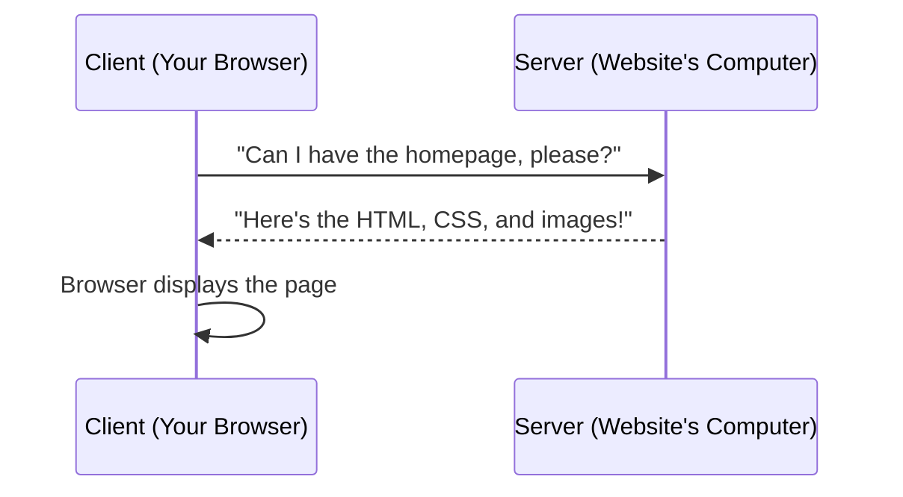
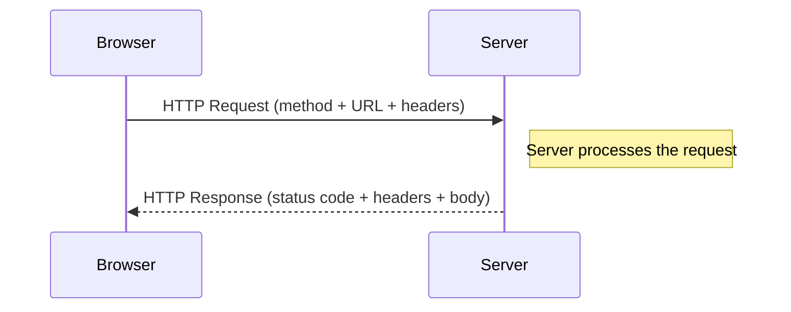
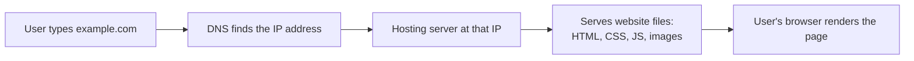
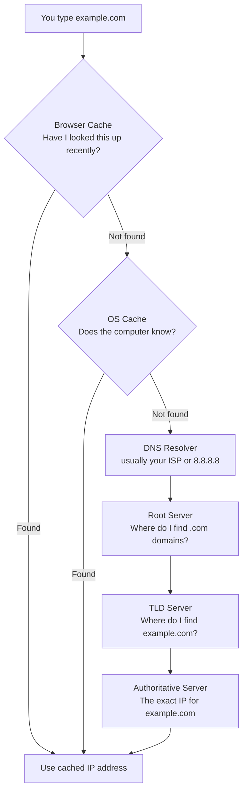
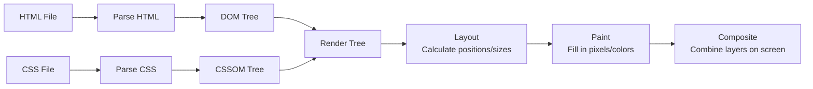

# The Internet — Beginner Guide

Welcome! Before you write a single line of HTML or CSS, it helps to understand the "plumbing" that makes websites possible. This guide explains, in plain language, how the internet actually works.

## Table of Contents
1. [How Does the Internet Work?](#1-how-does-the-internet-work)
2. [What Is HTTP?](#2-what-is-http)
3. [What Is a Domain Name?](#3-what-is-a-domain-name)
4. [What Is Hosting?](#4-what-is-hosting)
5. [DNS and How It Works](#5-dns-and-how-it-works)
6. [Browsers and How They Work](#6-browsers-and-how-they-work)

---

## 1. How Does the Internet Work?

Imagine the internet as a giant postal system connecting millions of computers around the world. When you visit a website, your computer (the **client**) sends a request to another computer somewhere else in the world (the **server**), and that server sends back a response.

This is called the **client-server model**:

- **Client**: Your device — laptop, phone, tablet — running a program like a web browser (Chrome, Firefox, Safari) that *asks* for information.
- **Server**: A powerful computer, usually sitting in a data center, that *stores* website files and *responds* to requests.

### Why does this matter?
Every single website you've ever visited works this way. Understanding this model is the foundation for understanding APIs, web hosting, and how your future JavaScript code will fetch data.



### Packets and Routers (in plain language)

Data doesn't travel across the internet as one giant blob. Instead, it gets chopped up into small chunks called **packets** — think of mailing a book by tearing out each page and sending them in separate envelopes, each labeled with an order number and destination address.

- **Packets**: Small pieces of data, each with a header containing the destination address and a sequence number (so they can be reassembled correctly).
- **Routers**: Specialized devices that read the address on each packet and forward it toward its destination, hopping from router to router, similar to how a letter passes through several sorting offices before reaching your mailbox.


**Why does this matter?** If one packet gets lost or delayed, only that tiny piece needs to be resent — not the whole webpage. This is part of why the internet is so resilient: there's no single path data *must* take.

---

## 2. What Is HTTP?

**HTTP** stands for **HyperText Transfer Protocol**. It's the *language* (a set of rules) that browsers and servers use to talk to each other. Think of it as the agreed-upon format for writing a request letter and a reply letter so both sides understand each other.

When you type a URL like `https://example.com` into your browser, you're telling the browser: "Use HTTP(S) to talk to the server at example.com."

> **Note:** `HTTPS` is just HTTP with encryption added (the "S" stands for "Secure"). It scrambles the data so nobody snooping on the network can read it.

### The Request-Response Cycle

Every interaction follows this pattern:



### HTTP Methods

Methods tell the server *what kind of action* you want to perform:

| Method | What it does | Real-world analogy |
|--------|--------------|---------------------|
| `GET` | Fetch/read data | Reading a book at the library |
| `POST` | Create new data | Submitting a new form to an office |
| `PUT` | Replace existing data entirely | Replacing a whole page in a filing cabinet |
| `PATCH` | Update part of existing data | Correcting one line on a form |
| `DELETE` | Remove data | Shredding a document |

**Example:** When you load a blog post, your browser sends a `GET` request. When you submit a comment, it sends a `POST` request.

### HTTP Status Codes

The server's response always includes a **status code** — a 3-digit number telling you what happened:

| Range | Meaning | Common Example |
|-------|---------|-----------------|
| 1xx | Informational | 100 Continue |
| 2xx | Success | 200 OK |
| 3xx | Redirection | 301 Moved Permanently |
| 4xx | Client error (you made a mistake) | 404 Not Found |
| 5xx | Server error (the server messed up) | 500 Internal Server Error |

**Why does this matter?** You've definitely seen `404` before — that's the server telling your browser "I looked, but I couldn't find that page." Knowing these codes will help you debug websites and APIs constantly as a developer.

### HTTP Headers

Headers are extra bits of information attached to a request or response — like sticky notes on an envelope. They don't contain the "main message" but provide context.

Examples:
- `Content-Type: text/html` — "this response body is HTML"
- `User-Agent: Chrome/120.0` — "this request came from Chrome browser"
- `Authorization: Bearer <token>` — "here's proof I'm logged in"

```
Example Request:
GET /index.html HTTP/1.1
Host: example.com
User-Agent: Mozilla/5.0

Example Response:
HTTP/1.1 200 OK
Content-Type: text/html
Content-Length: 1256

<html>...</html>
```

---

## 3. What Is a Domain Name?

A **domain name** is the human-friendly address you type into a browser, like `google.com` or `roadmap.sh`. Computers actually locate each other using numeric addresses called **IP addresses** (e.g., `142.250.premium.4`), but remembering strings of numbers is hard for humans — so domain names exist as friendly nicknames.

### Why does this matter?
Without domain names, you'd have to memorize numbers to visit every website. Domain names make the web usable for humans.

### Anatomy of a Domain Name

```
https://www.example.com/blog
   │      │    │      │
   │      │    │      └── Path (specific page)
   │      │    └───────── Top-Level Domain (TLD)
   │      └────────────── Domain name (second-level domain)
   └───────────────────── Subdomain
```

- **TLD (Top-Level Domain)**: `.com`, `.org`, `.dev`, `.io` — the "category" of the domain.
- **Second-Level Domain**: `example` — the unique name you register.
- **Subdomain**: `www`, `blog`, `mail` — an optional prefix that can point to a different section or server.

You "buy" (technically, *rent*) a domain name from a **domain registrar** (like Namecheap or GoDaddy) for a period of time, usually a year, and renew it periodically.

---

## 4. What Is Hosting?

**Hosting** is the service that stores your website's files (HTML, CSS, JavaScript, images) on a server that's connected to the internet 24/7, so anyone can access your site anytime.

### Why does this matter?
Your personal laptop *could* technically act as a server, but it's not reliable — it can go offline, isn't always connected to the internet, and doesn't have enough bandwidth to serve many visitors. Hosting companies provide powerful, always-on computers specifically for this job.

### How it all connects



Popular types of hosting for beginners:
- **Static hosting** (Netlify, Vercel, GitHub Pages) — great for HTML/CSS/JS sites with no backend database.
- **Shared hosting** (Bluehost, Hostinger) — cheap, good for small projects, but shares server resources with other websites.
- **Cloud hosting** (AWS, Google Cloud, Azure) — scalable and powerful, used by large applications.

---

## 5. DNS and How It Works

**DNS** stands for **Domain Name System**. It's essentially the internet's phonebook — it translates human-friendly domain names (`example.com`) into machine-friendly IP addresses (`93.184.216.34`).

### Why does this matter?
Every time you visit a website, this translation happens behind the scenes in milliseconds. Understanding it helps you debug issues like "why isn't my new website showing up yet?" (DNS propagation delays!).

### The Resolution Chain

When you type a URL, your computer looks up the IP address by checking several places *in order*, stopping as soon as it finds an answer:



Step-by-step, in plain words:

1. **Browser cache**: Your browser first checks if it already knows the IP address from a recent visit — like checking your recent contacts before looking someone up.
2. **OS cache**: If not, your operating system (Windows/Mac/Linux) checks its own local cache.
3. **DNS Resolver**: If still not found, a request goes out to a **recursive resolver** (often provided by your Internet Service Provider, or a public one like Google's `8.8.8.8`). This resolver does the heavy lifting of asking around on your behalf.
4. **Root Server**: The resolver asks one of 13 root DNS servers, "Who manages `.com` domains?"
5. **TLD Server**: The root server points to the TLD server for `.com`, which knows which server manages `example.com` specifically.
6. **Authoritative Server**: This final server has the actual DNS records for `example.com` and returns the real IP address.
7. The IP address is sent back to your browser, which is then cached for next time, and your browser can finally connect to the hosting server.

This whole process usually takes just a few milliseconds!

### Common DNS Record Types

| Record | Purpose |
|--------|---------|
| `A` | Points a domain to an IPv4 address |
| `AAAA` | Points a domain to an IPv6 address |
| `CNAME` | Points a domain to another domain name (alias) |
| `MX` | Specifies mail servers for email |
| `TXT` | Stores arbitrary text, often for verification |

---

## 6. Browsers and How They Work

A **web browser** (Chrome, Firefox, Safari, Edge) is a program that takes the HTML, CSS, and JavaScript files sent by a server and turns them into the visual, interactive page you see and click on.

### Why does this matter?
Understanding this pipeline explains *why* your CSS sometimes doesn't apply instantly, why JavaScript can "block" a page from loading, and how the browser decides what to draw where.

### The Rendering Pipeline



Step-by-step:

1. **Parsing HTML → DOM**: The browser reads your HTML file top to bottom and builds the **DOM** (Document Object Model) — a tree-like structure representing every element on the page (`<div>`, `<p>`, `<h1>`, etc.), with parent/child relationships.

2. **Parsing CSS → CSSOM**: Similarly, the browser reads your CSS and builds the **CSSOM** (CSS Object Model) — a tree describing every style rule and which elements they apply to.

3. **Render Tree**: The browser combines the DOM and CSSOM into a **Render Tree** — this only includes elements that will actually be *visible* (elements with `display: none` are excluded).

4. **Layout (a.k.a. Reflow)**: The browser calculates the exact size and position of every element on the page, based on the render tree — like a surveyor measuring out where every piece of furniture goes in a room.

5. **Paint**: The browser fills in the actual pixels — colors, borders, text, images, shadows — for each element.

6. **Composite**: Finally, if the page has multiple layers (like scrolling content, fixed headers, etc.), the browser combines them into the final image you see on screen.

### A Simple Example

```html
<!DOCTYPE html>
<html>
  <head>
    <style>
      p { color: blue; }
    </style>
  </head>
  <body>
    <p>Hello World</p>
  </body>
</html>
```

Here's what happens:
1. The browser parses this HTML and builds a DOM: `html → head, body`, `body → p`.
2. It parses the `<style>` block and builds a CSSOM: `p { color: blue }`.
3. It merges them: the `<p>` node in the render tree now knows it should be blue.
4. Layout calculates that the `<p>` should sit at the top-left of the body, take up the full width, and be as tall as one line of text.
5. Paint colors the text blue.
6. Composite displays the final page.

**Why does this matter?** This is why adding a `<script>` tag in the wrong place can slow down your page — if JavaScript modifies the DOM, the browser may have to redo layout and paint, which is called a **reflow**. As you write more HTML/CSS, keeping this pipeline in mind helps you write performant pages.

---

## Summary

- The internet works through a **client-server model**, with data broken into **packets** routed by **routers**.
- **HTTP** is the protocol browsers and servers use to communicate, using **methods** (GET, POST, etc.) and **status codes** (200, 404, etc.).
- A **domain name** is a human-friendly address; **DNS** translates it into an IP address through a chain: browser cache → OS → resolver → root → TLD → authoritative server.
- **Hosting** is where your website's files physically live on the internet.
- **Browsers** parse HTML/CSS into the DOM/CSSOM, merge them into a render tree, then perform layout, paint, and composite to show you the final page.

---

**Where this fits:** This is the first topic in the Frontend roadmap (Internet → HTML → CSS → JavaScript → Version Control → ...) — it's the foundation everything else builds on.
