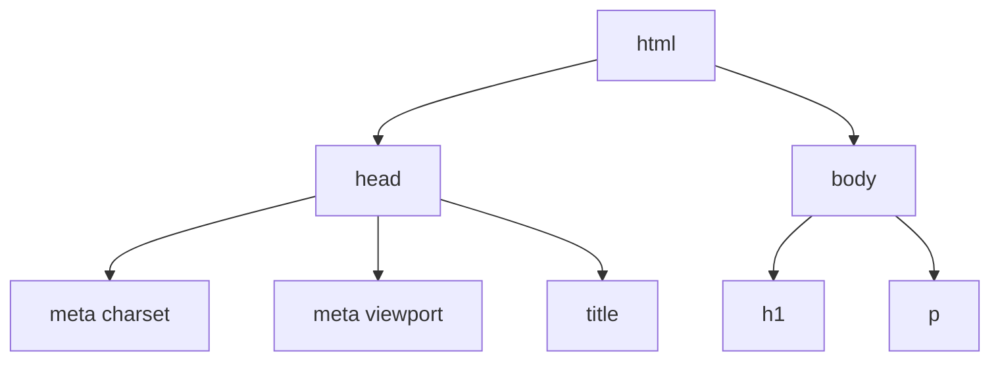
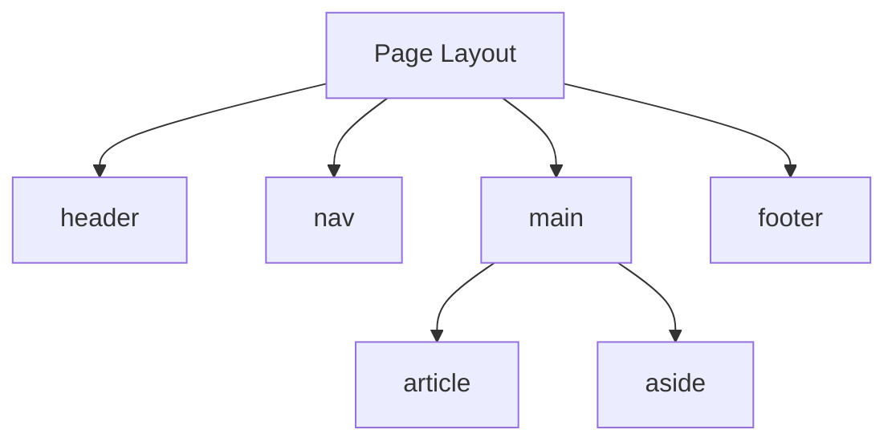
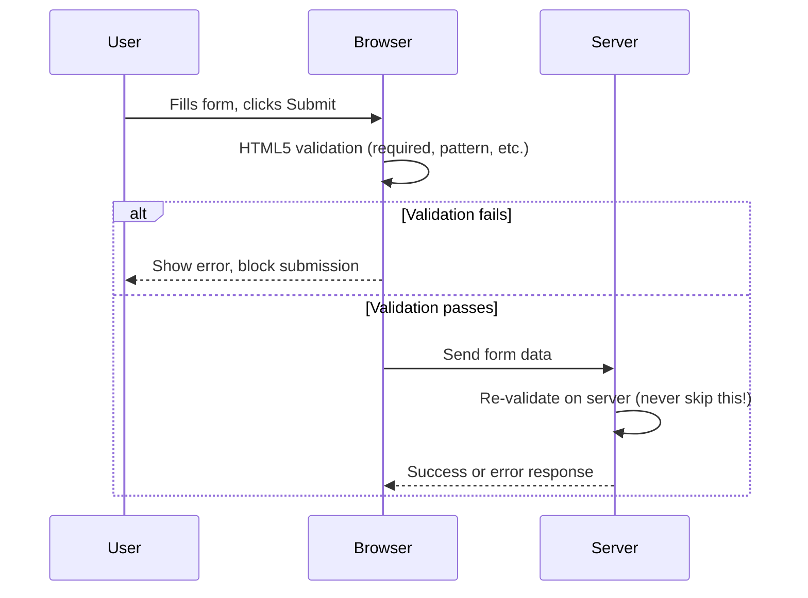

# HTML — Beginner Guide

HTML (**HyperText Markup Language**) is the skeleton of every web page. It's not a programming language — it's a **markup language**, meaning it describes the *structure and content* of a page using tags, not logic or calculations.

## Table of Contents
1. [Learn the Basics](#1-learn-the-basics)
2. [Writing Semantic HTML](#2-writing-semantic-html)
3. [Forms and Validations](#3-forms-and-validations)
4. [Accessibility](#4-accessibility)
5. [SEO Basics](#5-seo-basics)

---

## 1. Learn the Basics

### Document Structure

Every HTML page follows the same basic skeleton:

```html
<!DOCTYPE html>
<html lang="en">
  <head>
    <meta charset="UTF-8" />
    <meta name="viewport" content="width=device-width, initial-scale=1.0" />
    <title>My First Page</title>
  </head>
  <body>
    <h1>Hello, World!</h1>
    <p>This is my first paragraph.</p>
  </body>
</html>
```

Let's break this down line by line:

- `<!DOCTYPE html>` — Tells the browser "this is a modern HTML5 document." Without it, browsers may render your page in a weird compatibility mode.
- `<html lang="en">` — The root element wrapping everything. The `lang` attribute tells browsers/screen readers the page's language (helps translation tools and accessibility software).
- `<head>` — Contains metadata (information *about* the page) that isn't directly displayed: page title, character encoding, linked stylesheets, etc.
- `<meta charset="UTF-8" />` — Sets the character encoding so special characters (é, ñ, emoji, etc.) display correctly.
- `<meta name="viewport" ...>` — Controls how the page scales on mobile devices. Without this, mobile browsers will render your page as if it were on a desktop and zoom out.
- `<title>` — The text shown in the browser tab.
- `<body>` — Everything the user actually *sees* on the page goes here.



### What Is a Tag?

A **tag** marks the beginning and end of an HTML element. Most tags come in pairs: an opening tag `<p>` and a closing tag `</p>`, wrapping the content they apply to.

```html
<p>This entire sentence is inside a paragraph tag.</p>
```

Some tags are **self-closing** (void elements) because they don't wrap content — they're a single unit:

```html

<br />
<input type="text" />
```

### What Is an Attribute?

**Attributes** provide extra information about an element and always live inside the opening tag, in the format `name="value"`.

```html
<a href="https://example.com" target="_blank">Visit Example</a>
```

Here, `href` and `target` are attributes of the `<a>` (anchor/link) tag. `href` says *where* the link goes; `target="_blank"` says *open in a new tab*.

### Common Tags Every Beginner Should Know

| Tag | Purpose |
|-----|---------|
| `<h1>` – `<h6>` | Headings, from most important (`h1`) to least (`h6`) |
| `<p>` | Paragraph of text |
| `<a>` | Link (anchor) |
| `` | Image |
| `<ul>` / `<ol>` / `<li>` | Unordered/ordered list and list items |
| `<div>` | Generic block container (no meaning by itself) |
| `<span>` | Generic inline container (no meaning by itself) |
| `<button>` | Clickable button |

### Why does this matter?

HTML is the very first thing you learn because **every website on the internet is built from HTML**. CSS styles it, JavaScript makes it interactive, but without HTML, there's no content or structure at all.

---

## 2. Writing Semantic HTML

### What does "semantic" mean?

**Semantic HTML** means using tags that describe *what the content actually is*, not just how it looks. For example, using `<nav>` for navigation instead of a generic `<div>` that merely *looks* like navigation.

### "Div Soup" — the problem semantic HTML solves

Before semantic tags existed (or when developers ignore them), pages end up like this:

```html
<!-- BAD: "div soup" — no meaning, just boxes -->
<div class="header">
  <div class="nav">
    <div class="nav-item">Home</div>
    <div class="nav-item">About</div>
  </div>
</div>
<div class="main-content">
  <div class="article">
    <div class="article-title">My Blog Post</div>
    <div class="article-body">Some text...</div>
  </div>
</div>
<div class="footer">Copyright 2026</div>
```

A `<div>` tells a browser (or a screen reader, or Google's search bot) absolutely nothing about what it contains. Compare that to the semantic version:

```html
<!-- GOOD: semantic HTML — meaningful structure -->
<header>
  <nav>
    <a href="/">Home</a>
    <a href="/about">About</a>
  </nav>
</header>
<main>
  <article>
    <h1>My Blog Post</h1>
    <p>Some text...</p>
  </article>
</main>
<footer>Copyright 2026</footer>
```

### Common Semantic Tags

| Tag | Meaning |
|-----|---------|
| `<header>` | Introductory content, often a page/section header |
| `<nav>` | Navigation links |
| `<main>` | The main, unique content of the page (only one per page) |
| `<article>` | Self-contained, independently distributable content (a blog post, a news story) |
| `<section>` | A thematic grouping of content, usually with its own heading |
| `<aside>` | Content tangentially related to the main content (sidebars, pull quotes) |
| `<footer>` | Footer content, often copyright/contact info |
| `<figure>` / `<figcaption>` | An image/diagram and its caption |



### Why does this matter?

1. **Accessibility**: Screen readers use semantic tags to let visually impaired users jump directly to "the navigation" or "the main content" instead of reading every single div.
2. **SEO**: Search engines use semantic structure to understand what your page is about and rank it appropriately.
3. **Maintainability**: Other developers (including future you!) can read semantic HTML far more easily than a wall of unlabeled divs.

---

## 3. Forms and Validations

Forms let users submit data — signing up for an account, searching, leaving a comment.

### Basic Form Structure

```html
<form action="/submit" method="POST">
  <label for="name">Name:</label>
  <input type="text" id="name" name="name" required />

  <label for="email">Email:</label>
  <input type="email" id="email" name="email" required />

  <button type="submit">Submit</button>
</form>
```

- `<form>` — Wraps all the input fields. `action` says *where* to send the data; `method` says *how* (`GET` appends data to the URL, `POST` sends it in the request body — used for anything sensitive or large).
- `<label>` — Describes an input field. The `for` attribute must match the input's `id` — this creates a clickable connection (clicking the label focuses the input), which is also crucial for accessibility.
- `<input>` — The actual field the user types into. The `type` attribute changes its behavior entirely.

### Common Input Types

```html
<input type="text" />       <!-- plain text -->
<input type="email" />      <!-- validates email format -->
<input type="password" />   <!-- hides typed characters -->
<input type="number" />     <!-- only accepts numbers, shows up/down arrows -->
<input type="checkbox" />   <!-- toggle on/off -->
<input type="radio" />      <!-- pick one from a group -->
<input type="date" />       <!-- shows a date picker -->
<input type="file" />       <!-- upload a file -->
<textarea></textarea>       <!-- multi-line text -->
<select>
  <option value="us">United States</option>
  <option value="ca">Canada</option>
</select>                   <!-- dropdown -->
```

### HTML5 Validation Attributes

The browser can validate form data *before* it's ever sent to the server — no JavaScript required!

```html
<input type="text" required minlength="3" maxlength="20" />
<input type="number" min="1" max="100" />
<input type="email" required />
<input type="text" pattern="[A-Za-z]{3,}" title="At least 3 letters" />
```

| Attribute | What it does |
|-----------|---------------|
| `required` | Field cannot be left empty |
| `minlength` / `maxlength` | Minimum/maximum character count |
| `min` / `max` | Minimum/maximum numeric value |
| `pattern` | A regular expression the value must match |
| `type="email"` | Must be a validly formatted email address |

**Why does this matter?** Client-side validation gives users instant feedback (no waiting for a server round-trip) and reduces bad data hitting your server. **However**, always validate on the server too — client-side validation can be bypassed (a user can disable JavaScript or edit HTML), so never trust it as your only line of defense.



---

## 4. Accessibility

**Accessibility** (often abbreviated **a11y**) means building websites that people with disabilities — visual, motor, auditory, cognitive — can use.

### Why does this matter?

Millions of people use screen readers, keyboard-only navigation, or voice control to browse the web. Building accessible sites isn't optional politeness — in many countries it's a legal requirement, and it also just makes your site better for everyone (e.g., good alt text helps SEO too).

### Alt Text for Images

```html

```

The `alt` attribute describes the image for anyone who can't see it (screen reader users, or if the image fails to load). Never leave it out — and never fill it with keyword-stuffed junk. If an image is purely decorative, use `alt=""` (empty, but present) so screen readers skip it.

### Keyboard Navigation

Many users cannot use a mouse. They navigate using the `Tab` key to move between interactive elements (links, buttons, form fields) and `Enter`/`Space` to activate them.

```html
<!-- BAD: not focusable/keyboard-accessible by default -->
<div onclick="submitForm()">Submit</div>

<!-- GOOD: native button is keyboard-accessible automatically -->
<button onclick="submitForm()">Submit</button>
```

**Why does this matter?** A `<div>` isn't part of the "Tab order" by default and doesn't respond to Enter/Space — a keyboard user simply cannot activate it. Always prefer real interactive elements (`<button>`, `<a>`) over generic elements pretending to be interactive.

### ARIA Basics

**ARIA** (Accessible Rich Internet Applications) attributes add extra information for assistive technology when native HTML isn't enough.

```html
<button aria-label="Close menu">✕</button>

<div role="alert">Your form was submitted successfully!</div>

<nav aria-label="Main navigation">...</nav>
```

- `aria-label` — Provides an accessible name when visible text isn't descriptive enough (like an icon-only button).
- `role` — Tells assistive tech what *kind* of widget this is (`alert`, `dialog`, `tablist`, etc.).

> **Golden rule of ARIA**: "No ARIA is better than bad ARIA." Always prefer a native HTML element (`<button>`, `<nav>`) over recreating its behavior with `<div role="button">` plus a pile of ARIA attributes and manual JavaScript.

---

## 5. SEO Basics

**SEO** (Search Engine Optimization) is the practice of structuring your page so search engines (Google, Bing) understand it and rank it well in search results.

### Essential Meta Tags

```html
<head>
  <title>Best Chocolate Chip Cookie Recipe | My Baking Blog</title>
  <meta name="description" content="A simple, foolproof recipe for the best chocolate chip cookies you'll ever bake, ready in 30 minutes." />
  <meta name="viewport" content="width=device-width, initial-scale=1.0" />
</head>
```

- `<title>` — Shows up as the clickable headline in Google search results and the browser tab. Keep it descriptive and under ~60 characters.
- `<meta name="description">` — The short summary text shown under the title in search results. Doesn't affect ranking directly, but affects whether people *click* your result.

### Semantic Structure Helps SEO

Remember the semantic tags from Section 2? Search engines use them to understand your content's structure — a single `<h1>` per page, logically nested `<h2>`/`<h3>` subheadings, and `<article>`/`<main>` all help search engines figure out what your page is actually about.

```html
<main>
  <article>
    <h1>Best Chocolate Chip Cookie Recipe</h1>
    <section>
      <h2>Ingredients</h2>
      <ul>...</ul>
    </section>
    <section>
      <h2>Instructions</h2>
      <ol>...</ol>
    </section>
  </article>
</main>
```

### Structured Data (a peek ahead)

**Structured data** is extra markup (usually JSON-LD) that tells search engines exactly what type of content you have — a recipe, a product, an event — so they can show rich results (star ratings, prices, cook times) directly in search.

```html
<script type="application/ld+json">
{
  "@context": "https://schema.org",
  "@type": "Recipe",
  "name": "Chocolate Chip Cookies",
  "author": "Jane Doe",
  "prepTime": "PT30M"
}
</script>
```

**Why does this matter?** This is an advanced topic, but knowing it exists helps you understand why some Google search results show star ratings, images, or cooking times directly in the results.

---

## Summary

- HTML uses **tags** and **attributes** to structure content inside a standard document skeleton (`<!DOCTYPE>`, `<html>`, `<head>`, `<body>`).
- **Semantic HTML** (`<header>`, `<nav>`, `<main>`, `<article>`) describes *meaning*, improving accessibility, SEO, and maintainability over generic `<div>` soup.
- **Forms** collect user input; HTML5 attributes (`required`, `pattern`, `min`/`max`) provide free client-side validation — but always re-validate on the server.
- **Accessibility** means using `alt` text, native interactive elements for keyboard support, and ARIA attributes only when native HTML can't do the job.
- **SEO basics** start with a good `<title>`, `<meta description>`, and clean semantic structure.

---

**Where this fits:** Second topic in the Frontend roadmap (Internet → HTML → CSS → JavaScript → Version Control → ...) — HTML is the structural foundation that CSS will style next.
