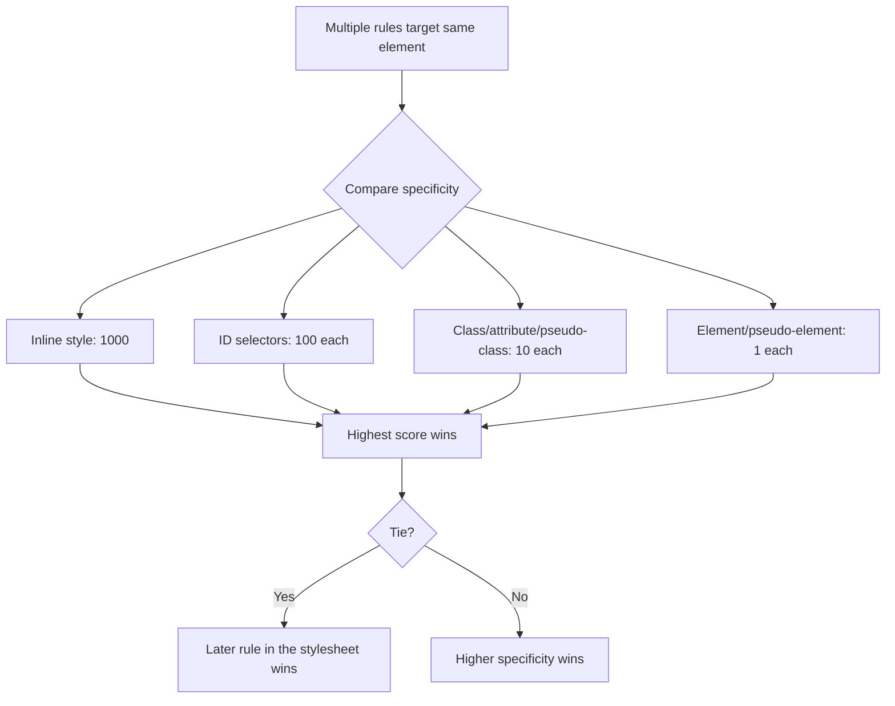
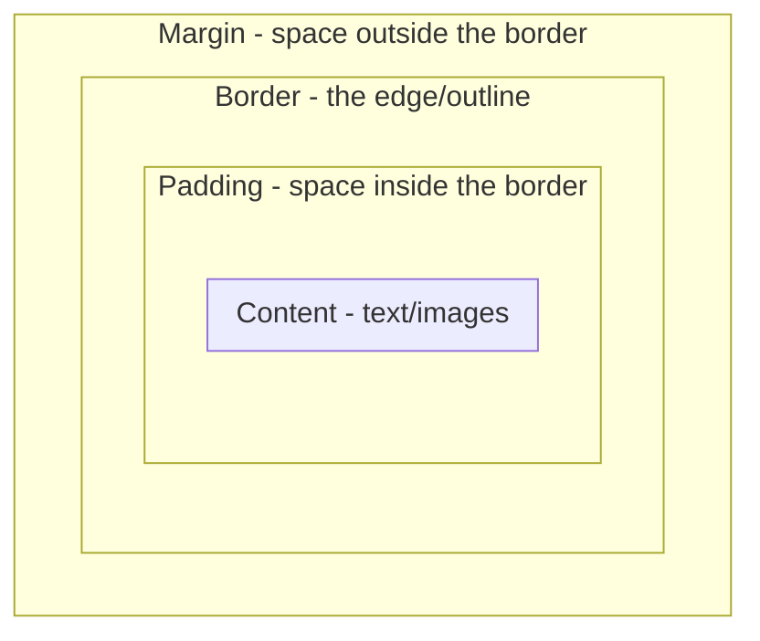
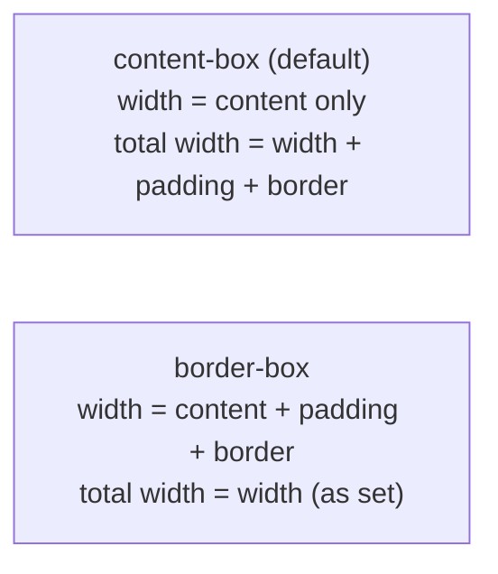
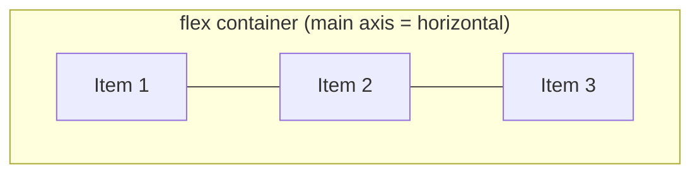
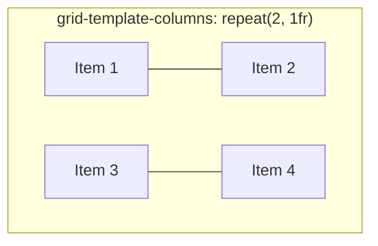
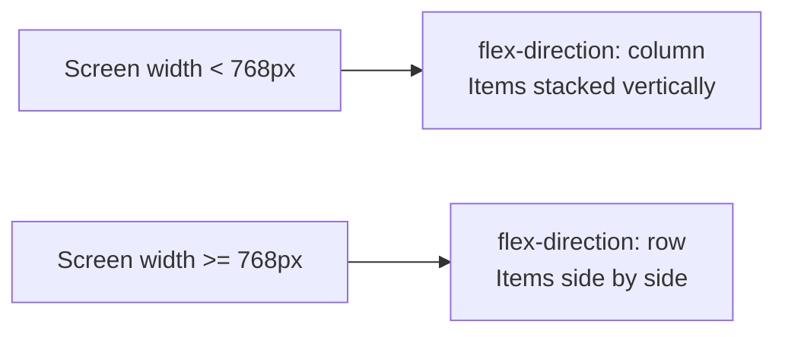

# CSS — Beginner Guide

CSS (**Cascading Style Sheets**) is what makes HTML look good. If HTML is the skeleton of a webpage, CSS is the skin, clothes, and makeup — it controls colors, fonts, spacing, layout, and animation.

## Table of Contents
1. [Learn the Basics](#1-learn-the-basics)
2. [Making Layouts](#2-making-layouts)
3. [Responsive Design](#3-responsive-design)

---

## 1. Learn the Basics

### How to attach CSS to HTML

There are three ways to add CSS to a page:

```html
<!-- 1. Inline (on the element itself — avoid for real projects) -->
<p style="color: blue;">Hello</p>

<!-- 2. Internal (in a <style> tag in <head>) -->
<head>
  <style>
    p { color: blue; }
  </style>
</head>

<!-- 3. External (a separate .css file — the recommended approach) -->
<head>
  <link rel="stylesheet" href="styles.css" />
</head>
```

**Why does this matter?** External stylesheets keep your HTML clean and let you reuse the same styles across many pages, and browsers can cache the CSS file separately for faster repeat visits.

### Anatomy of a CSS Rule

```css
selector {
  property: value;
}
```

Example:

```css
p {
  color: blue;
  font-size: 16px;
}
```

- **Selector** (`p`) — which element(s) this rule applies to.
- **Property** (`color`, `font-size`) — what aspect you're styling.
- **Value** (`blue`, `16px`) — what you're setting it to.

### Selectors

Selectors determine *which* elements get styled.

```css
/* Element selector — targets all <p> tags */
p { color: black; }

/* Class selector — targets elements with class="highlight" */
.highlight { background-color: yellow; }

/* ID selector — targets the one element with id="header" */
#header { font-weight: bold; }

/* Descendant selector — targets <a> tags inside .nav */
.nav a { text-decoration: none; }

/* Multiple selectors, same rule */
h1, h2, h3 { font-family: Arial, sans-serif; }
```

```html
<p class="highlight">This paragraph is highlighted.</p>
<div id="header">This is the header</div>
```

### Specificity — how the browser decides which rule "wins"

When multiple CSS rules target the same element, **specificity** decides which one applies. Think of it as a points system:

| Selector type | "Points" | Example |
|---|---|---|
| Inline style | 1000 | `style="color: red;"` |
| ID | 100 | `#header` |
| Class, attribute, pseudo-class | 10 | `.highlight`, `[type="text"]`, `:hover` |
| Element, pseudo-element | 1 | `p`, `::before` |

```css
p { color: blue; }          /* specificity: 1 */
.highlight { color: red; }  /* specificity: 10 — this wins */
```

```html
<p class="highlight">This text will be RED, because .highlight (10 points) beats p (1 point).</p>
```

**Why does this matter?** Specificity confusion is one of the most common CSS frustrations for beginners ("why isn't my style applying?!"). Understanding this points system tells you exactly why one rule overrides another.



### The Box Model

Every single HTML element is treated as a rectangular box by the browser, made up of four layers:



- **Content** — the actual text, image, or other content.
- **Padding** — clear space *between* the content and the border (inside the box).
- **Border** — a visible (or invisible) line around the padding.
- **Margin** — clear space *outside* the border, separating this box from other elements.

```css
.box {
  width: 200px;
  padding: 20px;
  border: 2px solid black;
  margin: 10px;
}
```

**Important gotcha:** By default, `width: 200px` only sets the *content* width — padding and border are added *on top*, making the box's actual rendered width larger than 200px! This is why almost every modern project includes this reset:

```css
* {
  box-sizing: border-box;
}
```

With `box-sizing: border-box`, `width: 200px` includes padding and border *within* that 200px, which is far more intuitive.



### Why does this matter?

Every layout you'll ever build is fundamentally about arranging boxes. Understanding selectors, specificity, and the box model is the bedrock for everything else in CSS.

---

## 2. Making Layouts

Modern CSS gives us two powerful layout systems: **Flexbox** (one-dimensional — a row OR a column) and **Grid** (two-dimensional — rows AND columns together).

### Flexbox

Flexbox arranges items in a single line (row or column), distributing space between/around them.

```html
<div class="container">
  <div class="item">1</div>
  <div class="item">2</div>
  <div class="item">3</div>
</div>
```

```css
.container {
  display: flex;
  justify-content: space-between; /* horizontal spacing */
  align-items: center;            /* vertical alignment */
  gap: 10px;                      /* space between items */
}
```

- `display: flex` — turns the container into a flex container; its direct children become "flex items."
- `justify-content` — controls alignment along the **main axis** (horizontal by default): `flex-start`, `flex-end`, `center`, `space-between`, `space-around`.
- `align-items` — controls alignment along the **cross axis** (vertical by default): `flex-start`, `flex-end`, `center`, `stretch`.
- `flex-direction: column` — flips the main axis to vertical.
- `gap` — adds consistent spacing between items, without needing margin hacks.



**Why does this matter?** Flexbox is perfect for navbars, button groups, centering a single element, and any "row of things" or "column of things" layout — which covers a huge percentage of real-world UI.

### Grid

Grid arranges items into rows AND columns simultaneously — perfect for full page layouts, image galleries, and dashboards.

```html
<div class="grid-container">
  <div class="grid-item">1</div>
  <div class="grid-item">2</div>
  <div class="grid-item">3</div>
  <div class="grid-item">4</div>
</div>
```

```css
.grid-container {
  display: grid;
  grid-template-columns: repeat(2, 1fr); /* 2 equal-width columns */
  gap: 16px;
}
```

- `display: grid` — turns the container into a grid container.
- `grid-template-columns` — defines the number and size of columns. `1fr` means "1 fraction of the remaining space" — a flexible unit that divides space proportionally.
- `repeat(2, 1fr)` — shorthand for "two columns, each taking 1 fraction" (equivalent to `1fr 1fr`).
- `gap` — spacing between grid cells, both rows and columns.



A more advanced example, defining a full page layout with named areas:

```css
.page {
  display: grid;
  grid-template-columns: 200px 1fr;
  grid-template-areas:
    "sidebar header"
    "sidebar main";
}
.sidebar { grid-area: sidebar; }
.header  { grid-area: header; }
.main    { grid-area: main; }
```

**Why does this matter?** Grid replaced older, hacky layout techniques (float-based layouts, table-based layouts) with a clean, purpose-built system for two-dimensional page structure.

### Flexbox vs. Grid — when to use which

| Use Flexbox when... | Use Grid when... |
|---|---|
| Arranging items in one direction (a row or a column) | Arranging items in rows AND columns together |
| Content size should drive layout | You want precise, fixed structure |
| Building a navbar, button group, or centering something | Building a whole page layout, dashboard, or image gallery |

They're not mutually exclusive — many real layouts use Grid for the overall page structure and Flexbox for the smaller components inside it.

---

## 3. Responsive Design

**Responsive design** means your website looks good and works well on any screen size — phone, tablet, laptop, huge desktop monitor.

### The Viewport Meta Tag

```html
<meta name="viewport" content="width=device-width, initial-scale=1.0" />
```

Without this tag in your `<head>`, mobile browsers assume your page was built for desktop and will render it at desktop width, then zoom out to fit the screen — making everything tiny and forcing users to pinch-zoom. This single line tells the browser "match the page width to the actual device width, and don't zoom in/out by default."

### Media Queries

**Media queries** let you apply different CSS rules depending on the screen size (or other device characteristics).

```css
/* Default styles (apply to all screen sizes) */
.container {
  display: flex;
  flex-direction: column;
}

/* Styles that ONLY apply when the screen is at least 768px wide */
@media (min-width: 768px) {
  .container {
    flex-direction: row;
  }
}
```

In plain language: "Stack items vertically by default. But if the screen is at least 768 pixels wide (a tablet or larger), arrange them in a row instead."



### Mobile-First Design

**Mobile-first** means you write your *base* CSS for small screens first, then use `min-width` media queries to add/adjust styles for larger screens as needed.

```css
/* Mobile-first: base styles target the SMALLEST screens */
.card {
  width: 100%;
}

/* Then progressively enhance for bigger screens */
@media (min-width: 600px) {
  .card { width: 48%; }
}

@media (min-width: 900px) {
  .card { width: 31%; }
}
```

**Why does this matter?** Most web traffic today comes from mobile devices. Starting with mobile styles forces you to prioritize essential content and avoids the trap of designing an elaborate desktop layout and then trying to awkwardly cram it onto a small screen afterward.

### Relative Units

Instead of fixed pixel values, responsive design favors units that scale relative to something else:

| Unit | Relative to |
|------|-------------|
| `%` | The parent element's size |
| `em` | The font-size of the current element (or its parent, for non-font properties) |
| `rem` | The font-size of the root `<html>` element (usually 16px by default) |
| `vw` | 1% of the viewport's width |
| `vh` | 1% of the viewport's height |

```css
html { font-size: 16px; }

.title {
  font-size: 2rem;    /* = 32px, always relative to the ROOT, predictable */
}

.card {
  padding: 1.5em;      /* relative to THIS element's own font-size */
  width: 90vw;          /* 90% of the viewport width */
  min-height: 50vh;     /* 50% of the viewport height */
}
```

**Why does this matter?** If a user increases their browser's default font size (common for visually impaired users), `rem`/`em`-based layouts scale gracefully along with it, while pixel-based layouts stay rigid and can break the design.

### Putting It Together — a Simple Responsive Card

```html
<div class="card">
  <h2>Product Name</h2>
  <p>A short description of the product goes here.</p>
</div>
```

```css
* { box-sizing: border-box; }

.card {
  width: 100%;
  padding: 1rem;
  border: 1px solid #ccc;
  border-radius: 8px;
}

@media (min-width: 768px) {
  .card {
    width: 50%;
    padding: 2rem;
  }
}
```

On a phone, the card takes the full width with modest padding. On a tablet or larger, it shrinks to half-width with more generous padding — all controlled purely through CSS, no JavaScript required.

---

## Summary

- CSS rules are made of **selectors + properties + values**; when rules conflict, **specificity** (inline > ID > class > element) decides the winner.
- The **box model** (content, padding, border, margin) describes how every element is sized; `box-sizing: border-box` makes sizing intuitive.
- **Flexbox** handles one-dimensional layouts (rows or columns); **Grid** handles two-dimensional layouts (rows and columns together).
- **Responsive design** uses the viewport meta tag, **media queries**, a **mobile-first** approach, and **relative units** (`rem`, `%`, `vw`/`vh`) to make sites work well on any screen size.

---

**Where this fits:** Third topic in the Frontend roadmap (Internet → HTML → CSS → JavaScript → Version Control → ...) — CSS styles the HTML structure you just learned, and comes right before you add interactivity with JavaScript.
