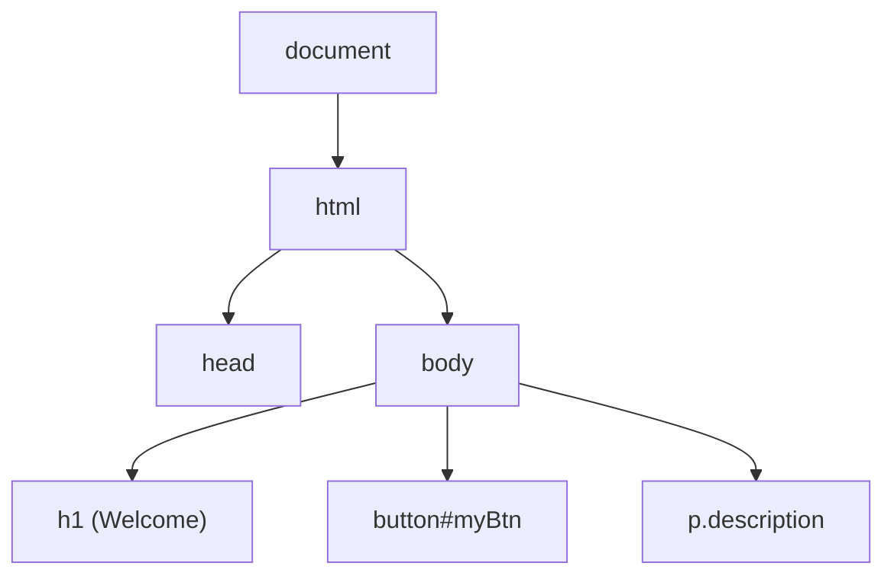
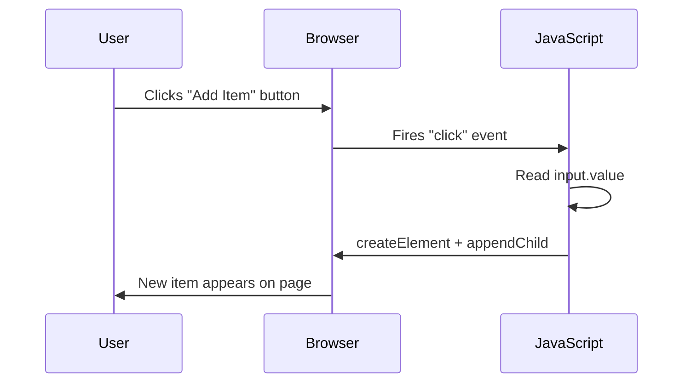
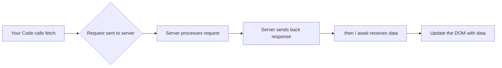

# JavaScript — Beginner Guide

JavaScript is the programming language of the web. HTML gives a page structure, CSS gives it style, and JavaScript (JS) gives it **behavior** — it's what makes a button do something when you click it, what validates a form, what fetches data from a server without reloading the page.

This guide covers three things every frontend developer needs first:

1. **The basics** — variables, types, functions, control flow
2. **DOM Manipulation** — how JS reads and changes what's on the page
3. **Fetch API / Ajax** — how JS talks to servers to get or send data

## Why this matters

Without JavaScript, a webpage is just a static document — like a PDF. You can read it, but it can't react to you. JavaScript is what turns a page into an *application*. Every interactive thing you've ever done on a website — liking a post, adding something to a cart, seeing a live chat message appear — is JavaScript running in your browser.

---

## Part 1: Learn the Basics

### 1.1 Variables — storing information

A variable is a named container that holds a value, like a labeled box.

```js
let name = "Alex";
let age = 25;
const country = "USA"; // const = cannot be reassigned later
```

- `let` — use this for values that might change later.
- `const` — use this for values that should never be reassigned (most common choice by default).
- `var` — the old way of declaring variables. Avoid it in new code; it has confusing scoping rules that `let`/`const` fixed.

```js
let score = 0;
score = 10; // OK — let allows reassignment

const PI = 3.14159;
PI = 4; // ERROR — const cannot be reassigned
```

### 1.2 Types — what kind of data are we storing?

JavaScript has a handful of basic ("primitive") data types:

| Type | Example | Meaning |
|---|---|---|
| String | `"hello"` | Text, wrapped in quotes |
| Number | `42`, `3.14` | Any number, whole or decimal |
| Boolean | `true`, `false` | A yes/no, on/off value |
| Undefined | `undefined` | A variable that has been declared but not given a value |
| Null | `null` | Deliberately "nothing" — set on purpose |
| Object | `{ name: "Alex" }` | A collection of key-value pairs |
| Array | `[1, 2, 3]` | An ordered list of values |

```js
let username = "sam99";      // String
let visits = 12;             // Number
let isLoggedIn = true;       // Boolean
let favoriteColor;           // Undefined (declared, no value yet)
let selectedItem = null;     // Null (explicitly empty)

let user = {                 // Object
  name: "Sam",
  age: 30
};

let colors = ["red", "green", "blue"]; // Array
```

You can check a value's type with `typeof`:

```js
console.log(typeof "hello"); // "string"
console.log(typeof 42);      // "number"
console.log(typeof true);    // "boolean"
```

### 1.3 Functions — reusable blocks of code

A function is a named block of code you can run whenever you need it, as many times as you want, so you don't repeat yourself.

```js
// Traditional function
function greet(name) {
  return "Hello, " + name + "!";
}

console.log(greet("Alex")); // "Hello, Alex!"
```

```js
// Arrow function — a shorter, modern way to write functions
const greet = (name) => {
  return "Hello, " + name + "!";
};

// Even shorter, when the function body is a single return statement:
const greetShort = (name) => `Hello, ${name}!`;
```

Note the `` `Hello, ${name}!` `` syntax above — that's a **template literal**. Backticks (`` ` ``) let you embed variables directly inside a string using `${...}`, instead of stitching text together with `+`.

### 1.4 Control flow — making decisions and repeating actions

**If/else** — run different code depending on a condition:

```js
let age = 20;

if (age >= 18) {
  console.log("You can vote.");
} else {
  console.log("You are too young to vote.");
}
```

**Comparison operators** you'll use inside conditions:

| Operator | Meaning |
|---|---|
| `===` | equal to (strict — checks value AND type) |
| `!==` | not equal to (strict) |
| `>` `<` | greater/less than |
| `>=` `<=` | greater/less than or equal to |

Always prefer `===` over `==`. `==` tries to convert types before comparing, which causes confusing bugs (e.g. `"5" == 5` is `true`, but `"5" === 5` is `false`).

**Loops** — repeat an action multiple times:

```js
// for loop — repeat a fixed number of times
for (let i = 0; i < 5; i++) {
  console.log("Count: " + i);
}

// while loop — repeat until a condition becomes false
let count = 0;
while (count < 3) {
  console.log("Looping...");
  count++;
}
```

**Looping over arrays** — a very common task:

```js
const fruits = ["apple", "banana", "cherry"];

for (const fruit of fruits) {
  console.log(fruit);
}

// Or using the array's built-in forEach method:
fruits.forEach((fruit) => {
  console.log(fruit);
});
```

---

## Part 2: DOM Manipulation

### What is the DOM?

DOM stands for **Document Object Model**. When your browser loads an HTML page, it doesn't just display the text — it builds a tree-like model of every element in memory. JavaScript can read and change this tree, and the browser instantly updates what you see.



Think of the DOM as the "live" version of your HTML that JavaScript can grab and modify.

### 2.1 Selecting elements

Before you can change something on the page, you need to select it.

```html
<h1 id="title">Hello</h1>
<button id="myBtn">Click me</button>
<p class="description">Some text</p>
```

```js
// Select by ID (returns one element)
const title = document.getElementById("title");

// Select by CSS selector (returns the FIRST match)
const button = document.querySelector("#myBtn");
const firstParagraph = document.querySelector(".description");

// Select ALL matches (returns a list-like NodeList)
const allParagraphs = document.querySelectorAll("p");
```

`querySelector` and `querySelectorAll` accept any valid CSS selector — `#id`, `.class`, `tag`, `div > p`, etc. — which makes them the most flexible and commonly used methods today.

### 2.2 Changing content and styles

```js
const title = document.querySelector("#title");

// Change the text
title.textContent = "Welcome!";

// Change the HTML content (can include tags)
title.innerHTML = "Welcome <em>friend</em>!";

// Change a style directly
title.style.color = "blue";
title.style.fontSize = "24px";

// Add or remove a CSS class (preferred over inline styles)
title.classList.add("highlight");
title.classList.remove("highlight");
title.classList.toggle("highlight"); // adds if missing, removes if present
```

Prefer `classList` over `.style` when possible — it keeps your styling in CSS files, and JS just flips classes on and off.

### 2.3 Event listeners — reacting to user actions

An "event" is something that happens on the page: a click, a key press, a form submission, the mouse moving. You attach an **event listener** to "listen" for that event and run code when it happens.

```js
const button = document.querySelector("#myBtn");

button.addEventListener("click", function () {
  alert("Button was clicked!");
});
```

Using an arrow function instead:

```js
button.addEventListener("click", () => {
  console.log("Clicked!");
});
```

Common events you'll use constantly:

| Event | Fires when... |
|---|---|
| `click` | an element is clicked |
| `input` | the value of a text field changes |
| `submit` | a form is submitted |
| `keydown` | a key is pressed down |
| `mouseover` | the mouse hovers over an element |
| `DOMContentLoaded` | the HTML has fully loaded (put on `document`) |

Example: reading a text input as the user types.

```js
const input = document.querySelector("#nameInput");

input.addEventListener("input", (event) => {
  console.log("Current value:", event.target.value);
});
```

The `event` object passed into the listener tells you details about what happened — `event.target` is the element that triggered it.

### 2.4 Creating and modifying elements

You can build new HTML elements entirely in JavaScript and insert them into the page:

```js
// 1. Create a new element
const newItem = document.createElement("li");

// 2. Give it content
newItem.textContent = "New shopping list item";

// 3. Add it to the page
const list = document.querySelector("#shoppingList");
list.appendChild(newItem);
```

Removing an element:

```js
newItem.remove();
```

Full example — adding items to a list from a button click:

```html
<input id="itemInput" type="text" />
<button id="addBtn">Add Item</button>
<ul id="shoppingList"></ul>
```

```js
const input = document.querySelector("#itemInput");
const addBtn = document.querySelector("#addBtn");
const list = document.querySelector("#shoppingList");

addBtn.addEventListener("click", () => {
  const li = document.createElement("li");
  li.textContent = input.value;
  list.appendChild(li);
  input.value = ""; // clear the input after adding
});
```

This is the core loop of almost every interactive webpage: **select an element → listen for an event → change the DOM in response.**



---

## Part 3: Fetch API / Ajax (XHR)

### Why do we need this?

Most real websites need data from a server — a list of products, a user's profile, search results. Instead of reloading the whole page every time you need new data, JavaScript can request data **in the background** and update just part of the page. This technique is broadly called **Ajax** (Asynchronous JavaScript and XML — even though today the data is almost always JSON, not XML).

### 3.1 The old way: XMLHttpRequest (XHR)

Before modern tools existed, developers used `XMLHttpRequest`. You'll see this in older codebases, so it's worth recognizing — but you won't write new code with it.

```js
const xhr = new XMLHttpRequest();
xhr.open("GET", "https://api.example.com/users");

xhr.onload = function () {
  if (xhr.status === 200) {
    const data = JSON.parse(xhr.responseText);
    console.log(data);
  }
};

xhr.send();
```

It works, but it's verbose and awkward to chain multiple requests together.

### 3.2 The modern way: fetch()

`fetch()` is the built-in, modern way to make network requests. It returns a **Promise** — an object representing a value that will be available *later*.

```js
fetch("https://api.example.com/users")
  .then((response) => response.json()) // parse the response body as JSON
  .then((data) => {
    console.log(data);
  })
  .catch((error) => {
    console.error("Something went wrong:", error);
  });
```

Breaking this down:
1. `fetch(url)` starts the request and returns a Promise.
2. `.then()` runs once the Promise resolves (the request finished).
3. `response.json()` reads the response body and parses it as JSON — this is *also* asynchronous, so it returns another Promise.
4. The second `.then()` gives you the actual data.
5. `.catch()` runs if anything fails (network error, etc).

### 3.3 async/await — a cleaner way to write the same thing

`async`/`await` lets you write asynchronous code that *looks* synchronous, which is usually much easier to read.

```js
async function getUsers() {
  try {
    const response = await fetch("https://api.example.com/users");
    const data = await response.json();
    console.log(data);
  } catch (error) {
    console.error("Something went wrong:", error);
  }
}

getUsers();
```

- `async` before a function means "this function returns a Promise and can use `await` inside it."
- `await` pauses the function until the Promise resolves, then gives you the result directly.
- `try`/`catch` is how you handle errors in this style (instead of `.catch()`).

### 3.4 Sending data (POST request)

```js
async function createUser(name, email) {
  const response = await fetch("https://api.example.com/users", {
    method: "POST",
    headers: {
      "Content-Type": "application/json",
    },
    body: JSON.stringify({ name, email }),
  });

  const data = await response.json();
  return data;
}

createUser("Alex", "alex@example.com");
```

### 3.5 fetch vs XHR — quick comparison

| | XMLHttpRequest | fetch() |
|---|---|---|
| Syntax | Verbose, event-based | Clean, Promise-based |
| Works with async/await | No (without wrapping) | Yes, natively |
| Chaining requests | Awkward (nested callbacks) | Easy (`.then()` chains or `await`) |
| Browser support | Very old browsers | All modern browsers |
| Recommended for new code | No | Yes |



---

## Putting it all together

A tiny real example: fetch a list of users and display them on the page.

```html
<ul id="userList"></ul>
```

```js
async function loadUsers() {
  const list = document.querySelector("#userList");

  const response = await fetch("https://api.example.com/users");
  const users = await response.json();

  users.forEach((user) => {
    const li = document.createElement("li");
    li.textContent = user.name;
    list.appendChild(li);
  });
}

loadUsers();
```

This combines everything: variables, functions, async/await, fetch, and DOM manipulation — the exact pattern used in real frontend apps every day.

---

**Where this fits:** JavaScript → Version Control (Git) → Package Managers → Pick a Framework → Writing CSS → ...
