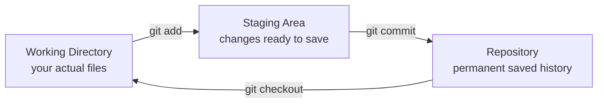
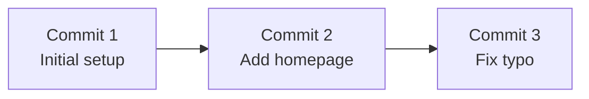
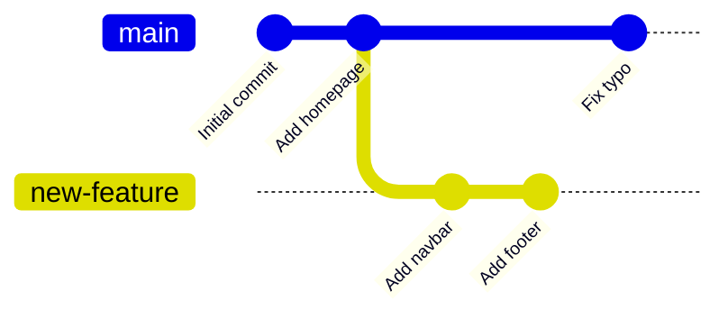
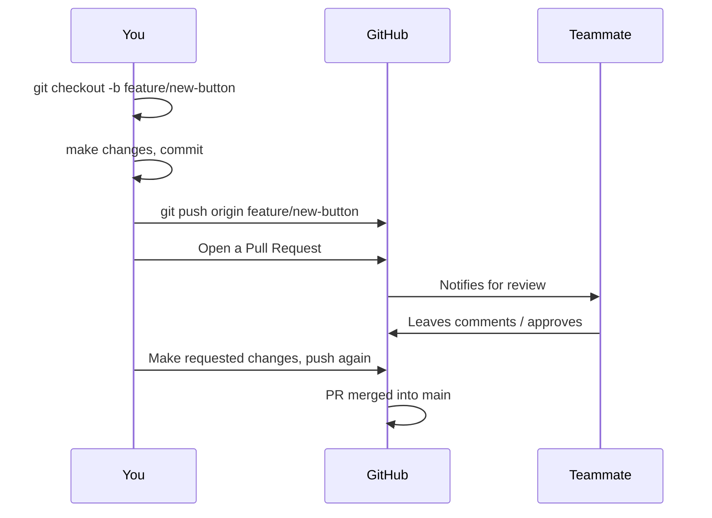

# Version Control — Beginner Guide

Imagine you're writing an essay and you keep saving new copies: `essay.docx`, `essay_v2.docx`, `essay_final.docx`, `essay_final_FINAL.docx`. It gets messy fast, and if two people edit it at once, you have no good way to combine their changes.

**Version control** solves this. It's a system that tracks every change you make to your files over time, lets you go back to any previous version, see exactly what changed and when, and lets multiple people work on the same project without overwriting each other's work.

**Git** is by far the most popular version control system, and it's essential for every professional developer. This guide covers Git fundamentals, and then the hosting platforms (GitHub, GitLab, Bitbucket) that are built on top of Git.

## Why this matters

Every company you'll work for uses Git. It's how code gets saved, shared, reviewed, and deployed. Without it, you cannot collaborate with other developers, and you have no safety net if you break something.

---

## Part 1: Git Fundamentals

### The three areas of a Git project

Git organizes your project into three conceptual areas:



- **Working directory** — the actual files on your computer that you edit in your code editor.
- **Staging area** (also called the "index") — a holding area where you put changes you're about to save. It lets you choose *exactly* which changes go into your next save.
- **Repository** (the ".git" folder) — the permanent, saved history of every commit you've ever made.

### Installing Git and creating a repository

To start tracking a folder with Git, you "initialize" it:

```bash
git init
```

This creates a hidden `.git` folder inside your project — that's where all the history lives. Nothing is tracked yet; you have to tell Git what to track.

### `git add` — staging changes

Let's say you created a file called `index.html`. Git sees it exists but isn't tracking it yet.

```bash
git status
```

This shows you what's changed. You'll see `index.html` listed as "untracked."

```bash
git add index.html
```

This moves `index.html` into the staging area — it's now ready to be saved. You can also stage everything at once:

```bash
git add .
```

### `git commit` — saving a snapshot

A commit is a permanent snapshot of your staged changes, with a message describing what you did.

```bash
git commit -m "Add homepage HTML structure"
```

Every commit has:
- A unique ID (a long string of letters/numbers, called a "hash")
- An author and timestamp
- A message explaining the change
- A link back to the previous commit (this is what forms the "history")



### Checking history

```bash
git log
```

Shows every commit in order, newest first, with its message and author.

### `git branch` — working on separate versions

A branch is an independent line of development. The default branch is usually called `main`. When you want to build a new feature without disturbing the working code, you create a new branch:

```bash
git branch new-feature      # create a branch
git checkout new-feature    # switch to it

# Or do both in one step:
git checkout -b new-feature
```

Now any commits you make happen on `new-feature`, leaving `main` untouched.



### `git merge` — combining branches back together

Once your feature is done and tested, you bring it back into `main`:

```bash
git checkout main
git merge new-feature
```

This takes all the commits made on `new-feature` and applies them onto `main`.

Sometimes Git can't automatically figure out how to combine two branches — this is called a **merge conflict**, and it happens when the same lines of a file were changed differently on both branches. Git will mark the conflicting lines in the file and ask you to manually decide what the final result should be, then you `git add` the resolved file and commit.

### A typical beginner workflow

```bash
git init                          # start tracking a project
git add .                         # stage all changes
git commit -m "Initial commit"    # save a snapshot

git checkout -b feature/login     # start a new branch
# ... make changes ...
git add .
git commit -m "Add login form"

git checkout main                 # go back to main
git merge feature/login           # bring the changes in
```

---

## Part 2: VCS Hosting — GitHub, GitLab, Bitbucket

Git itself runs entirely on your computer — it doesn't require the internet. But to collaborate with other people, you need a place to store a shared copy of the repository online. That's what hosting platforms provide.

### What they add on top of plain Git

| Feature | What it does |
|---|---|
| **Remote hosting** | Stores a copy of your repository in the cloud, so your team can all push/pull from the same place |
| **Pull Requests (PRs)** — called "Merge Requests" on GitLab | A structured way to propose merging one branch into another, with a space for review comments before it's accepted |
| **Issues** | A ticket-tracking system for bugs, feature requests, and tasks, linked directly to the code |
| **CI/CD** | Automatically runs tests, builds, and deployments whenever you push code |
| **Access control** | Manage who can view, edit, or approve changes to the repository |

The most popular platforms are **GitHub**, **GitLab**, and **Bitbucket**. They all build on the same underlying Git technology — the differences are mostly in their extra features, pricing, and ecosystem.

### Pushing your local repo to a remote

Once you've created an empty repository on GitHub (or similar), you connect your local repo to it:

```bash
git remote add origin https://github.com/yourname/your-repo.git
git push -u origin main
```

- `git remote add origin <url>` — tells Git "the remote called `origin` lives at this URL."
- `git push` — uploads your local commits to the remote.
- `-u` — remembers this remote/branch pairing so future `git push` calls (with no arguments) know where to send changes.

To get other people's changes onto your machine:

```bash
git pull
```

This downloads new commits from the remote and merges them into your current branch.

### The Pull Request workflow

This is how most professional teams collaborate:



1. You create a branch for your change.
2. You push that branch to the hosting platform.
3. You open a **Pull Request** — a proposal to merge your branch into `main`.
4. Teammates review your code, leave comments, request changes.
5. Once approved, the PR is merged, and your changes become part of the main codebase.

This review step is one of the most valuable parts of working on a team — it catches bugs, shares knowledge, and keeps code quality high before anything reaches production.

---

**Where this fits:** JavaScript → Version Control (Git) → Package Managers → Pick a Framework → Writing CSS → ...
