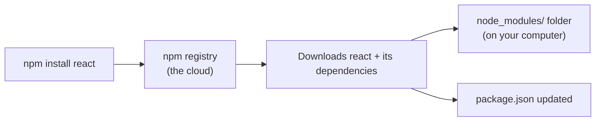
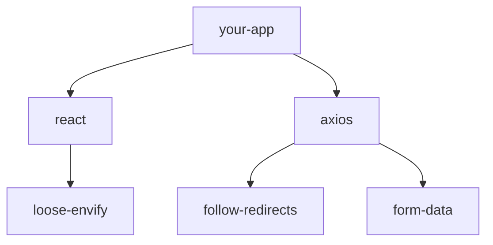
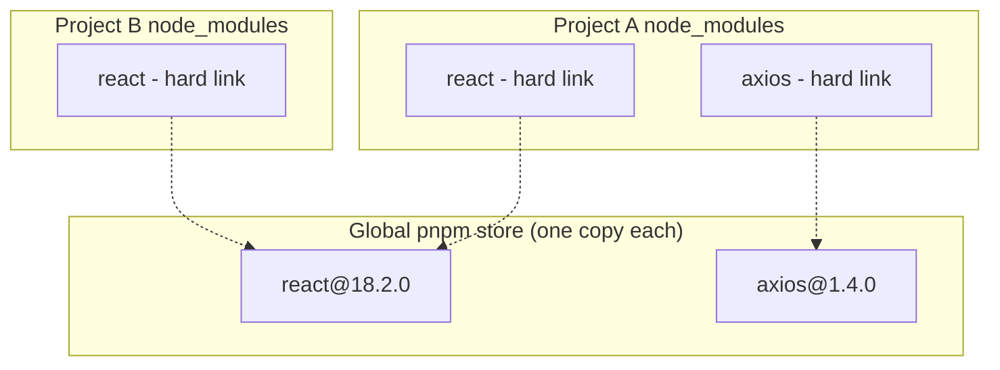

# Package Managers — Beginner Guide

When you build a website or app, you rarely write everything from scratch. You use code that other people have already written and published — things like React, date formatting libraries, or testing tools. These reusable pieces of code are called **packages** (or "libraries" / "dependencies").

A **package manager** is a tool that:
- Downloads packages your project needs from a public registry
- Keeps track of exactly which versions you're using
- Makes sure everyone on your team gets the exact same versions
- Lets you easily add, update, or remove packages

For JavaScript, the main package managers are **npm**, **pnpm**, and **yarn**. This guide explains what a package manager does, then compares the three.

## Why this matters

Without a package manager, you'd have to manually download every library's code, keep track of updates yourself, and hope everyone on your team has the exact same files. Package managers automate all of this — it's one of the first tools you'll touch on any real JavaScript project.

---

## Part 1: What is a package manager?

### `package.json` — your project's manifest

Every JavaScript project managed by npm (or pnpm/yarn) has a `package.json` file. It's a JSON file that describes your project: its name, version, and — most importantly — its **dependencies** (the packages it needs to run).

```json
{
  "name": "my-website",
  "version": "1.0.0",
  "dependencies": {
    "react": "^18.2.0",
    "axios": "^1.4.0"
  },
  "devDependencies": {
    "eslint": "^8.45.0"
  },
  "scripts": {
    "start": "node index.js",
    "build": "vite build"
  }
}
```

Breaking this down:
- **`dependencies`** — packages your app needs to actually run (e.g. React, if you're building a React app).
- **`devDependencies`** — packages only needed while developing (e.g. a linter, a testing tool) — not shipped to production.
- **`scripts`** — shortcuts for common commands. Running `npm run build` runs whatever command is listed under `"build"`.

### Installing your first package

```bash
npm install react
```

This does three things:
1. Downloads the `react` package (and anything *it* depends on) from the npm registry — a giant public repository of JavaScript packages.
2. Adds `"react": "^18.2.0"` (or whatever the latest version is) to your `package.json`.
3. Places the actual code inside a folder called `node_modules`.



### `node_modules` — where the code actually lives

Every package you install ends up inside a folder called `node_modules`. This folder can get huge — a simple project can have hundreds of packages once you count every dependency-of-a-dependency. You never edit files in here directly, and you never commit this folder to Git (it's always listed in `.gitignore`) — it can always be regenerated from `package.json`.

### Dependency resolution — what happens under the hood

Packages depend on other packages, which depend on other packages, and so on. When you install `react`, npm has to figure out the entire tree of everything it needs, pick compatible versions for each, and download them all. This process is called **dependency resolution**.



### Lockfiles — guaranteeing everyone gets the same versions

`package.json` often specifies version *ranges* (like `^18.2.0`, meaning "18.2.0 or any compatible newer version"). That's flexible, but it means two different people running `npm install` on different days could get slightly different versions.

To solve this, package managers create a **lockfile** — `package-lock.json` for npm, `pnpm-lock.yaml` for pnpm, `yarn.lock` for yarn. This file records the *exact* version of every single package (including nested dependencies) that was installed. As long as everyone commits and uses this lockfile, everyone gets identical installs.

**Always commit your lockfile to Git.** It's one of the most important habits to build early — it prevents "works on my machine" bugs caused by version mismatches.

---

## Part 2: npm vs pnpm vs yarn

All three do the same fundamental job — read `package.json`, resolve dependencies, download packages, write a lockfile — but they differ in speed, disk usage, and how they organize `node_modules`.

### npm — the default, built into Node.js

npm (Node Package Manager) comes bundled with Node.js, so it's always available with zero extra setup. It's the original and most widely used.

```bash
npm install          # install everything in package.json
npm install axios    # add a new package
npm uninstall axios  # remove a package
npm run build         # run a script
```

### yarn — created to fix npm's early weaknesses

Yarn was released by Facebook (Meta) years ago when npm was slower and less reliable. Modern npm has closed most of that gap, but yarn remains popular, especially "Yarn Berry" (yarn v2+) with extra features like Plug'n'Play (an alternative to `node_modules` entirely).

```bash
yarn install    # or just `yarn`
yarn add axios
yarn remove axios
yarn build
```

### pnpm — focused on speed and disk space

pnpm ("performant npm") takes a fundamentally different approach to storing packages, which makes it much faster and far more disk-efficient — especially if you work on multiple projects.

```bash
pnpm install
pnpm add axios
pnpm remove axios
pnpm build
```

### How pnpm saves disk space: the content-addressable store

Normally, if you have 10 projects that all use `react`, npm and yarn would download and store 10 separate copies of `react` inside 10 separate `node_modules` folders.

pnpm instead keeps **one single global store** on your computer (usually in your home directory). Every version of every package is stored there exactly once. When a project needs `react`, pnpm creates **hard links** (lightweight references, not copies) from that project's `node_modules` back to the single global copy.



This is why pnpm uses drastically less disk space when you have many projects — the actual files exist only once on your machine.

### Quick comparison table

| | npm | yarn | pnpm |
|---|---|---|---|
| Comes pre-installed with Node.js | Yes | No | No |
| Install speed | Good | Good | Fastest (usually) |
| Disk usage | Highest (duplicates packages per project) | High | Lowest (shared global store) |
| Lockfile | `package-lock.json` | `yarn.lock` | `pnpm-lock.yaml` |
| Good for monorepos | OK (needs workspaces config) | Good (workspaces) | Excellent (built for this) |
| Popularity | Most widely used, default choice | Popular, especially older projects | Growing fast, especially performance-focused teams |

### Which one should you pick as a beginner?

Just use **npm** to start — it comes with Node.js, so there's nothing extra to install, and virtually every tutorial assumes it. Once you're comfortable, try pnpm on a personal project to feel the speed and disk-space difference for yourself.

---

**Where this fits:** JavaScript → Version Control (Git) → Package Managers → Pick a Framework → Writing CSS → ...
