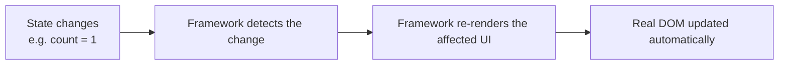
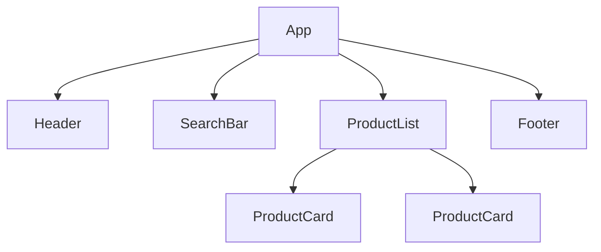

# Pick a Framework — Beginner Guide

So far, everything you've learned — HTML, CSS, JavaScript, DOM manipulation — can build a working website. So why does almost every professional frontend job use a "framework" like React, Vue, or Angular on top of that? This guide explains why frameworks exist, then walks through the major options so you can understand what each one is and when people choose it.

## Why this matters

Frameworks are how real-world frontend teams build and maintain large, interactive applications without the codebase collapsing into chaos. Nearly every frontend job posting names a specific framework — knowing why they exist (not just how to use one) will make you a much stronger developer.

---

## Part 1: Why frontend frameworks exist

### The problem with plain DOM manipulation

Remember from the JavaScript lessons: you select an element, then manually update it when something changes.

```js
const countEl = document.querySelector("#count");
let count = 0;

button.addEventListener("click", () => {
  count++;
  countEl.textContent = count; // you must remember to update the DOM yourself
});
```

This is fine for one counter. Now imagine a page with 50 pieces of changing data — a shopping cart total, a list of items, a user's login state, a search filter — all needing to stay in sync with what's on screen, and all interacting with each other. Manually tracking "what changed, and which DOM elements need updating because of it" becomes extremely error-prone as an app grows.

### Declarative UI — describing "what," not "how"

Plain JavaScript DOM manipulation is **imperative**: you write step-by-step instructions for *how* to change the page ("find this element, set its text, add this class").

Frameworks let you write **declarative** UI instead: you describe *what* the page should look like for a given piece of data, and the framework figures out how to make the real DOM match it.

```jsx
// Declarative (React) — describe WHAT the UI should look like
function Counter() {
  const [count, setCount] = useState(0);
  return (
    <div>
      <p>{count}</p>
      <button onClick={() => setCount(count + 1)}>Add</button>
    </div>
  );
}
```

You never manually touch the DOM here. You say "the count should display `count`," and whenever `count` changes, the framework updates the page automatically.



### The component model

Frameworks let you break your UI into **components** — small, reusable, self-contained pieces (a button, a search bar, a whole page) that manage their own data and can be combined like building blocks.

```jsx
function App() {
  return (
    <div>
      <Header />
      <SearchBar />
      <ProductList />
      <Footer />
    </div>
  );
}
```

Each of `Header`, `SearchBar`, `ProductList`, `Footer` is its own component — built once, reused anywhere, tested independently, and easy to reason about in isolation.



### Reactivity — the magic that keeps UI in sync

"Reactivity" means: when your data changes, the framework automatically knows which parts of the UI depend on that data and updates only those parts — without you writing manual DOM update code.

| Approach | Who tracks what changed and updates the DOM? |
|---|---|
| Vanilla JS | You, manually, every time |
| Framework (React, Vue, etc.) | The framework, automatically |

This is the single biggest reason frameworks exist: **they turn "keeping the UI in sync with data" from a manual chore into an automatic guarantee.**

---

## Part 2: Comparing the major frameworks

### React

Created by Facebook (Meta). By far the most widely used framework in job postings today. Uses a "virtual DOM" — it builds a lightweight in-memory copy of the UI, compares it to the previous version when state changes, and only updates the real DOM where something actually differs.

```jsx
function Greeting({ name }) {
  return <h1>Hello, {name}!</h1>;
}
```

- **Reactivity model**: Virtual DOM diffing, driven by explicit `useState`/`useReducer` hooks.
- **Learning curve**: Moderate — JSX (mixing HTML-like syntax into JS) feels unusual at first.
- **Ecosystem**: Enormous — most third-party libraries, most job postings, most tutorials.
- **Pick this if**: You want the largest job market, the biggest community, and the most learning resources.

### Vue.js

Created by Evan You. Known for being approachable and using plain HTML templates that feel closer to what beginners already know.

```vue
<template>
  <h1>Hello, {{ name }}!</h1>
</template>

<script setup>
import { ref } from "vue";
const name = ref("Alex");
</script>
```

- **Reactivity model**: Built-in reactive objects/refs — Vue automatically tracks what data a template uses and updates only that part when it changes.
- **Learning curve**: Gentle — templates look like regular HTML with small additions.
- **Ecosystem**: Strong, especially in Asia and parts of Europe; smaller than React's but very well-maintained official tooling (router, state management built by the same team).
- **Pick this if**: You want something beginner-friendly with official, cohesive tooling out of the box.

### Angular

Created and maintained by Google. A full, opinionated framework — not just a UI library — with routing, forms, HTTP handling, and dependency injection built in from day one.

```typescript
@Component({
  selector: "app-greeting",
  template: `<h1>Hello, {{ name }}!</h1>`,
})
export class GreetingComponent {
  name = "Alex";
}
```

- **Reactivity model**: Traditionally "change detection" checking the whole component tree; newer versions (Angular 17+) added "Signals" for fine-grained reactivity similar to Vue/Solid.
- **Learning curve**: Steepest of the major frameworks — requires learning TypeScript, dependency injection, and Angular's own conventions.
- **Ecosystem**: Large, especially in enterprise companies; everything is built-in rather than picking separate libraries.
- **Pick this if**: You're joining (or targeting) a large enterprise company that already uses Angular, or you want a fully "batteries-included" framework.

### Svelte

Created by Rich Harris. Unlike React/Vue, Svelte is a **compiler** — it turns your component code into small, highly optimized vanilla JavaScript at build time, rather than shipping a framework runtime to the browser.

```svelte
<script>
  let name = "Alex";
</script>

<h1>Hello, {name}!</h1>
```

- **Reactivity model**: Compile-time — the compiler analyzes your code and inserts precise DOM update instructions directly; no virtual DOM, no runtime diffing.
- **Learning curve**: Very gentle — code often looks like plain HTML/JS with minimal extra syntax.
- **Ecosystem**: Smaller than React/Vue but growing, with SvelteKit as its official full-stack framework.
- **Pick this if**: You want the smallest bundle sizes and simplest-looking code, and don't need React's massive ecosystem.

### Solid JS

Created by Ryan Carniato. Looks similar to React (JSX-based) but has a fundamentally different reactivity engine — no virtual DOM at all.

```jsx
function Greeting() {
  const [name] = createSignal("Alex");
  return <h1>Hello, {name()}!</h1>;
}
```

- **Reactivity model**: Fine-grained "signals" — each piece of state tracks exactly which DOM nodes use it and updates them directly, with no re-rendering of whole components.
- **Learning curve**: Moderate — familiar if you know React, but signals behave differently from React state (note the `name()` function call above, not just `name`).
- **Ecosystem**: Smaller, newer, but well-regarded for performance.
- **Pick this if**: You want React-like syntax with significantly better raw performance, and don't need React's ecosystem size.

### Qwik

Created by Misko Hevery (also an original Angular creator). Designed around an idea called "resumability" — instead of re-running all your JavaScript on page load like other frameworks, Qwik ships almost no JavaScript initially and only loads/executes the exact code needed when a user actually interacts with something.

```jsx
export const Greeting = component$(() => {
  const name = useSignal("Alex");
  return <h1>Hello, {name.value}!</h1>;
});
```

- **Reactivity model**: Fine-grained signals, combined with lazy-loading individual pieces of component code on interaction.
- **Learning curve**: Moderate — the concepts (resumability, `$` markers for lazy boundaries) are genuinely new, even for experienced React developers.
- **Ecosystem**: Newest and smallest of this list.
- **Pick this if**: You're building a content-heavy site where extremely fast initial page load matters most (e.g. e-commerce, marketing sites), and you're comfortable with a newer, smaller ecosystem.

### At-a-glance summary

| Framework | Reactivity | Learning curve | Ecosystem size | Best for |
|---|---|---|---|---|
| React | Virtual DOM diffing | Moderate | Largest | Job market, huge community |
| Vue.js | Reactive refs/objects | Gentle | Large | Beginner-friendly, official tooling |
| Angular | Change detection (+ Signals) | Steep | Large (enterprise) | Big companies, all-in-one framework |
| Svelte | Compile-time | Gentle | Medium, growing | Small bundles, simple syntax |
| Solid JS | Fine-grained signals | Moderate | Small | React-like syntax, top performance |
| Qwik | Signals + resumability | Moderate–steep | Smallest | Instant page loads, content sites |

### How to actually choose as a beginner

Pick **React**. It has the most tutorials, the most job postings, the biggest community for getting help when you're stuck, and the concepts you learn (components, one-way data flow, hooks-style state) transfer reasonably well to every other framework on this list. You can explore Vue, Svelte, or others later once you're comfortable with the core ideas.

---

**Where this fits:** JavaScript → Version Control (Git) → Package Managers → Pick a Framework → Writing CSS → ...
