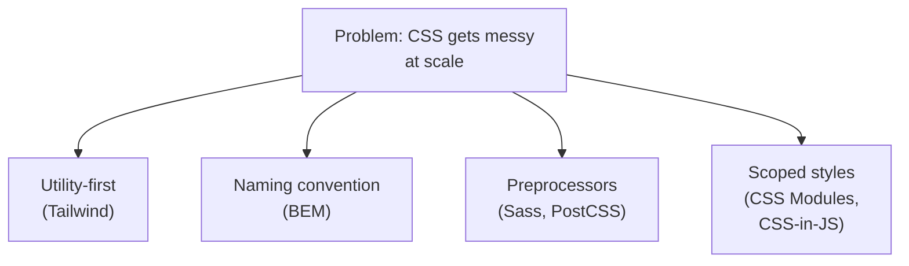
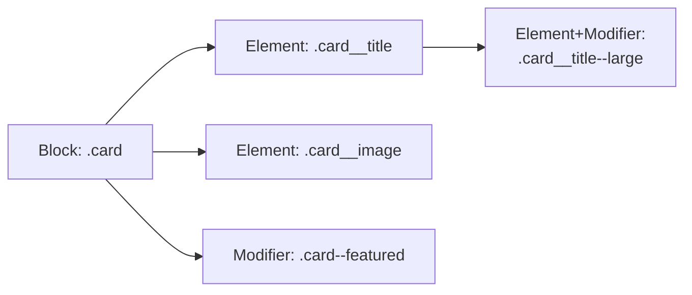
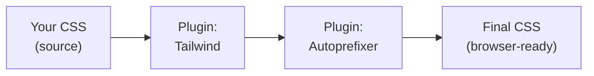

# Writing CSS (Beginner)

Welcome! By now you know basic CSS — colors, box model, flexbox, maybe grid. This module is about **how professional teams actually organize and write CSS** in real projects. Writing CSS for a 5-page personal site is very different from writing CSS for an app with hundreds of components built by a team of 20 people. That's the problem the tools in this module solve.

We'll cover:
1. Tailwind CSS (utility-first CSS)
2. BEM (a naming convention for plain CSS)
3. CSS Preprocessors — Sass and PostCSS
4. A quick look at CSS-in-JS, CSS Modules, and Styled Components

---

## 1. Why does "how you write CSS" even matter?

If you've only ever written CSS for small projects, you might not have hit the pain yet. Here's the pain, in plain language:

- **Global namespace problem**: every CSS class you write is available everywhere in your whole site. If you write `.card { color: red; }` in one file, and someone else — or even you, six months later — writes `.card { color: blue; }` in another file, one of them wins and you get a bug that's very confusing to track down.
- **Growing files**: a single `style.css` file can grow to thousands of lines. Finding "where is the CSS for the login button" becomes a search-and-guess exercise.
- **No clear connection to HTML**: when you look at a `<div class="box">`, there's no way to know, just by reading the HTML, what `.box` actually looks like or whether it's safe to reuse elsewhere.

The tools below are different **strategies** people invented to solve these problems. There's no single "correct" one — different teams pick different strategies — but you'll meet all of them in real jobs, so let's understand each one.



---

## 2. Tailwind CSS — utility-first CSS

### What is it?

Normally, you write CSS like this:

```css
/* styles.css */
.card {
  background-color: white;
  padding: 16px;
  border-radius: 8px;
  box-shadow: 0 1px 3px rgba(0,0,0,0.1);
}
```

```html
<div class="card">Hello</div>
```

You invent a class name (`card`), then define what it means in a separate CSS file. This is the traditional approach.

**Tailwind CSS flips this around.** Instead of inventing your own class names, you use Tailwind's ready-made "utility classes" — small classes that each do exactly **one** small thing — directly in your HTML:

```html
<div class="bg-white p-4 rounded-lg shadow">Hello</div>
```

Let's break that down:
- `bg-white` → `background-color: white;`
- `p-4` → `padding: 1rem;` (16px)
- `rounded-lg` → `border-radius: 0.5rem;`
- `shadow` → a preset box-shadow

You never leave your HTML file. You never write a `.css` file with custom class names. You just combine small utility classes like Lego bricks.

### A full worked example

Say we want a simple profile card.

**Without Tailwind (traditional CSS):**

```html
<div class="profile-card">
  
  <h2 class="profile-name">Jane Doe</h2>
  <p class="profile-role">Frontend Developer</p>
</div>
```

```css
.profile-card {
  display: flex;
  flex-direction: column;
  align-items: center;
  padding: 24px;
  background: white;
  border-radius: 12px;
  box-shadow: 0 2px 8px rgba(0,0,0,0.1);
}
.profile-avatar {
  width: 80px;
  height: 80px;
  border-radius: 9999px;
  margin-bottom: 12px;
}
.profile-name {
  font-size: 1.25rem;
  font-weight: 600;
  margin: 0;
}
.profile-role {
  color: #6b7280;
  margin: 4px 0 0;
}
```

**With Tailwind (utility-first):**

```html
<div class="flex flex-col items-center p-6 bg-white rounded-xl shadow-md">
  
  <h2 class="text-xl font-semibold m-0">Jane Doe</h2>
  <p class="text-gray-500 mt-1">Frontend Developer</p>
</div>
```

Notice: **zero CSS files needed.** Everything is expressed as classes right in the markup.

### Why would anyone want this?

It sounds strange at first ("isn't that just inline styles with extra steps?"), but it has real benefits:

- You never have to invent a class name (naming things is hard!).
- You never leave the HTML file to check what a style does — it's all right there.
- Because everyone reuses the same small set of utilities, your CSS file barely grows even as your app grows (Tailwind only includes the utilities you actually used).
- Deleting a component means deleting its CSS too — no orphaned, unused CSS left behind.

### How Tailwind works under the hood (very briefly)

Tailwind scans your project's files (HTML, JSX, etc.), looks for which utility class names you actually used, and generates a CSS file containing **only** those. This is why you must tell Tailwind where your files live, using a `content` (or `tailwind.config.js`) setting — more on this "gotcha" in the Intermediate guide.

---

## 3. BEM — a naming convention for plain CSS

Not every team uses Tailwind. Many teams still write regular CSS, and to avoid the "global namespace" mess described earlier, they follow a **naming convention** — an agreed-upon pattern for naming classes so nothing collides and everything is predictable.

**BEM** stands for **Block, Element, Modifier**. It's not a tool or a library — it's just a set of rules you and your team agree to follow when naming CSS classes.

- **Block**: a standalone, reusable component. E.g. `card`, `menu`, `button`.
- **Element**: a part *inside* a block that has no meaning outside of it. Written as `block__element`. E.g. `card__title`, `menu__item`.
- **Modifier**: a variant or state of a block/element. Written as `block--modifier` or `block__element--modifier`. E.g. `button--disabled`, `card__title--large`.

### Worked example

```html
<div class="card">
  
  <h3 class="card__title card__title--large">Mountain Trip</h3>
  <p class="card__description">A trip through the Alps.</p>
  <button class="card__button card__button--disabled">Book now</button>
</div>
```

```css
.card {
  border: 1px solid #e5e7eb;
  border-radius: 8px;
  padding: 16px;
}

.card__image {
  width: 100%;
  border-radius: 4px;
}

.card__title {
  font-size: 1rem;
  font-weight: 600;
}

.card__title--large {
  font-size: 1.5rem;
}

.card__description {
  color: #6b7280;
}

.card__button {
  padding: 8px 16px;
  background: #2563eb;
  color: white;
  border: none;
  border-radius: 4px;
}

.card__button--disabled {
  background: #9ca3af;
  cursor: not-allowed;
}
```

### Why does this help?

Because every class name tells you **exactly** where it belongs, just by reading it:
- `card__title` — "this is the title, and it only makes sense inside a `card`."
- `card--featured` — "this is a variant of the whole card."

This means two different developers can never accidentally create a naming collision, because the block name is baked into every class name. It also makes CSS files easier to search: searching for `card__` shows you everything related to the card component.



---

## 4. CSS Preprocessors: Sass

Plain CSS, for a long time, lacked features that regular programming languages have — variables, reusable logic, nesting. **Sass** (Syntactically Awesome StyleSheets) is a preprocessor: you write your styles in an enhanced language (`.scss` files), and a build tool compiles it down into plain `.css` that browsers understand.

> Note: modern CSS actually has native variables (`--custom-property`) and native nesting now, so Sass is less essential than it used to be — but it's still extremely common in real codebases, so you need to recognize it.

### Variables

```scss
// _variables.scss
$primary-color: #2563eb;
$spacing-unit: 8px;

.button {
  background-color: $primary-color;
  padding: $spacing-unit * 2;
}
```

Compiles to:

```css
.button {
  background-color: #2563eb;
  padding: 16px;
}
```

### Nesting

Instead of repeating the parent selector, you can nest child selectors inside it, which mirrors your HTML structure and is easier to read:

```scss
.card {
  padding: 16px;

  .card__title {
    font-size: 1.25rem;

    &:hover {
      color: $primary-color;
    }
  }
}
```

The `&` symbol means "the parent selector" — so `&:hover` becomes `.card__title:hover`.

Compiles to:

```css
.card {
  padding: 16px;
}
.card .card__title {
  font-size: 1.25rem;
}
.card .card__title:hover {
  color: #2563eb;
}
```

### Mixins (reusable chunks of CSS)

A mixin is like a function for CSS — you define a reusable block of styles once, and "call" it wherever you need it.

```scss
@mixin flex-center {
  display: flex;
  align-items: center;
  justify-content: center;
}

.modal {
  @include flex-center;
  height: 100vh;
}

.button-group {
  @include flex-center;
  gap: 8px;
}
```

Compiles to:

```css
.modal {
  display: flex;
  align-items: center;
  justify-content: center;
  height: 100vh;
}
.button-group {
  display: flex;
  align-items: center;
  justify-content: center;
  gap: 8px;
}
```

Notice how the mixin saved us from typing the same three lines twice.

---

## 5. PostCSS — the plugin pipeline

**PostCSS** is different from Sass in an important way: Sass is a full language with its own syntax rules. **PostCSS is a tool that transforms CSS using plugins** — it takes your CSS, runs it through a chain (pipeline) of small plugins, and each plugin does one job.

Common PostCSS plugins:
- **Autoprefixer**: automatically adds vendor prefixes like `-webkit-` so your CSS works across different browsers, without you typing them by hand.
- **postcss-preset-env**: lets you use tomorrow's CSS syntax today, and converts it to something today's browsers understand.

You write:

```css
.box {
  display: flex;
  user-select: none;
}
```

Autoprefixer outputs:

```css
.box {
  display: flex;
  -webkit-user-select: none;
  -moz-user-select: none;
  user-select: none;
}
```

You never typed the prefixed versions — the plugin pipeline added them automatically at build time.

**Important fact**: Tailwind CSS itself is actually built as a PostCSS plugin! When you set up Tailwind, you're really setting up a PostCSS pipeline where one of the plugins is Tailwind.



---

## 6. A quick mention: CSS-in-JS, CSS Modules, Styled Components

You'll hear these terms a lot, especially in React projects. You don't need to master them yet — just know what they are:

- **CSS Modules**: files named like `Card.module.css`. When imported into a JS/React component, class names are automatically made unique behind the scenes (e.g. `card` becomes `card_a1b2c3`), so styles never leak or collide between components — similar goal to BEM, but enforced automatically by the build tool instead of by a naming convention you have to remember.

  ```css
  /* Card.module.css */
  .title { font-weight: 600; }
  ```
  ```jsx
  import styles from './Card.module.css';
  function Card() {
    return <h2 className={styles.title}>Hello</h2>;
  }
  ```

- **Styled Components** (a popular CSS-in-JS library): you write actual CSS *inside* your JavaScript/React file, attached to a component:

  ```jsx
  import styled from 'styled-components';

  const Title = styled.h2`
    font-weight: 600;
    color: #2563eb;
  `;

  function Card() {
    return <Title>Hello</Title>;
  }
  ```

- **CSS-in-JS** is the general category name for this approach (Styled Components is one library that does it; there are others like Emotion).

Each of these solves the same core problem (avoiding style collisions, keeping styles close to their component) with a different mechanism. You'll likely encounter at least one of these in a real job.

---

## Summary table

| Approach | What it is | Where styles live |
|---|---|---|
| Tailwind CSS | Utility classes composed in HTML | In your markup |
| BEM | A naming convention for plain CSS | Separate `.css` files |
| Sass | A CSS preprocessor language (variables, nesting, mixins) | `.scss` files, compiled to CSS |
| PostCSS | A plugin pipeline that transforms CSS | Plugins configured in your build |
| CSS Modules | Auto-scoped CSS files per component | `.module.css` files |
| Styled Components / CSS-in-JS | CSS written inside JavaScript | Inside your `.jsx`/`.tsx` files |

---

**Where this fits**: this comes right after picking a frontend framework, and right before Build Tools — Pick a Framework → **Writing CSS** → Build Tools → Testing → Authentication Strategies.
