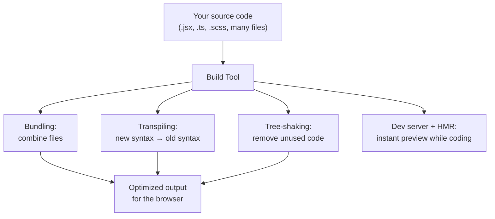

# Build Tools (Beginner)

You've written HTML, CSS, and JavaScript. But when you open a real-world frontend project on GitHub, you'll almost never find plain `.html`/`.css`/`.js` files that you just double-click to open in a browser. Instead you'll see commands like `npm run dev` or `npm run build`. This module explains **why**, and introduces the tools that make it happen.

We'll cover:
1. Why build tools exist at all
2. Module bundlers (Vite, Webpack, Rollup, Parcel, esbuild)
3. A note on SWC
4. Linters and formatters (ESLint vs Prettier)

---

## 1. Why do build tools exist?

Imagine you write modern JavaScript like this, split across multiple files, because splitting code into files keeps it organized:

```js
// math.js
export function add(a, b) {
  return a + b;
}
```

```js
// app.js
import { add } from './math.js';
console.log(add(2, 3));
```

You *can* actually load this directly in some modern browsers using `<script type="module">`. But real projects run into problems this simple setup can't solve alone:

- **Too many files, too many requests**: an app might import hundreds of small files. Loading each one as a separate network request is slow.
- **Browser compatibility**: not every browser supports every new JavaScript feature (or a framework's special syntax like JSX). You need to convert your code into something older/other browsers understand.
- **Big libraries have unused parts**: if you `import` a big library but only use one function from it, ideally you'd want to ship only that one function, not the whole library.
- **Slow feedback loop during development**: if every time you change a line of code you have to manually refresh the browser and lose your app's current state (like a filled-out form), that's painful and slows you down.

Build tools solve all four problems. Let's define each concept in plain language:

- **Bundling**: combining many small files into fewer, optimized files, so the browser has less work to do fetching them.
- **Transpiling**: converting code written in a newer or special syntax (modern JS, TypeScript, JSX) into plain JavaScript that browsers can run.
- **Tree-shaking**: automatically detecting and removing code that's never actually used, so it doesn't get shipped to users, keeping the final bundle smaller.
- **Dev server with HMR (Hot Module Replacement)**: a local server that watches your files, and when you save a change, instantly updates just that piece in the running browser page — without a full page reload, and without losing your app's current state.



---

## 2. Module Bundlers

A **module bundler** is the core piece of software that does the bundling/transpiling/tree-shaking described above. There are several popular ones — you'll meet different ones on different teams/projects.

### Vite

**Vite** (French for "fast") is the most popular modern choice for new projects. Its key trick: during development, it does **not** bundle your whole app up front. Instead it serves your files directly to the browser using native ES modules, and only transforms files as the browser actually requests them. This makes the dev server start almost instantly, even on large projects.

```bash
npm create vite@latest my-app
cd my-app
npm install
npm run dev
```

For production, Vite switches to using **Rollup** under the hood to create a fully bundled, optimized build.

### Webpack

**Webpack** was, for years, the dominant bundler in the JavaScript ecosystem. It's extremely configurable and powerful, using a config file (`webpack.config.js`) where you define "loaders" (to handle different file types like CSS or images) and "plugins" (to add extra build behavior).

```js
// webpack.config.js (simplified)
module.exports = {
  entry: './src/index.js',
  output: { filename: 'bundle.js' },
  module: {
    rules: [
      { test: /\.css$/, use: ['style-loader', 'css-loader'] },
    ],
  },
};
```

Webpack's power comes at a cost: its configuration has a reputation for being complex, and its dev server rebuild times can feel slower than newer tools, especially on large projects.

### Rollup

**Rollup** focuses specifically on producing very clean, efficient bundles — it pioneered a lot of the tree-shaking techniques used today. It's a popular choice for building **libraries** (packages published to npm) rather than full applications, because its output is lean.

### Parcel

**Parcel**'s pitch is "zero configuration" — you point it at your HTML file and it figures out the rest automatically, without you writing a config file at all. Great for quickly getting started without learning bundler configuration.

### esbuild

**esbuild** is a bundler written in Go (rather than JavaScript), which makes it dramatically faster at the raw tasks of bundling and transpiling — often 10-100x faster than JS-based tools for the same job. It's frequently used as a fast building block *inside* other tools (Vite uses esbuild for parts of its process) rather than as a full standalone solution for complex apps.

### Comparison table

| Tool | Known for | Common use case |
|---|---|---|
| Vite | Fast dev server, simple config | Most new projects today |
| Webpack | Maximum configurability | Large legacy/enterprise apps |
| Rollup | Clean, tree-shaken output | Publishing libraries |
| Parcel | Zero config | Quick prototypes, beginners |
| esbuild | Raw speed (written in Go) | Used inside other tools, fast scripts |

---

## 3. A note on SWC

**SWC** (Speedy Web Compiler) is another Go/Rust-style-fast tool, but written in Rust. It's not a bundler — it's a **compiler/transpiler**, meaning its job is converting modern JS/TypeScript/JSX into plain JavaScript, similar to what a tool called Babel has traditionally done, but much faster because it's written in a compiled language (Rust) instead of JavaScript. You'll often find SWC used inside other tools (like Next.js) as the piece responsible for fast transpilation.

---

## 4. Linters and Formatters: ESLint vs Prettier

These two tools are often confused by beginners because they both "check your code," but they do genuinely different jobs.

### ESLint — the linter

A **linter** analyzes your code for **potential bugs, bad practices, and style rule violations** — it looks at what your code *does*, not just how it looks.

```js
// ESLint can catch this:
function greet(name) {
  console.log(mesage); // typo: "mesage" is not defined — ESLint flags this
}
```

```js
// ESLint can also flag "code smells", e.g. unused variables:
function add(a, b) {
  const unused = 5; // ESLint: 'unused' is assigned a value but never used
  return a + b;
}
```

### Prettier — the formatter

A **formatter** only cares about *how your code looks* — spacing, line length, quote style, semicolons — not whether the code is logically correct.

```js
// Before Prettier
function add(a,b){return a+b}

// After Prettier (auto-formatted)
function add(a, b) {
  return a + b;
}
```

### The key distinction

| | ESLint (linter) | Prettier (formatter) |
|---|---|---|
| Job | Finds bugs & enforces code quality rules | Enforces consistent visual formatting |
| Example catch | Unused variable, undefined variable, unreachable code | Wrong indentation, missing/extra semicolons, quote style |
| Fixes code automatically? | Some rules, not all | Yes, always (that's its whole job) |

Most real projects use **both together**: ESLint for catching mistakes, Prettier for consistent style, configured to not conflict with each other.

### Example configs

```json
// .eslintrc.json (simplified)
{
  "extends": ["eslint:recommended"],
  "rules": {
    "no-unused-vars": "warn",
    "no-undef": "error"
  }
}
```

```json
// .prettierrc
{
  "semi": true,
  "singleQuote": true,
  "tabWidth": 2
}
```

---

## Summary

| Concept | What it means |
|---|---|
| Bundling | Combining many files into fewer optimized files |
| Transpiling | Converting new/special syntax into browser-compatible JS |
| Tree-shaking | Removing unused code from the final bundle |
| HMR | Instantly updating running code in the browser as you save files |
| Vite / Webpack / Rollup / Parcel / esbuild | Different bundlers, different trade-offs |
| SWC | A fast Rust-based transpiler, often used inside other tools |
| ESLint | Finds bugs and enforces code quality rules |
| Prettier | Enforces consistent code formatting/style |

---

**Where this fits**: Pick a Framework → Writing CSS → **Build Tools** → Testing → Authentication Strategies.
