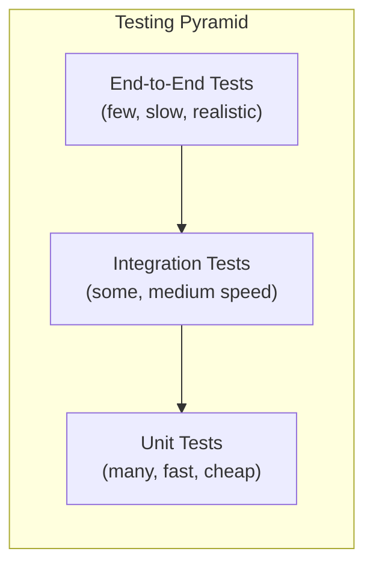

# Testing (Beginner)

You've built things with a framework, styled them, and set up build tools. But how do you know your code actually works — not just today, but after someone (maybe you) changes it in three months? That's what **testing** is for. This module introduces why testing matters and the main tools used to test frontend applications.

We'll cover:
1. Why testing matters
2. The testing pyramid (unit / integration / e2e)
3. Vitest and Jest (unit testing tools)
4. Playwright and Cypress (end-to-end testing tools)

---

## 1. Why does testing matter?

Imagine you build a `calculateDiscount` function. It works today because you tested it manually by clicking around in the browser. Six months later, a teammate changes some unrelated code, and — without realizing it — breaks `calculateDiscount`. Nobody notices until a customer complains that their discount is wrong.

**Automated tests** are code you write that checks your other code is behaving correctly — automatically, every time, without a human manually clicking through the app.

Why this matters:

- **Catches bugs early**: a test fails immediately when something breaks, often before the code even reaches a real user.
- **Enables confident changes**: if you have good tests, you can change code and know quickly whether you broke something, instead of being afraid to touch old code.
- **Acts as documentation**: a test that says `expect(calculateDiscount(100, 0.1)).toBe(90)` tells future readers exactly what the function is supposed to do.
- **Saves time long-term**: manually testing an entire app by clicking through it every time you make a change is slow and easy to get wrong; a computer running tests is fast and consistent.

---

## 2. The Testing Pyramid

Not all tests are the same. Some are fast and check tiny pieces of code; others are slow but check that the *whole app* works together, the way a real user would experience it. The **testing pyramid** is a way of visualizing how many of each kind of test you should typically have.



- **Unit tests** — test one small piece of code in isolation (a single function, a single component), pretending the rest of the app doesn't exist. Fast to run (thousands can run in seconds) and cheap to write, so you should have lots of them.
- **Integration tests** — test that several pieces work correctly *together* (e.g. a form component that calls an API function and updates the page). Slower than unit tests, and there should be a moderate number of them.
- **End-to-end (E2E) tests** — test the *entire app* running in a real browser, simulating an actual user: opening the app, clicking buttons, filling forms, checking the page updates correctly. These are the slowest and most expensive to write and maintain, so you should have the fewest of them, reserved for your most critical user flows (e.g. "can a user sign up and log in?").

The shape of the pyramid (wide at the bottom, narrow at the top) is a guideline: **many fast, cheap unit tests; fewer, more expensive, slower end-to-end tests.**

---

## 3. Unit testing: Vitest and Jest

Unit testing tools let you write small, isolated tests for individual functions or components. **Jest** has historically been the most popular JavaScript testing framework; **Vitest** is a newer tool, designed to work seamlessly with Vite-based projects, using a very similar (often near-identical) API to Jest.

### A Vitest example

Say we have a simple function:

```js
// sum.js
export function sum(a, b) {
  return a + b;
}
```

We write a test file next to it:

```js
// sum.test.js
import { describe, it, expect } from 'vitest';
import { sum } from './sum.js';

describe('sum', () => {
  it('adds two positive numbers', () => {
    expect(sum(2, 3)).toBe(5);
  });

  it('handles negative numbers', () => {
    expect(sum(-1, -1)).toBe(-2);
  });
});
```

Let's break this down:
- `describe(...)` groups related tests together under a label — purely organizational.
- `it(...)` (you'll also see `test(...)`, they're interchangeable) defines a single test case, with a human-readable description of what it checks.
- `expect(...)` wraps the actual value your code produced.
- `.toBe(...)` is a **matcher** — it states what you expect that value to equal. If the actual value doesn't match, the test fails and tells you exactly what was expected vs what was received.

Running `npx vitest` executes this file and reports pass/fail for each test.

### A Jest example

Jest tests look almost identical, on purpose (Vitest was designed to be a compatible alternative):

```js
// sum.js
function sum(a, b) {
  return a + b;
}
module.exports = { sum };
```

```js
// sum.test.js
const { sum } = require('./sum');

test('adds two positive numbers', () => {
  expect(sum(2, 3)).toBe(5);
});
```

Notice Jest doesn't require you to `import` `test`/`expect` — they're automatically available globally when Jest runs. Vitest, by contrast, generally wants you to import them explicitly (though it can also be configured for globals).

### What can a unit test check for a UI component?

Using a companion library called **Testing Library**, you can also unit-test React (or other framework) components:

```jsx
// Button.jsx
export function Button({ onClick, children }) {
  return <button onClick={onClick}>{children}</button>;
}
```

```jsx
// Button.test.jsx
import { render, screen, fireEvent } from '@testing-library/react';
import { Button } from './Button';

test('calls onClick when clicked', () => {
  const handleClick = vi.fn(); // a "mock" function that tracks calls
  render(<Button onClick={handleClick}>Click me</Button>);

  const button = screen.getByText('Click me');
  fireEvent.click(button);

  expect(handleClick).toHaveBeenCalledTimes(1);
});
```

This test renders the button in a simulated environment, clicks it programmatically, and checks that the click handler was actually called — all without opening a real browser.

---

## 4. End-to-end testing: Playwright and Cypress

Unit tests check small pieces in isolation. But what about checking that a real user, using a real browser, can actually complete a task on your live app — like logging in, adding an item to a cart, and checking out? That's what **end-to-end (E2E) testing tools** are for.

**Playwright** (by Microsoft) and **Cypress** are the two most popular E2E testing tools for the web. Both let you write a test script that automates a real browser: navigating to pages, clicking things, typing into forms, and asserting that the page shows what it should.

### A Playwright example

```js
// login.spec.js
import { test, expect } from '@playwright/test';

test('user can log in successfully', async ({ page }) => {
  await page.goto('https://example.com/login');

  await page.fill('input[name="email"]', 'user@example.com');
  await page.fill('input[name="password"]', 'password123');
  await page.click('button[type="submit"]');

  await expect(page.locator('h1')).toHaveText('Welcome back!');
});
```

Let's walk through it:
- `page.goto(...)` — opens the login page in a real (headless, meaning invisible-by-default) browser.
- `page.fill(...)` — types text into a form field, found via a CSS selector.
- `page.click(...)` — clicks a button.
- `expect(page.locator('h1')).toHaveText(...)` — asserts that after all that, the page actually shows the expected welcome heading.

This test runs an entire real user journey, in an actual browser engine, and fails loudly if any step doesn't behave as expected.

### Playwright vs Cypress — a first look

Both do fundamentally the same job (browser automation + assertions), with different design choices:

| | Playwright | Cypress |
|---|---|---|
| Browsers supported | Chromium, Firefox, WebKit (Safari engine) | Chromium-based browsers, plus experimental Firefox/WebKit |
| Runs tests in parallel across multiple tabs/browsers | Yes, built-in | More limited without paid features |
| Language support | JS/TS, Python, Java, .NET | JS/TS only |

You'll meet both in real jobs — which one a team uses is often just historical choice, and the core concepts transfer between them easily once you understand one.

---

## Summary

| Concept | What it means |
|---|---|
| Unit test | Tests one small isolated piece of code, fast and cheap |
| Integration test | Tests multiple pieces working together |
| E2E test | Tests the whole app in a real browser like a real user |
| Testing pyramid | Have many unit tests, some integration tests, few E2E tests |
| Vitest | Fast unit testing tool, great fit for Vite projects |
| Jest | The long-standing standard unit testing framework |
| Playwright | Modern E2E browser testing tool, multi-browser, multi-language |
| Cypress | Popular E2E browser testing tool, JS/TS-focused |

---

**Where this fits**: Pick a Framework → Writing CSS → Build Tools → **Testing** → Authentication Strategies.
