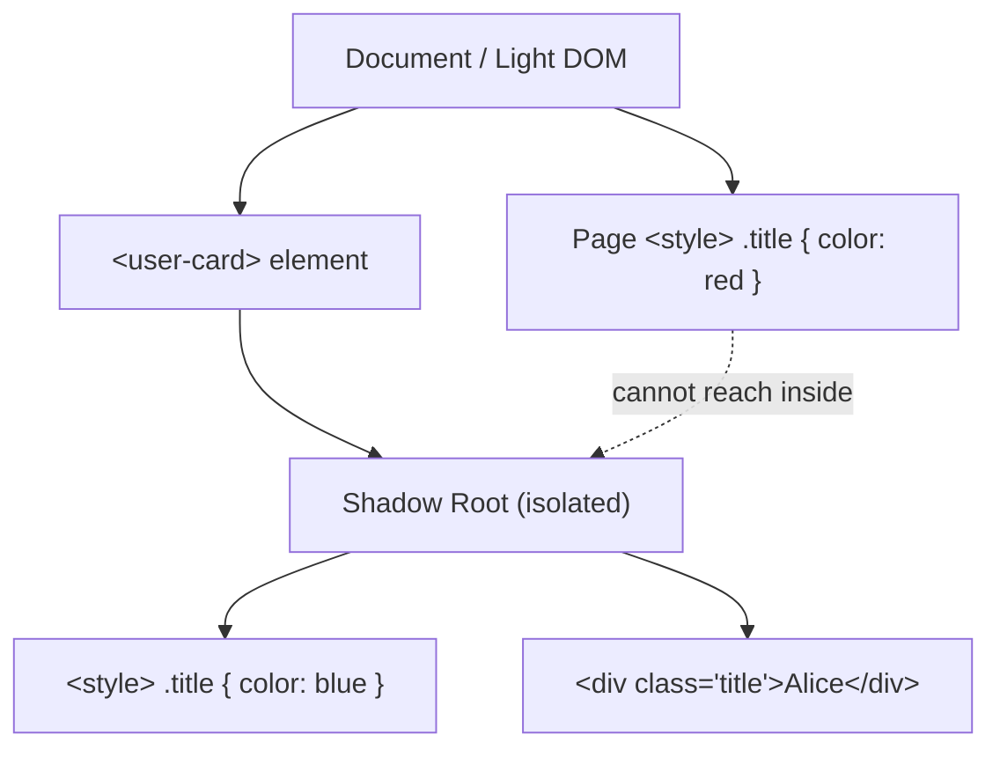

# Web Components — Beginner Guide

## What are Web Components?

Web Components are a set of **browser-native** APIs that let you create reusable, encapsulated custom HTML elements — without needing React, Vue, or any framework at all. They're built into the browser itself, meaning `<my-custom-button>` can work in any web page, regardless of what framework (or no framework) that page uses.

Three technologies make this possible:

1. **Custom Elements** — define your own HTML tags with custom behavior.
2. **HTML Templates** (`<template>`) — define reusable, inert HTML fragments.
3. **Shadow DOM** — encapsulate a component's internal markup and styles so they don't leak out or get affected by the outside page.

Let's go through each one.

---

## 1. Custom Elements

A Custom Element is just a class that extends `HTMLElement` and gets registered with a tag name. The tag name **must contain a hyphen** (e.g., `my-button`, `user-card`) — this is a deliberate rule so custom tags never collide with future standard HTML tags (which never contain hyphens).

### Defining a tag, step by step

```javascript
// Step 1: Create a class extending HTMLElement
class GreetingCard extends HTMLElement {
  connectedCallback() {
    // This runs automatically when the element is added to the page
    this.innerHTML = `<p>Hello, ${this.getAttribute('name') || 'stranger'}!</p>`;
  }
}

// Step 2: Register it with a tag name (must contain a hyphen)
customElements.define('greeting-card', GreetingCard);
```

```html
<!-- Step 3: Use it anywhere in your HTML, just like a built-in tag -->
<greeting-card name="Alice"></greeting-card>
<greeting-card name="Bob"></greeting-card>
```

This renders:
```
Hello, Alice!
Hello, Bob!
```

### Lifecycle callbacks

Custom Elements have special methods the browser calls automatically at certain moments:

| Callback | Called when |
|----------|-------------|
| `connectedCallback()` | Element is inserted into the DOM |
| `disconnectedCallback()` | Element is removed from the DOM |
| `attributeChangedCallback(name, oldVal, newVal)` | A watched attribute changes |
| `observedAttributes` (static getter) | Declares which attributes to watch |

```javascript
class GreetingCard extends HTMLElement {
  static get observedAttributes() {
    return ['name']; // watch the "name" attribute
  }

  attributeChangedCallback(name, oldValue, newValue) {
    if (name === 'name') {
      this.innerHTML = `<p>Hello, ${newValue}!</p>`;
    }
  }

  connectedCallback() {
    if (!this.innerHTML) {
      this.innerHTML = `<p>Hello, ${this.getAttribute('name') || 'stranger'}!</p>`;
    }
  }
}
customElements.define('greeting-card', GreetingCard);
```

**Why this matters:** These callbacks are like React's `useEffect` or Vue's lifecycle hooks, but built directly into the browser — no library required.

---

## 2. HTML Templates (`<template>`)

The `<template>` tag lets you define a chunk of HTML that the browser **parses but does not render**. Nothing inside a `<template>` shows up on the page or runs (images don't load, scripts don't execute) until you explicitly clone it into the document with JavaScript.

```html
<template id="card-template">
  <div class="card">
    <h3 class="card-title"></h3>
    <p class="card-body"></p>
  </div>
</template>
```

```javascript
// Clone and use the template
const template = document.getElementById('card-template');
const clone = template.content.cloneNode(true); // deep clone the content

clone.querySelector('.card-title').textContent = 'My Card';
clone.querySelector('.card-body').textContent = 'This is the card content.';

document.body.appendChild(clone);
```

**Why this matters:** Templates are the standard way to define a component's "blueprint" HTML once, then stamp out many instances of it efficiently — this is exactly what Custom Elements use internally to build their markup.

---

## 3. Shadow DOM

The Shadow DOM is the encapsulation piece. It creates a **separate, isolated DOM tree** attached to an element — the "shadow root" — whose internal markup and CSS are hidden from (and protected from) the rest of the page.

### Why encapsulation matters

Without Shadow DOM, if your component uses a class like `.title`, and the parent page also has CSS targeting `.title`, the styles will clash. Shadow DOM solves this: CSS written inside the shadow root **only applies inside that shadow tree**, and outside CSS **cannot reach inside** it (with a few controlled exceptions like CSS custom properties).

### Code example

```javascript
class UserCard extends HTMLElement {
  connectedCallback() {
    // Attach a shadow root — "open" means JS outside can still inspect it via .shadowRoot
    const shadow = this.attachShadow({ mode: 'open' });

    shadow.innerHTML = `
      <style>
        /* This CSS is scoped ONLY to this component's shadow tree */
        .title {
          color: blue;
          font-weight: bold;
        }
      </style>
      <div class="title">${this.getAttribute('username')}</div>
    `;
  }
}

customElements.define('user-card', UserCard);
```

```html
<style>
  /* This page-level CSS does NOT affect the .title inside the shadow DOM */
  .title { color: red; }
</style>

<user-card username="Alice"></user-card>
<!-- Renders "Alice" in BLUE, not red — shadow DOM styles win inside the shadow tree -->
```



**Why this matters:** This is the same trick CSS-in-JS libraries and CSS Modules try to achieve in frameworks — Shadow DOM gives you real style isolation natively, with zero build tooling or naming conventions needed.

---

## Putting it all together

```javascript
class RatingWidget extends HTMLElement {
  connectedCallback() {
    const shadow = this.attachShadow({ mode: 'open' });
    const rating = this.getAttribute('stars') || '0';

    shadow.innerHTML = `
      <style>
        .stars { color: gold; font-size: 1.5rem; }
      </style>
      <span class="stars">${'★'.repeat(rating)}${'☆'.repeat(5 - rating)}</span>
    `;
  }
}
customElements.define('rating-widget', RatingWidget);
```

```html
<rating-widget stars="4"></rating-widget>
<!-- Displays: ★★★★☆, fully self-contained and style-isolated -->
```

---

## Why this matters as a framework-agnostic alternative

Web Components are **built into the browser** — no build step, no framework runtime, no version upgrades to manage. A component you write today will keep working in browsers for years without needing to be "ported" to whatever framework is popular next.

This makes them especially useful for:
- **Design systems** shared across teams using different frameworks (one team uses React, another uses Vue — both can use the same `<my-button>`).
- **Widgets embedded on third-party sites** (like a chat widget or payment button) where you can't control what framework the host page uses.
- **Long-lived components** that need to outlive any particular framework's popularity cycle.

The tradeoff: Web Components have a more verbose, lower-level API than frameworks like React, and things like reactive state management or complex data binding need to be built by hand (or via a lightweight helper library like Lit).

---

## Where this fits

Web Components sits alongside Type Checkers, after Web Security Basics, in the frontend roadmap — both are "how do I build robust, reusable UI" topics that precede learning Server-Side Rendering (SSR).
