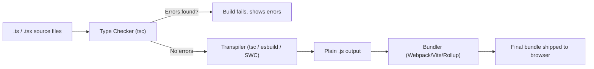

# Type Checkers (TypeScript) — Beginner Guide

## What problem does a type checker solve?

JavaScript is **dynamically typed** — a variable can hold any type of value, and the JavaScript engine only discovers type mismatches while your code is actually **running** (at "runtime"). This means bugs like calling `.toUpperCase()` on a number, or passing a string where a function expects an object, often aren't caught until a user actually triggers that exact code path in production.

**TypeScript** is a "type checker" — technically a superset of JavaScript that adds a type system on top. It checks your code **before it ever runs**, at "compile time" (when your code is being built/transpiled), catching an entire category of bugs before they ship.

### Compile-time vs runtime errors

| | Runtime error (plain JS) | Compile-time error (TypeScript) |
|---|---|---|
| **When caught** | While the program is executing (maybe in production!) | While writing/building code, before it ever runs |
| **Example** | `undefined is not a function` in the browser console | Red squiggly line in your editor, or a build failure |
| **Who sees it** | Possibly your users | Only you, the developer |

### A simple before/after example

**Plain JavaScript (bug only found at runtime):**

```javascript
function getDiscountedPrice(price, discountPercent) {
  return price - (price * discountPercent) / 100;
}

// Looks fine... until someone calls it wrong:
getDiscountedPrice("49.99", 10);
// "49.99" - ("49.99" * 10) / 100
// JavaScript coerces types silently — this doesn't throw an error!
// It actually returns 44.991, which LOOKS plausible but the math is
// happening on a mix of string/number in a confusing way, and
// nothing warns you that "49.99" should have been a number.
```

**TypeScript (bug caught immediately, before running anything):**

```typescript
function getDiscountedPrice(price: number, discountPercent: number): number {
  return price - (price * discountPercent) / 100;
}

getDiscountedPrice("49.99", 10);
// Compile error, right in your editor:
// Argument of type 'string' is not assignable to parameter of type 'number'.
```

TypeScript stops you from even building the project until you fix this — turning a subtle runtime bug into an obvious, immediate compile-time error.

**Why this matters:** As codebases grow to hundreds of files and many developers, it becomes impossible to manually remember every function's expected input types. TypeScript acts as living, enforced documentation that catches mistakes automatically, as you type.

---

## Basic Syntax

### Type annotations

You add a type after a colon `:` for variables, function parameters, and return values.

```typescript
let username: string = "alice";
let age: number = 30;
let isActive: boolean = true;
let tags: string[] = ["admin", "editor"]; // an array of strings

function greet(name: string): string {
  return `Hello, ${name}!`;
}
```

### Interfaces

An `interface` describes the **shape** of an object — what properties it must have, and their types.

```typescript
interface User {
  id: number;
  name: string;
  email: string;
  isAdmin?: boolean; // the "?" makes this property optional
}

function printUser(user: User): void {
  console.log(`${user.name} (${user.email})`);
}

printUser({ id: 1, name: "Alice", email: "alice@example.com" }); // OK, isAdmin is optional

printUser({ id: 2, name: "Bob" });
// Error: Property 'email' is missing in type '{ id: number; name: string; }'
// but required in type 'User'.
```

### Type aliases

`type` is similar to `interface` — it gives a name to a type, and can also describe things interfaces can't, like unions.

```typescript
type ID = string | number; // a "union type" — can be EITHER a string OR a number

function findUser(id: ID) {
  // ...
}

findUser(42);      // OK
findUser("abc123"); // OK
findUser(true);     // Error: 'boolean' is not assignable to type 'ID'
```

### Generics

Generics let you write reusable code that works with **multiple types**, while still keeping type safety — instead of writing one function per type, or using `any` and losing type checking entirely.

```typescript
// Without generics, you'd need to duplicate this function per type,
// or use `any` and lose all type safety.
function firstElement<T>(arr: T[]): T {
  return arr[0];
}

const firstNumber = firstElement<number>([1, 2, 3]);   // TypeScript knows this is a `number`
const firstString = firstElement<string>(["a", "b"]);  // TypeScript knows this is a `string`

// TypeScript can often infer <T> automatically, so you rarely need to write it:
const inferred = firstElement([10, 20, 30]); // inferred as number, no <T> needed
```

**Why this matters:** Generics let you write one `firstElement` function that's fully type-safe no matter what array type you give it — TypeScript will correctly tell you the return type without you writing separate functions for numbers, strings, users, etc.

---

## How TypeScript fits into your build pipeline

TypeScript code (`.ts` files) isn't understood natively by browsers — it needs to be **compiled/transpiled** into plain JavaScript before it can run. This happens as part of your build pipeline.



### `tsc` — the official TypeScript compiler

`tsc` (TypeScript Compiler) does two jobs: **type-checking** your code, and **transpiling** it down to plain JavaScript that browsers/Node can run.

```bash
# Install TypeScript
npm install --save-dev typescript

# Compile all .ts files according to tsconfig.json
npx tsc
```

A basic `tsconfig.json`:

```json
{
  "compilerOptions": {
    "target": "ES2020",
    "module": "ESNext",
    "strict": true,
    "outDir": "./dist"
  },
  "include": ["src/**/*"]
}
```

### `esbuild` / `SWC` — faster transpilers

`tsc` is thorough but relatively slow, since it does full type-checking as part of compiling. Modern build tools like **esbuild** and **SWC** (both written in fast, compiled languages — Go and Rust respectively) can transpile TypeScript to JavaScript **much faster**, but they **skip type-checking entirely** — they just strip out the type annotations.

This is why real-world projects often use a hybrid setup:
- **esbuild/SWC** (via Vite, Next.js, etc.) handles the fast day-to-day transpiling during development.
- **`tsc --noEmit`** runs separately (often in CI, or as a pre-commit check) purely to type-check the project without producing output files — catching type errors that the fast transpiler silently ignored.

```bash
# Type-check only, don't output any files — commonly run in CI
npx tsc --noEmit
```

**Why this matters:** Understanding this split explains a common point of confusion — "why did my build succeed but there's still a type error?" Usually it's because the fast bundler (esbuild/SWC) only stripped types without checking them, and the separate `tsc --noEmit` check either wasn't run or was skipped.

---

## Where this fits

Type Checkers sits alongside Web Components, after Web Security Basics, in the frontend roadmap — both are "how do I build robust, reusable UI" topics that precede learning Server-Side Rendering (SSR).
