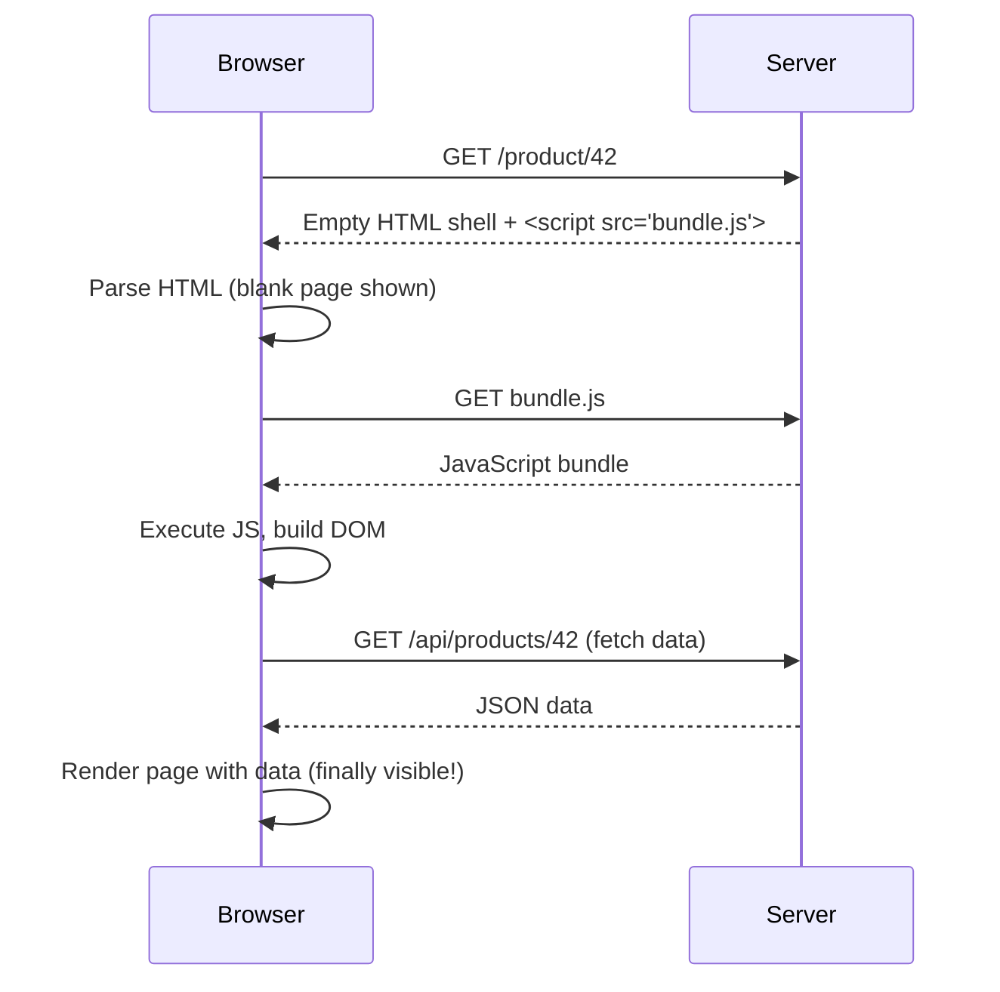
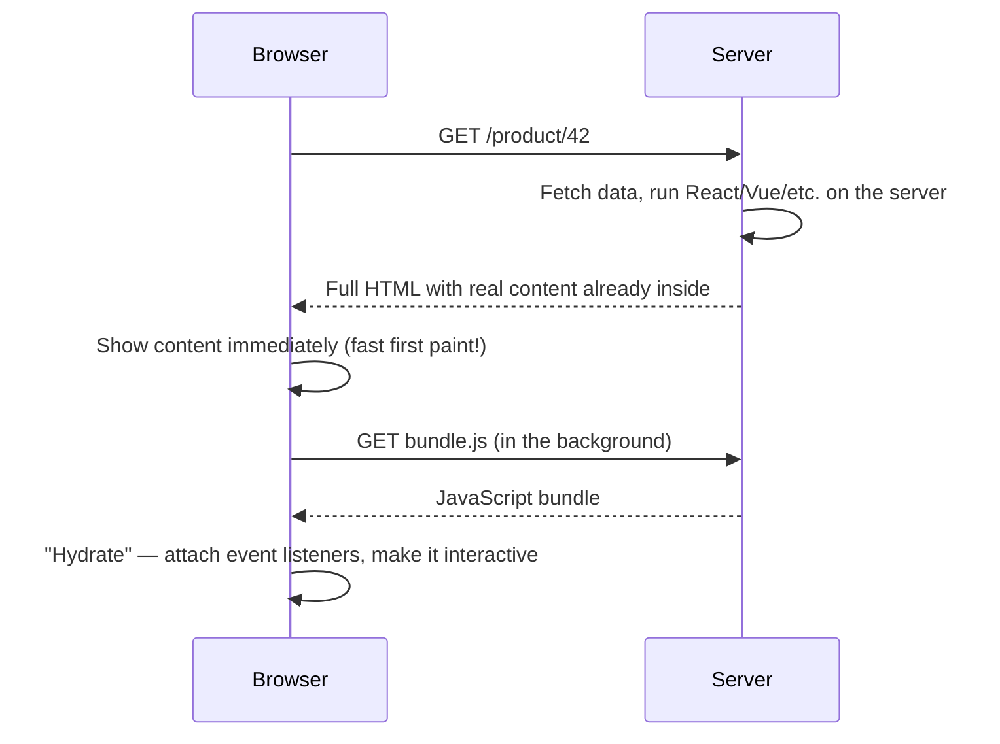
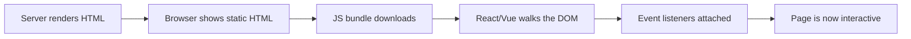

# Server-Side Rendering (SSR) — Beginner Guide

## 1. What is SSR, really?

Every website you visit is ultimately just HTML, CSS, and JavaScript sent to your browser. The question SSR answers is: **where does that HTML get built — on the server, or in the browser?**

- **Client-Side Rendering (CSR)**: the server sends a nearly empty HTML file (just a `<div id="root"></div>` and a `<script>` tag). The browser downloads a JavaScript bundle, runs it, and *then* builds the page.
- **Server-Side Rendering (SSR)**: the server runs your app's code itself, produces a full HTML page (with the actual content already in it), and sends that finished HTML to the browser. The browser can show something immediately, and JavaScript "wakes up" the page afterward.

Think of CSR as being handed a flat-pack furniture box (you assemble it yourself before you can sit on it) versus SSR as being handed the assembled chair (you can sit down immediately, but it later gets bolted to the floor so it becomes fully interactive — that bolting step is "hydration", covered below).

### Why this matters

Two very concrete problems pushed the industry toward SSR:

1. **SEO (Search Engine Optimization)**: Search engine crawlers (and social media link-preview bots) fetch a page's raw HTML. If your HTML is just an empty `<div>`, older or simpler crawlers may see nothing useful — no title, no article text, no product description. SSR guarantees real content is present in the very first response.
2. **First paint / perceived speed**: With CSR, a user on a slow connection stares at a blank white screen until the JS bundle downloads, parses, and executes. With SSR, they see real content almost instantly, even if the page isn't fully interactive yet.

## 2. CSR vs SSR: the request/response flow

Let's trace what happens, step by step, for each approach.

### CSR flow



Notice how many round trips happen before the user sees *anything* useful. That gap between "blank page" and "content visible" is wasted time.

### SSR flow



With SSR, the user sees the product name, description, and price the moment the HTML arrives — before any JavaScript has even downloaded.

## 3. Hydration — the crucial extra step

Sending pre-built HTML solves the "show content fast" problem, but that HTML is just static markup. Buttons don't work yet. Clicking "Add to Cart" does nothing. That's because no JavaScript has attached event listeners or set up component state.

**Hydration** is the process where the JavaScript framework runs in the browser, looks at the existing server-rendered HTML, and "attaches" itself to it — reusing the DOM that's already there, rather than throwing it away and rebuilding it from scratch. After hydration finishes, the page becomes fully interactive.



Why not just rebuild the DOM from scratch in the browser (like CSR does)? Because that would throw away the fast first paint you just got — the browser would flicker or the page would feel "janky" as it's torn down and rebuilt. Hydration re-uses the existing markup, which is much cheaper.

### A simple mental model with code

Imagine a simple counter component:

```jsx
function Counter() {
  const [count, setCount] = React.useState(0);
  return (
    <button onClick={() => setCount(count + 1)}>
      Clicked {count} times
    </button>
  );
}
```

- **On the server**, this renders to plain HTML: `<button>Clicked 0 times</button>`. There's no `onClick` handler in that HTML string — HTML can't contain JavaScript functions.
- **In the browser**, once the JS bundle loads, React "hydrates" — it finds that exact `<button>` in the DOM and attaches the real `onClick` handler to it, without re-creating the button element.
- Only after this hydration step does clicking the button actually work.

This is why, on a slow SSR site, you sometimes see a page that *looks* ready but clicking a button does nothing for a second — the HTML is there, but hydration hasn't finished yet.

## 4. Frameworks that do SSR for you

Writing your own server-rendering setup from scratch (server routing + data fetching + running React on the server + hydration wiring) is a lot of plumbing. These frameworks do it for you out of the box:

| Framework | Base library | Notes |
|---|---|---|
| **Next.js** | React | The most popular React SSR framework. Supports SSR, SSG (static generation), and a hybrid model. |
| **Nuxt.js** | Vue | Vue's equivalent of Next.js — same core ideas, Vue syntax. |
| **SvelteKit** | Svelte | Svelte compiles away most of the runtime, so hydration is lighter/faster. |
| **Astro** | Any (or none) | Ships **zero JavaScript by default**. Uses "islands" — see below. |

### A minimal Next.js SSR example

```jsx
// pages/product/[id].jsx  (Next.js "Pages Router")
export async function getServerSideProps({ params }) {
  const res = await fetch(`https://api.example.com/products/${params.id}`);
  const product = await res.json();

  // Whatever you return in "props" is available to the component below,
  // and this function runs ON THE SERVER, on every request.
  return { props: { product } };
}

export default function ProductPage({ product }) {
  return (
    <div>
      <h1>{product.name}</h1>
      <p>{product.description}</p>
      <p>${product.price}</p>
    </div>
  );
}
```

Every time a browser requests `/product/42`, Next.js runs `getServerSideProps` on the server, fetches the data, and renders the full HTML with that data already filled in — exactly like the SSR flow diagram above.

### Astro's "islands" idea

Astro takes a different angle: most of your page is rendered to plain HTML with **no JavaScript at all** (great for blogs, marketing pages, documentation). Only the specific components that truly need interactivity (a carousel, a like button, a search box) are marked as "islands" and get their own small bit of JavaScript, hydrated independently.

```astro
---
// This runs only on the server/at build time — no JS shipped for this part.
const posts = await fetch('https://api.example.com/posts').then(r => r.json());
---
<h1>Blog</h1>
<ul>
  {posts.map(post => <li>{post.title}</li>)}
</ul>

<!-- Only this component gets hydrated with JavaScript in the browser -->
<LikeButton client:load postId="42" />
```

The `client:load` directive tells Astro "ship JS and hydrate this one island immediately." Everything else stays as static HTML — no wasted JavaScript.

## 5. What about React Router (client-side routing)?

**React Router** (in its classic/basic usage) is a *client-side* routing library — it swaps out components in the browser as the URL changes, entirely with JavaScript, without a full page reload or a new server request. That's the CSR/SPA (Single Page Application) model.

Contrast:

| | React Router (classic SPA usage) | Next.js (SSR) |
|---|---|---|
| Where's the first HTML built? | Browser (after JS runs) | Server (before JS runs) |
| Does navigating to a new page hit the server? | No — client swaps components | Depends — can be server-rendered per navigation or client-navigated after first load |
| Good for SEO out of the box? | Not without extra work | Yes |
| First paint on slow networks | Slower (blank until JS loads) | Faster (HTML arrives ready) |

Modern React Router (v7 / "Remix" merger) actually **added SSR support**, blurring this line — but the classic mental model to remember is: plain React Router in a Create-React-App-style SPA is CSR; Next.js/Nuxt/SvelteKit are SSR-first frameworks.

## 6. Quick recap

- SSR builds the HTML on the server so the browser gets real content immediately.
- CSR builds the HTML in the browser using JavaScript, so there's a blank-page gap first.
- SSR helps SEO (crawlers see real content) and perceived performance (faster first paint).
- Hydration is the step where JavaScript "attaches" to server-rendered HTML to make it interactive — it doesn't rebuild the DOM, it reuses it.
- Next.js, Nuxt.js, and SvelteKit are full SSR frameworks; Astro ships zero JS by default and only hydrates specific "islands."
- Plain client-side React Router is the CSR/SPA model — no server rendering unless you add it.

---
**Where this fits:** Web Components / Type Checkers → SSR → GraphQL → Static Site Generators → PWAs → Mobile Apps / Desktop Apps
