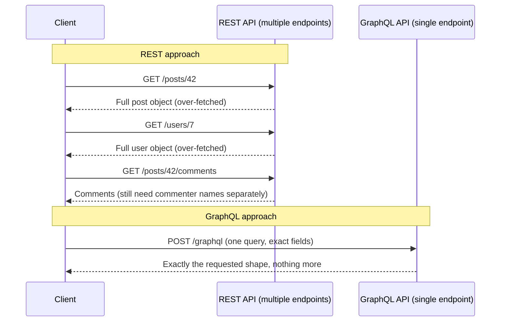

# GraphQL — Beginner Guide

## 1. What is GraphQL?

GraphQL is a **query language for APIs**, created by Facebook. Instead of your frontend hitting many different fixed URLs to get data (the traditional REST way), you send a *single request* to *one endpoint*, describing exactly the shape of data you want back — and the server returns exactly that, nothing more, nothing less.

Think of it like ordering at a restaurant two different ways:

- **REST** is like a fixed menu where each dish comes as a whole combo — if you want just the fries from the burger combo, you still get the whole combo (or you have to order three separate combos to assemble what you actually wanted).
- **GraphQL** is like a build-your-own-plate buffet — you point at exactly the items you want, and that's exactly what lands on your plate.

### Why this matters

Two very common REST pain points motivated GraphQL:

1. **Over-fetching**: an endpoint like `/users/1` might return the full user object — name, email, address, bio, join date, preferences — when your UI only needed the name and avatar. You downloaded data you'll never use, wasting bandwidth.
2. **Under-fetching**: a single screen often needs data from *multiple* resources — e.g., a user's profile plus their last 5 posts plus their follower count. With REST, that's often three separate requests to three separate endpoints, each with its own round-trip latency.

GraphQL fixes both: you describe the exact fields you want, from potentially multiple related resources, in one query, and get exactly that back in one response.

## 2. REST vs GraphQL — a side-by-side example

Imagine we're building a page that shows a blog post's title, its author's name, and the first 3 comments (with commenter name and text).

### The REST way (multiple requests)

```
GET /posts/42
→ { "id": 42, "title": "...", "body": "...", "authorId": 7, "createdAt": "...", "tags": [...] }

GET /users/7
→ { "id": 7, "name": "...", "email": "...", "bio": "...", "avatarUrl": "..." }

GET /posts/42/comments?limit=3
→ [ { "id": 1, "text": "...", "userId": 3, ... }, ... ]

GET /users/3   (repeat for each commenter...)
```

That's potentially **4+ separate HTTP requests**, each returning far more fields than the UI actually displays (email, bio, tags, createdAt — all unused here).

### The GraphQL way (one request, exact shape)

```graphql
query {
  post(id: 42) {
    title
    author {
      name
    }
    comments(limit: 3) {
      text
      author {
        name
      }
    }
  }
}
```

One request to one endpoint (typically `/graphql`), and the response matches the query's shape exactly:

```json
{
  "data": {
    "post": {
      "title": "Understanding GraphQL",
      "author": { "name": "Alice" },
      "comments": [
        { "text": "Great post!", "author": { "name": "Bob" } },
        { "text": "Very helpful", "author": { "name": "Carol" } }
      ]
    }
  }
}
```

No unused fields (no `email`, `bio`, `createdAt`, `tags`), and no repeated round trips.



## 3. Key building blocks of GraphQL

- **Schema**: a strongly-typed contract describing every type of data the API can return and every operation the client can perform. Every field has a known type (`String`, `Int`, `ID`, a custom object type, etc.).
- **Query**: read operation — "give me this data" (like a GET request).
- **Mutation**: write operation — "change this data" (like a POST/PUT/DELETE request).
  ```graphql
  mutation {
    createComment(postId: 42, text: "Nice article!") {
      id
      text
    }
  }
  ```
- **Resolver**: server-side function that knows how to fetch the actual data for a given field (e.g., a resolver for `author` on a `Post` might look up the user in a database).
- **Single endpoint**: unlike REST's many URLs, essentially all GraphQL traffic goes to one URL, and the *query itself* — not the URL — determines what data comes back.

## 4. Talking to a GraphQL API from the frontend: Apollo Client and Relay

Writing raw `fetch()` calls with a JSON body containing your GraphQL query works, but two popular libraries make this much nicer by adding caching, loading states, and automatic UI updates.

### Apollo Client

The most widely used GraphQL client for React (also works with Vue, Angular, etc.). It handles caching, re-fetching, and gives you simple hooks.

```jsx
import { useQuery, gql } from '@apollo/client';

const GET_POST = gql`
  query GetPost($id: ID!) {
    post(id: $id) {
      title
      author {
        name
      }
    }
  }
`;

function PostPage({ postId }) {
  const { loading, error, data } = useQuery(GET_POST, {
    variables: { id: postId },
  });

  if (loading) return <p>Loading...</p>;
  if (error) return <p>Something went wrong.</p>;

  return (
    <div>
      <h1>{data.post.title}</h1>
      <p>By {data.post.author.name}</p>
    </div>
  );
}
```

Apollo automatically manages the loading/error/data states for you and caches results so repeated queries for the same data don't always hit the network.

### Relay (Relay Modern)

Also built by Facebook (the same company that created GraphQL), Relay is more opinionated and tightly integrated with GraphQL's design. It requires each component to declare exactly the data *it* needs via **fragments**, and Relay's compiler stitches these together at build time into optimized queries. This is more setup than Apollo but scales very well on large apps because each component only knows about its own data needs.

```jsx
// Simplified illustration — Relay usage involves a build step (relay-compiler)
const postFragment = graphql`
  fragment PostCard_post on Post {
    title
    author {
      name
    }
  }
`;
```

For a beginner, the takeaway is: **Apollo Client** is the easier, more commonly taught starting point; **Relay** is a more advanced, highly-optimized alternative favored in very large-scale applications (Relay itself was born out of Facebook's own needs).

## 5. Quick recap

- GraphQL uses **one endpoint** and lets the client specify the **exact shape** of data it wants.
- This solves REST's **over-fetching** (getting unused fields) and **under-fetching** (needing multiple requests) problems.
- A **query** reads data, a **mutation** writes data, a **schema** defines what's possible, and **resolvers** fetch the actual values server-side.
- **Apollo Client** and **Relay Modern** are the two major libraries for consuming GraphQL APIs from frontend apps — Apollo is more beginner-friendly, Relay is more structured/optimized for scale.

---
**Where this fits:** Web Components / Type Checkers → SSR → GraphQL → Static Site Generators → PWAs → Mobile Apps / Desktop Apps
