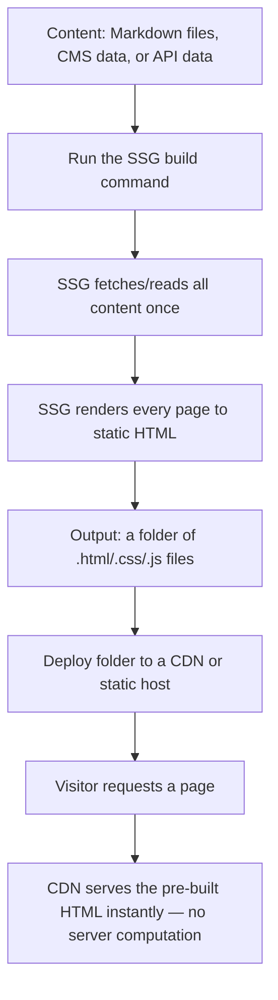

# Static Site Generators (SSG) — Beginner Guide

## 1. What is a Static Site Generator?

A Static Site Generator (SSG) is a tool that builds your entire website's HTML pages **ahead of time**, during a "build" step — before any user ever visits the site. The output is a folder full of plain `.html`, `.css`, and `.js` files that can be hosted anywhere (even a basic file server) with no server-side code needed to generate pages on the fly.

To understand SSG, it helps to place it alongside the two other rendering approaches you've likely already seen:

| Approach | When is HTML built? | Example |
|---|---|---|
| **CSR** (Client-Side Rendering) | In the browser, at *view time*, using JavaScript | A plain React SPA |
| **SSR** (Server-Side Rendering) | On the server, at *request time* (every time someone visits) | Next.js with `getServerSideProps` |
| **SSG** (Static Site Generation) | On the server (or your own machine), at *build time* (once, before anyone visits) | Astro, Eleventy, a Next.js page using `getStaticProps` |

### Why this matters

Because SSG pages are pre-built plain files, they are:

- **Extremely fast to serve** — no database query, no server-side computation per visitor. A CDN (Content Delivery Network) can cache and serve the file from a location physically close to the user.
- **Cheap to host** — no need to run a server process per request; you can host on something as simple as static file hosting (Netlify, Vercel, GitHub Pages, S3).
- **Great for SEO** — like SSR, the full HTML content is present immediately, so search engine crawlers see real content.
- **Not ideal for highly dynamic, per-user content** — if every visitor needs a personalized dashboard, pre-building one static HTML file per user doesn't make sense; SSR or CSR (with client-side data fetching) fits better there.

## 2. How SSG actually works — the build step



The key idea: work that would otherwise happen on *every single request* (in SSR) instead happens **once**, at build time. If you have a blog with 100 posts, an SSG builds 100 HTML files once; every visitor after that just receives the matching pre-built file.

## 3. A blog post example, explained simply

Say you have a Markdown file for a blog post:

```markdown
---
title: "Why I Love Static Sites"
date: "2026-01-15"
---

Static sites are fast because the HTML is already built...
```

At build time, the SSG:
1. Reads this Markdown file.
2. Converts the Markdown content to HTML.
3. Wraps it in your site's page template (header, footer, styling).
4. Writes the final result to a file like `dist/blog/why-i-love-static-sites/index.html`.

That file now exists as a real file on disk — no code runs when a visitor requests `/blog/why-i-love-static-sites`; the web server (or CDN) just returns the file that's already there.

## 4. Popular Static Site Generators

### Next.js (in SSG mode)

Next.js can do SSR *or* SSG, page by page, depending on which data function you export. Using `getStaticProps` instead of `getServerSideProps` tells Next.js "run this once at build time, not per request":

```jsx
// pages/blog/[slug].jsx
export async function getStaticPaths() {
  const posts = await getAllPostSlugs(); // e.g. read all markdown filenames
  return {
    paths: posts.map(slug => ({ params: { slug } })),
    fallback: false,
  };
}

export async function getStaticProps({ params }) {
  const post = await getPostBySlug(params.slug); // runs at BUILD time, not per request
  return { props: { post } };
}

export default function BlogPost({ post }) {
  return (
    <article>
      <h1>{post.title}</h1>
      <div>{post.content}</div>
    </article>
  );
}
```

`getStaticPaths` tells Next.js *which* pages to pre-build (e.g., one per blog post slug), and `getStaticProps` supplies the data for each one — both run during `next build`, producing a static HTML file per post.

### Astro

Astro is a modern SSG built around performance-by-default. It renders pages to static HTML and ships **zero JavaScript unless you explicitly opt in** (via "islands," covered in the SSR topic). It's especially good for content-heavy sites like blogs, documentation, and marketing pages.

```astro
---
// This code runs at build time on the server, not in the browser.
const posts = await Astro.glob('./posts/*.md');
---
<html>
  <body>
    <h1>My Blog</h1>
    <ul>
      {posts.map(post => (
        <li><a href={post.url}>{post.frontmatter.title}</a></li>
      ))}
    </ul>
  </body>
</html>
```

### VuePress

A Vue-powered SSG originally built for writing **documentation** (it grew out of Vue.js's own docs). You write content in Markdown, and VuePress renders it into a themed static site, with Vue components usable inside your Markdown if you need custom interactive bits.

```markdown
# Getting Started

Welcome to the docs. You can even use Vue components inline:

<CustomAlert type="warning">Don't forget to install dependencies!</CustomAlert>
```

### Eleventy (11ty)

A deliberately simple, framework-agnostic SSG written in JavaScript. Unlike Next.js/Astro, Eleventy doesn't require you to use React, Vue, or any particular component framework at all — you can use plain HTML templates, Markdown, Nunjucks, Liquid, or several other templating languages. It's popular for its minimalism and speed of setup.

```njk
{# index.njk — Eleventy with Nunjucks templating #}
<h1>{{ title }}</h1>
<ul>

  <li><a href="{{ post.url }}">{{ post.data.title }}</a></li>

</ul>
```

## 5. Which tool suits what?

| Tool | Best suited for |
|---|---|
| **Next.js (SSG mode)** | Apps that need *both* some static pages and some SSR/dynamic pages, using React, with a large ecosystem |
| **Astro** | Content-heavy sites (blogs, marketing, docs) wanting minimal shipped JavaScript and top-tier performance |
| **VuePress** | Documentation sites, especially if you're already in the Vue ecosystem |
| **Eleventy** | Simple, framework-free sites where you don't want to bring in React/Vue/Svelte at all — maximum simplicity and control over templating |

## 6. Quick recap

- SSG builds all HTML pages once, ahead of time, at **build time** — not per request (SSR) and not in the browser (CSR).
- This makes SSG sites extremely fast to serve and cheap to host, at the cost of not suiting highly personalized, per-user content well.
- Next.js can mix SSG and SSR page-by-page; Astro, VuePress, and Eleventy are dedicated static-site tools, each suited to slightly different use cases (general content sites, documentation, and framework-free simplicity, respectively).

---
**Where this fits:** Web Components / Type Checkers → SSR → GraphQL → Static Site Generators → PWAs → Mobile Apps / Desktop Apps
