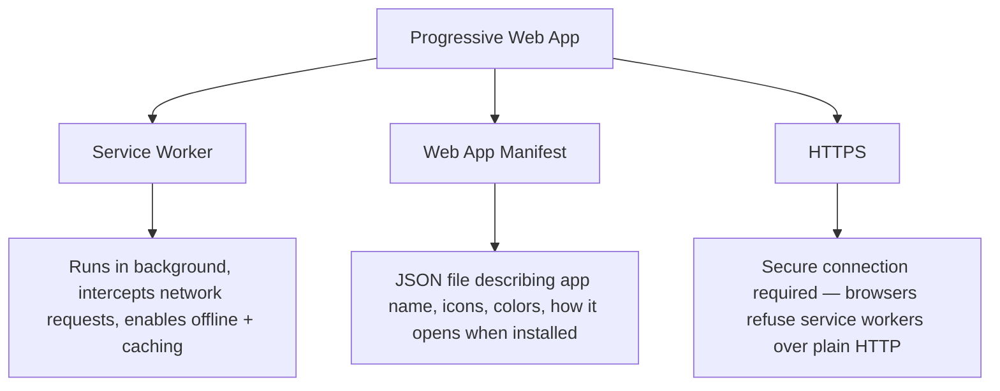
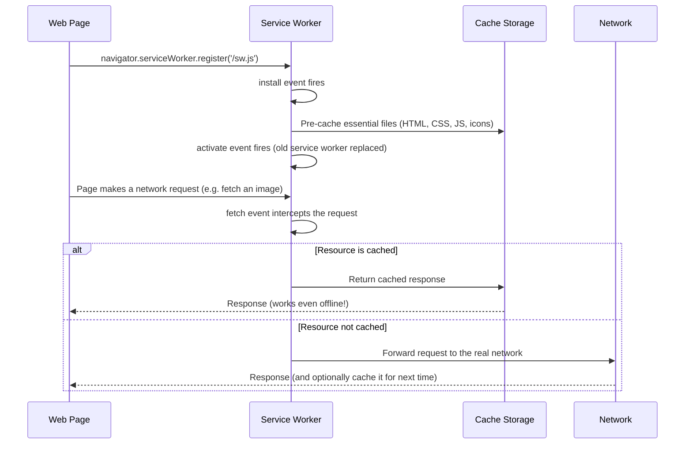

# Progressive Web Apps (PWAs) — Beginner Guide

## 1. What is a PWA?

A **Progressive Web App** is a regular website that's been enhanced with a specific set of web technologies so it can behave like a native app installed on your phone or computer — even though it's really still just a website under the hood.

Concretely, a PWA can:

- **Be installed** — users can add it to their home screen / desktop, and it opens in its own window without a browser address bar, just like a "real" app.
- **Work offline (or with a flaky connection)** — instead of showing the browser's "no internet" error page, a PWA can show cached content, or a custom offline page, because it intercepts network requests itself.
- **Feel native** — full-screen mode, its own icon, splash screen, push notifications, and fast repeat-visit loading (because assets are cached locally).

### Why this matters

Building and shipping a native app (iOS App Store, Google Play) is expensive: separate codebases, app store review processes, and users have to actively go download it. A PWA gives you *many* of the same benefits — installability, offline support, an app icon — using the same web codebase you already have, deployed the same way a normal website is deployed. A user can start using it instantly (it's just a URL) and *optionally* install it later if they like it.

## 2. The three pillars of a PWA

Every PWA rests on three required pieces:



1. **Service Worker** — a special JavaScript file that runs separately from your web page, in the background, even when the page isn't open. It can intercept every network request your page makes and decide what to do (fetch from the network, return a cached response, or a mix of both).
2. **Web App Manifest** — a `manifest.json` file that tells the browser (and operating system) what your app is called, what icon to show, what color scheme to use, and how it should open when launched from the home screen (full-screen? with a URL bar?).
3. **HTTPS** — service workers are powerful (they can intercept and modify network traffic), so browsers *require* your site to be served over HTTPS (a secure connection) before they'll even register a service worker. `localhost` is a special exception allowed for development.

Without all three, you don't have a true installable, offline-capable PWA.

## 3. The Service Worker lifecycle

A service worker doesn't just start running the moment you write the code — it goes through a specific, well-defined lifecycle:



### Step by step, in plain language

1. **Register**: your page's regular JavaScript tells the browser "please install this service worker file."
2. **Install**: the browser downloads the service worker script and fires an `install` event. This is typically where you pre-cache the core files your app needs (HTML shell, CSS, key images) so they're available offline immediately.
3. **Activate**: once installed, the service worker fires an `activate` event — this is where you'd clean up old, outdated caches from a previous version of your service worker.
4. **Fetch (intercept)**: from now on, *every* network request the page makes passes through the service worker's `fetch` event handler first. The service worker decides: serve from cache, go to the network, or some combination (e.g., "try cache first, fall back to network").

## 4. A minimal example: manifest + registration + service worker

### `manifest.json`

```json
{
  "name": "My Awesome PWA",
  "short_name": "AwesomePWA",
  "start_url": "/",
  "display": "standalone",
  "background_color": "#ffffff",
  "theme_color": "#317EFB",
  "icons": [
    {
      "src": "/icons/icon-192.png",
      "sizes": "192x192",
      "type": "image/png"
    },
    {
      "src": "/icons/icon-512.png",
      "sizes": "512x512",
      "type": "image/png"
    }
  ]
}
```

- `"display": "standalone"` means it opens like a native app (no browser address bar).
- The `icons` array provides the images used for the home screen icon at different sizes.

You link this file from your HTML `<head>`:

```html
<link rel="manifest" href="/manifest.json">
```

### Registering the service worker (in your page's JavaScript)

```js
if ('serviceWorker' in navigator) {
  navigator.serviceWorker.register('/sw.js')
    .then(registration => {
      console.log('Service worker registered:', registration);
    })
    .catch(error => {
      console.error('Service worker registration failed:', error);
    });
}
```

This checks that the browser actually supports service workers (`'serviceWorker' in navigator`), then registers the service worker file at `/sw.js`.

### A basic `sw.js` (service worker file itself)

```js
const CACHE_NAME = 'my-app-cache-v1';
const FILES_TO_CACHE = ['/', '/index.html', '/styles.css', '/app.js'];

// Install: pre-cache core files
self.addEventListener('install', (event) => {
  event.waitUntil(
    caches.open(CACHE_NAME).then(cache => cache.addAll(FILES_TO_CACHE))
  );
});

// Activate: clean up old caches from previous versions
self.addEventListener('activate', (event) => {
  event.waitUntil(
    caches.keys().then(keys =>
      Promise.all(
        keys.filter(key => key !== CACHE_NAME).map(key => caches.delete(key))
      )
    )
  );
});

// Fetch: serve from cache first, fall back to network
self.addEventListener('fetch', (event) => {
  event.respondWith(
    caches.match(event.request).then(cachedResponse => {
      return cachedResponse || fetch(event.request);
    })
  );
});
```

This is a "cache-first" strategy: if the requested file is already cached, serve it instantly (works offline!); otherwise, go fetch it from the network.

## 5. Quick recap

- A PWA is a website enhanced to feel and behave like a native app: installable, offline-capable, native-feeling.
- The three required pillars are: a **Service Worker** (background script for offline/caching), a **Web App Manifest** (`manifest.json` describing the app), and **HTTPS** (required for security).
- The service worker lifecycle is: **register → install (pre-cache files) → activate (clean up old caches) → fetch (intercept every network request)**.
- With just a manifest file and a small service worker script, an ordinary website gains installability and offline support.

---
**Where this fits:** Web Components / Type Checkers → SSR → GraphQL → Static Site Generators → PWAs → Mobile Apps / Desktop Apps
