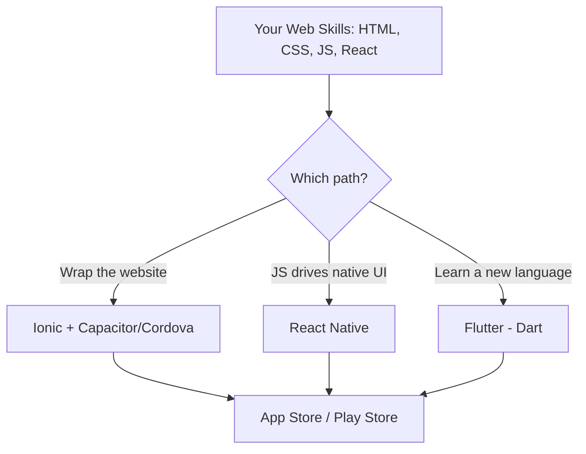
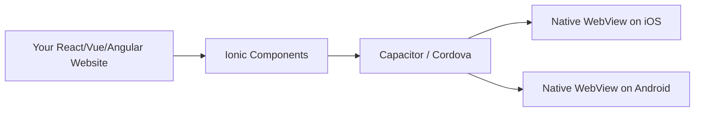

# Mobile Apps (Beginner)

## Why this matters

You already know HTML, CSS, and JavaScript (and probably React). The good news: a huge chunk of that knowledge transfers directly to building mobile apps. You don't have to learn Swift or Kotlin from scratch just to put an app on someone's phone. This page walks through the main ways web developers build mobile apps, in plain language, so you understand what each tool actually does before you pick one.

## How web skills transfer

There are two very different ways to turn your web skills into a mobile app:

1. **Wrap your website in an app shell** — you build a normal website, then put it inside a native app "container" that can be installed from the App Store / Play Store. The UI is still HTML/CSS running in a browser engine.
2. **Use your JavaScript/React skills to drive real native UI** — you write JavaScript (or Dart, in Flutter's case), but instead of rendering `<div>`s, the framework renders actual native buttons, lists, and screens that look and feel like a "real" app.



All three end up producing an app you can submit to app stores. They differ in *how* the screen actually gets drawn, and that difference matters a lot for performance and how "native" the app feels.

## React Native

**What it is:** A framework by Meta (the company behind Facebook) that lets you write JavaScript and React components, but instead of rendering to the browser DOM, it renders to **real native UI components** on iOS and Android.

- On iOS, a `<Text>` component in React Native becomes a real `UILabel`.
- On Android, it becomes a real `TextView`.

This means the app *looks* native because it genuinely is using native building blocks — just controlled by your JavaScript code.

**What you need to know:**
- You write components the same way you do in React: JSX, props, state, hooks (`useState`, `useEffect`, etc.)
- Instead of `<div>`, `<span>`, `<p>`, you use React Native's own components: `<View>`, `<Text>`, `<Image>`.
- Styling is done with JavaScript objects that resemble CSS (a subset of it — no full CSS support).

**Example — a simple screen:**

```jsx
import { View, Text, Button, StyleSheet } from 'react-native';
import { useState } from 'react';

function CounterScreen() {
  const [count, setCount] = useState(0);

  return (
    <View style={styles.container}>
      <Text style={styles.text}>Count: {count}</Text>
      <Button title="Add One" onPress={() => setCount(count + 1)} />
    </View>
  );
}

const styles = StyleSheet.create({
  container: { flex: 1, justifyContent: 'center', alignItems: 'center' },
  text: { fontSize: 24, marginBottom: 12 },
});

export default CounterScreen;
```

Notice how similar this is to a React web component — same hooks, same JSX pattern — but the building blocks (`View`, `Text`, `Button`) are different, and there's no `<div>` in sight.

**Why this matters:** If you already know React, React Native has one of the shortest learning curves of any "real" mobile framework, because 70-80% of your mental model transfers directly.

## Flutter

**What it is:** A framework by Google. Unlike React Native, Flutter does **not** use the platform's native UI components at all. Instead, it draws every single pixel itself using its own high-performance rendering engine (called Skia, soon replaced by Impeller). It paints buttons, text, and animations directly onto a canvas, the same way a game engine would.

**Language:** Flutter uses **Dart**, a language made by Google specifically for Flutter. It looks a bit like a mix of Java and JavaScript.

```dart
import 'package:flutter/material.dart';

class CounterScreen extends StatefulWidget {
  @override
  State<CounterScreen> createState() => _CounterScreenState();
}

class _CounterScreenState extends State<CounterScreen> {
  int count = 0;

  @override
  Widget build(BuildContext context) {
    return Scaffold(
      body: Center(
        child: Column(
          mainAxisAlignment: MainAxisAlignment.center,
          children: [
            Text('Count: $count', style: TextStyle(fontSize: 24)),
            ElevatedButton(
              onPressed: () => setState(() => count++),
              child: Text('Add One'),
            ),
          ],
        ),
      ),
    );
  }
}
```

**Why this matters:** Because Flutter draws its own UI instead of relying on the OS, it looks *identical* on iOS and Android (pixel for pixel), and it tends to run very smoothly. The tradeoff: you have to learn a brand-new language (Dart), so there's less direct transfer from your existing web skills compared to React Native.

## Ionic

**What it is:** Ionic lets you build the app using regular web technology — HTML, CSS, and JavaScript (often paired with React, Angular, or Vue) — and then wraps that website inside a native app shell using a tool called **Capacitor** (Ionic's modern tool) or **Cordova** (the older tool).

Think of it like this: your app is really a website, but it's packaged into something installable, and it runs inside a hidden native browser window (called a "WebView") instead of Safari or Chrome. Capacitor/Cordova also give your JavaScript code access to native device features — camera, GPS, contacts — through plugins.



**Example — an Ionic + React button:**

```jsx
import { IonButton, IonContent, IonPage } from '@ionic/react';

function HomePage() {
  return (
    <IonPage>
      <IonContent>
        <IonButton onClick={() => alert('Hello from Ionic!')}>
          Tap Me
        </IonButton>
      </IonContent>
    </IonPage>
  );
}

export default HomePage;
```

**Why this matters:** If you already have a React web app, Ionic is by far the fastest way to get *something* installable in the app stores — you're reusing nearly all of your existing code and skills. The tradeoff is that it's running in a WebView, so it's not quite as fast or "native-feeling" as React Native or Flutter for complex, animation-heavy apps.

## Comparison table

| Framework | Language | Rendering approach | Performance | Learning curve (from web dev) |
|---|---|---|---|---|
| **React Native** | JavaScript/TypeScript + React | Compiles to real native UI components | Very good — near-native | Low if you know React |
| **Flutter** | Dart | Draws its own UI with its own rendering engine | Excellent — very smooth, consistent | Medium-high — new language (Dart) |
| **Ionic** | HTML/CSS/JS (React, Vue, or Angular) | Web content inside a native WebView wrapper | Good for most apps, weaker for heavy animation | Very low — reuses existing web app |

## Quick summary

- **Already know React and want something close to native?** → React Native.
- **Want the smoothest possible experience and don't mind learning Dart?** → Flutter.
- **Already have a web app and want it in app stores fast?** → Ionic.

---

**Where this fits:** This topic follows Static Site Generators and Progressive Web Apps (PWAs), and comes right before Desktop Apps in the roadmap — after PWAs (web apps that behave like apps), Mobile Apps is the next step in taking your web skills beyond the browser.
