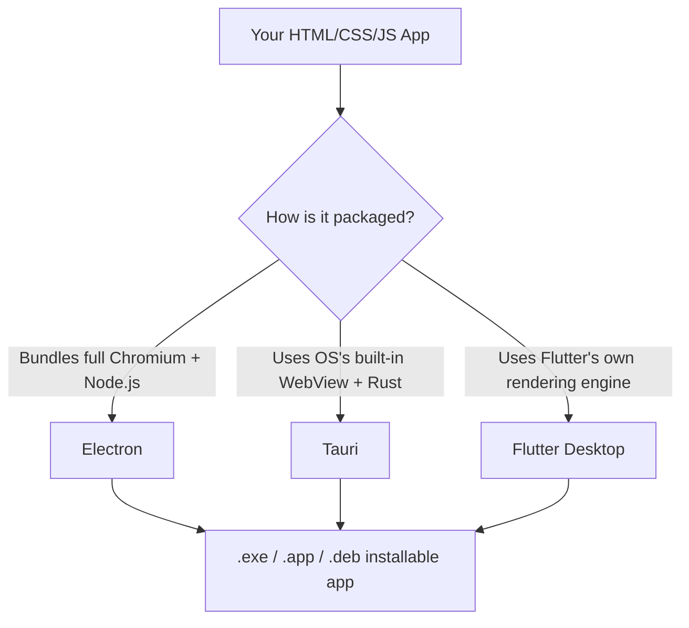
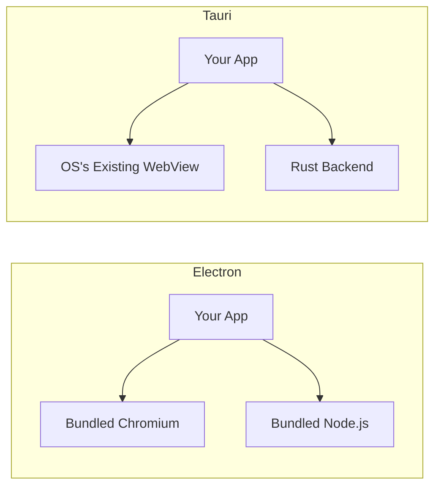

# Desktop Apps (Beginner)

## Why this matters

Just like you can turn your web skills into mobile apps, you can also turn them into full desktop applications — the kind that show up in your Start Menu or Applications folder, with their own icon, their own window, and no browser address bar in sight. Apps like **Visual Studio Code**, **Slack**, **Discord**, and **Figma** are all built this way. This page explains the three main approaches and how they actually work under the hood.

## The core idea

A normal website only runs inside a browser tab. A desktop app needs to:
1. Open its own window (not a browser tab).
2. Access things a website normally can't — the file system, system notifications, hardware, etc.
3. Be installable and double-clickable like any other program.

To do this, frameworks bundle a "browser engine" (the thing that actually renders HTML/CSS/JS) together with a way to talk to the operating system.



## Electron

**What it is:** Electron bundles **Chromium** (the same engine that powers Google Chrome) and **Node.js** together into every single app you build. Your HTML/CSS/JS runs inside that bundled Chromium, and because Node.js is also included, your JavaScript code can do things a website normally can't — read and write files, spawn other programs, access the file system directly.

**Why it's so popular:** It lets web developers build a full desktop app using nothing but the skills they already have — HTML, CSS, JavaScript, and any frontend framework (React, Vue, etc.). No new language, no new rendering engine to learn. This is exactly why apps like:

- **Visual Studio Code** (Microsoft's code editor)
- **Slack**
- **Discord**

are all built on Electron — they wanted to ship fast, on every OS (Windows, macOS, Linux), using one shared codebase.

**Example — a minimal Electron app:**

```javascript
// main.js — this is the "backend" of your desktop app (runs in Node.js)
const { app, BrowserWindow } = require('electron');

function createWindow() {
  const win = new BrowserWindow({
    width: 800,
    height: 600,
  });

  win.loadFile('index.html'); // loads your normal HTML/CSS/JS
}

app.whenReady().then(createWindow);
```

```html
<!-- index.html — this is just a normal web page! -->
<!DOCTYPE html>
<html>
  <body>
    <h1>Hello from Electron!</h1>
  </body>
</html>
```

Run `electron .` and this opens a real, standalone desktop window — no browser needed.

**The downside:** Because Electron bundles an *entire copy* of Chromium plus Node.js into every app, even a tiny "Hello World" app can be 100+ MB in size. And because every Electron app runs its own private copy of Chromium, having several Electron apps open at once (Slack + Discord + VS Code) can use a lot of your computer's memory — each one is essentially running its own separate web browser in the background.

## Tauri

**What it is:** Tauri takes a very different approach. Instead of bundling Chromium, it uses the **WebView that's already built into your operating system** (WebView2 on Windows, WebKit on macOS, WebKitGTK on Linux). The backend — the part that talks to the operating system — is written in **Rust**, a fast, memory-safe systems programming language, instead of Node.js.

Because it doesn't need to ship its own copy of Chromium, a Tauri app can be **dramatically smaller** — often just a few megabytes instead of 100+.



**Why this matters:** If you care about your app's download size and memory usage, Tauri is a much lighter alternative. The frontend (your HTML/CSS/JS) stays exactly the same as it would be in Electron — the difference is entirely in what's running underneath it.

## Flutter for Desktop

**What it is:** The same Flutter framework used for mobile apps (see the Mobile Apps topic) can also target desktop — Windows, macOS, and Linux. Since Flutter draws its own UI with its own rendering engine (rather than relying on a browser or the OS's native widgets), a Flutter desktop app looks and behaves identically across all platforms it runs on.

**Why this matters:** If you're already building a mobile app in Flutter, adding desktop support is often just a matter of flipping on desktop as a target platform — you get to reuse most of your existing Dart code.

## Comparison table

| Framework | Bundle size | Memory usage | Language | Maturity |
|---|---|---|---|---|
| **Electron** | Large (100+ MB typical) | Higher — each app runs its own Chromium | JavaScript/HTML/CSS + Node.js | Very mature, huge ecosystem |
| **Tauri** | Small (a few MB) | Lower — reuses OS WebView | Rust (backend) + your usual JS/HTML/CSS (frontend) | Newer, growing fast |
| **Flutter Desktop** | Medium | Medium | Dart | Maturing, strong for cross-platform consistency |

## Quick summary

- **Want the fastest path using pure web skills, and don't mind a bigger app?** → Electron.
- **Want a small, fast app and are open to learning a bit of Rust for the backend?** → Tauri.
- **Already building the same app for mobile in Flutter?** → Flutter Desktop.

---

**Where this fits:** This topic follows Mobile Apps and comes before Browser APIs in the roadmap — after learning to ship apps to phones, this is how the same web skills ship apps to the desktop.
