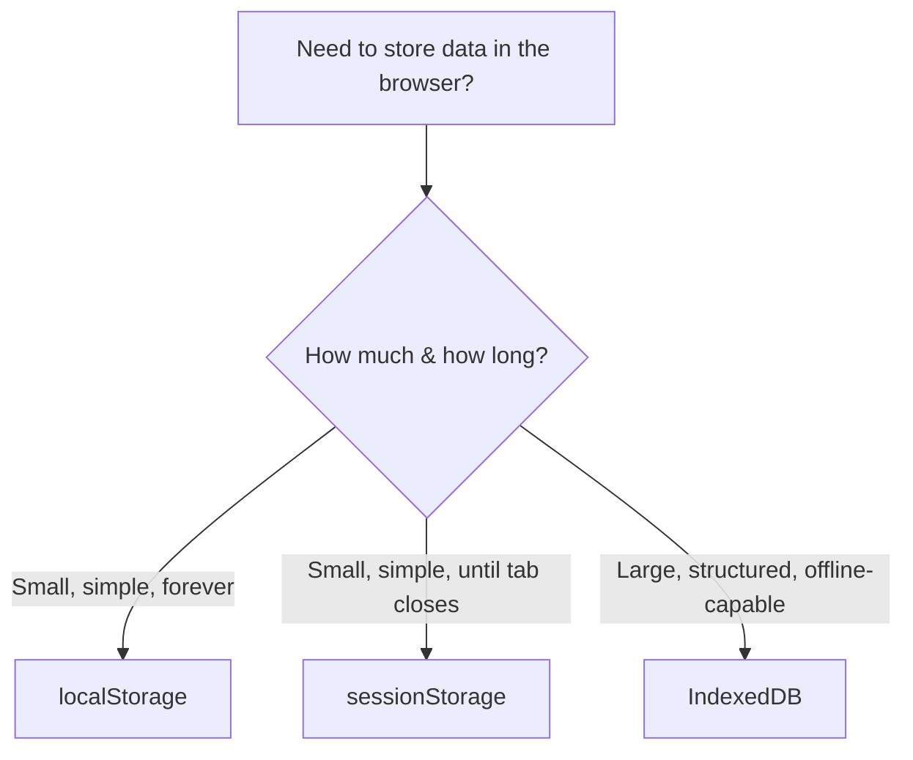

# Browser APIs (Beginner)

## Why this matters

Browsers give JavaScript far more power than just manipulating a page. They expose built-in APIs (Application Programming Interfaces — pre-built tools the browser provides that your JavaScript code can call) that let you store data, talk to servers in new ways, know the user's location, show system notifications, and more — all without needing any third-party library. This page walks through the most important ones a frontend developer should know.

## Storage: localStorage vs sessionStorage vs IndexedDB

Sometimes you need to save small bits of data in the user's browser — like a theme preference, a login token, or a shopping cart — without sending it to a server. Browsers give you three main tools for this.

### localStorage

Stores key-value pairs (both must be strings) that **persist forever** — until the user clears their browser data or your code deletes them. Even if the user closes the tab, restarts their computer, and comes back a week later, the data is still there.

```javascript
// Save data
localStorage.setItem('theme', 'dark');

// Read data
const theme = localStorage.getItem('theme'); // "dark"

// Remove data
localStorage.removeItem('theme');

// Wipe everything
localStorage.clear();
```

**Important:** localStorage only stores strings. If you want to store an object, you must convert it first:

```javascript
const user = { name: 'Alex', age: 30 };
localStorage.setItem('user', JSON.stringify(user)); // convert object -> string

const savedUser = JSON.parse(localStorage.getItem('user')); // convert string -> object back
```

### sessionStorage

Works exactly the same way as localStorage (same methods: `setItem`, `getItem`, etc.) but the data **only lasts for the current tab's lifetime**. Close the tab, and it's gone. Open the same site in a new tab, and it starts empty again — it doesn't even share data between two tabs of the same site.

```javascript
sessionStorage.setItem('currentStep', '3'); // e.g. tracking progress through a multi-step form
```

**Use it for:** temporary state you don't want to survive a tab close — like "which step of a form the user is on."

### IndexedDB

A full database built into the browser. Unlike localStorage/sessionStorage (which only store simple strings), IndexedDB can store much larger amounts of structured data, including objects, files, and blobs — and it's asynchronous, so it won't freeze your page while reading/writing large amounts of data.

```javascript
// Opening a database (simplified)
const request = indexedDB.open('MyAppDB', 1);

request.onupgradeneeded = (event) => {
  const db = event.target.result;
  db.createObjectStore('notes', { keyPath: 'id' });
};

request.onsuccess = (event) => {
  const db = event.target.result;
  const tx = db.transaction('notes', 'readwrite');
  tx.objectStore('notes').add({ id: 1, text: 'Learn IndexedDB' });
};
```

**Use it for:** offline apps, storing lots of data (megabytes, not kilobytes), or storing files/images locally.



## WebSockets

A normal web request (HTTP) works like sending a letter: your browser asks a question ("give me this webpage"), the server replies once, and the connection ends. If you want new data, you have to ask again.

A **WebSocket** is different — it opens a single, persistent, two-way connection between the browser and the server that stays open. Either side can send a message to the other, at any time, without having to start a new request each time. This is what makes live chat apps, multiplayer games, and real-time dashboards possible.

```javascript
const socket = new WebSocket('wss://example.com/chat');

socket.onopen = () => {
  console.log('Connected!');
  socket.send('Hello server!');
};

socket.onmessage = (event) => {
  console.log('Received:', event.data);
};

socket.onclose = () => {
  console.log('Connection closed');
};
```

**Why this matters:** Without WebSockets, a chat app would have to constantly ask the server "any new messages? any new messages?" over and over (called "polling"). WebSockets let the server just push new messages the instant they arrive.

## Server-Sent Events (SSE)

Server-Sent Events are similar to WebSockets in that the server can push data to the browser without the browser asking again — but SSE is **one-way only**: the server sends data to the browser, and the browser cannot send data back over that same connection.

```javascript
const eventSource = new EventSource('/live-updates');

eventSource.onmessage = (event) => {
  console.log('New update:', event.data);
};
```

**SSE vs. WebSockets:**

| | WebSockets | Server-Sent Events |
|---|---|---|
| Direction | Two-way (client ↔ server) | One-way (server → client only) |
| Use case | Chat apps, multiplayer games | Live news feeds, stock tickers, notifications |
| Protocol | Its own (`ws://`, `wss://`) | Plain HTTP |
| Complexity | More setup | Simpler — built on regular HTTP |

**Why this matters:** If you only need the server to push updates to the browser (like a live score feed) and never need to send data back over that same channel, SSE is simpler than WebSockets.

## Service Workers (brief)

A Service Worker is a special script that runs in the background, separate from your webpage, and can intercept network requests, cache files, and even work while the page is closed. It's the core technology behind Progressive Web Apps (PWAs) — offline support, background sync, and push notifications all rely on it. Since Service Workers are covered in depth in the PWAs topic, just know for now: **Service Workers = the engine that makes offline-capable web apps possible.**

## Geolocation

The Geolocation API lets you (with the user's permission) find out where they are.

```javascript
navigator.geolocation.getCurrentPosition(
  (position) => {
    console.log(position.coords.latitude, position.coords.longitude);
  },
  (error) => {
    console.error('Could not get location:', error.message);
  }
);
```

**Why this matters:** Powers "find stores near me," maps, delivery apps — anything that needs to know where the user physically is. The browser always asks the user's permission first; you cannot get their location silently.

## Notifications

The Notification API lets your web app show system-level notifications — the same kind you'd get from a native app, appearing outside the browser window (e.g., in the corner of the screen or notification center).

```javascript
if (Notification.permission === 'granted') {
  new Notification('New message!', { body: 'You have a new message from Alex.' });
} else {
  Notification.requestPermission().then((permission) => {
    if (permission === 'granted') {
      new Notification('Thanks for allowing notifications!');
    }
  });
}
```

**Why this matters:** Lets web apps re-engage users even when they're not looking at the tab — similar to how mobile apps send push notifications.

## Device Orientation

The Device Orientation API tells you how the device is physically tilted or rotated in space — useful for games, AR experiences, or apps that respond to movement.

```javascript
window.addEventListener('deviceorientation', (event) => {
  console.log('Tilt left-right:', event.gamma);
  console.log('Tilt front-back:', event.beta);
  console.log('Compass direction:', event.alpha);
});
```

**Why this matters:** Mostly used on mobile browsers — think of a bubble-level app, a steering-wheel game control, or a 360° photo viewer that moves as you tilt your phone.

## Payments

The Payment Request API provides a standard, browser-built-in checkout UI, so users can pay using saved cards/wallets (like Apple Pay or Google Pay) without your site building a custom payment form from scratch.

```javascript
const request = new PaymentRequest(
  [{ supportedMethods: 'basic-card' }],
  { total: { label: 'Total', amount: { currency: 'USD', value: '49.99' } } }
);

request.show().then((paymentResponse) => {
  // process the payment
  paymentResponse.complete('success');
});
```

**Why this matters:** Gives users a fast, familiar, trusted checkout experience using payment details already saved in their browser or device — no re-typing a credit card number.

## Credentials

The Credential Management API lets the browser securely store and retrieve a user's login credentials (or federated logins, like "Sign in with Google") on your site's behalf, enabling smoother, faster sign-in experiences.

```javascript
navigator.credentials.get({ password: true }).then((credential) => {
  if (credential) {
    console.log('Auto sign-in with saved credentials');
  }
});
```

**Why this matters:** Reduces login friction — the browser can auto-fill or auto-sign-in a returning user instead of making them retype a password every time.

## Summary table

| API | What it does |
|---|---|
| localStorage | Small key-value storage, persists forever |
| sessionStorage | Small key-value storage, cleared when tab closes |
| IndexedDB | Larger structured/offline database in the browser |
| WebSockets | Persistent two-way connection with a server |
| Server-Sent Events | One-way server-to-browser data stream |
| Service Workers | Background script enabling offline/PWA features |
| Geolocation | Get the user's physical location (with permission) |
| Notifications | Show system-level notifications |
| Device Orientation | Detect device tilt/rotation |
| Payment Request | Built-in browser checkout UI |
| Credential Management | Store/retrieve login credentials securely |

---

**Where this fits:** This topic follows Desktop Apps and comes before Measuring & Improving Performance in the roadmap — these are the browser-native superpowers available to any frontend developer, mobile app or not.
