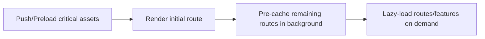
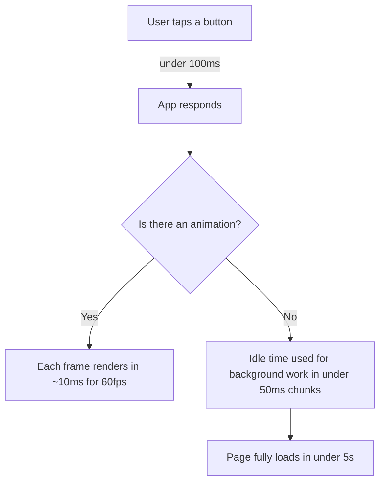
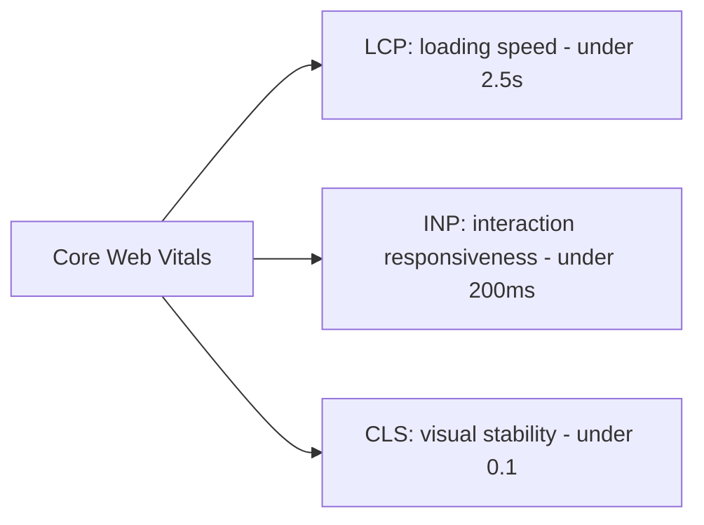

# Measuring & Improving Performance (Beginner)

## Why this matters

A website can be built perfectly and still feel slow, clunky, or frustrating if nobody thought about performance. Users notice — they'll leave a site that takes too long to load, and Google actually uses performance as a ranking factor for search results. This page introduces the core mental models and tools frontend developers use to measure and improve how fast and smooth a site feels.

## The PRPL Pattern

PRPL is a strategy (originally promoted by Google) for structuring how your app loads, especially useful for sites that need to load fast even on slow networks or low-power devices. It stands for:

- **P**ush (or Preload) — get the critical resources (the ones needed for the very first screen) to the browser as early as possible.
- **R**ender — render the initial route/screen as fast as possible, so the user sees *something* quickly.
- **P**re-cache — while the user is looking at that first screen, quietly cache other resources they're likely to need next (using a Service Worker).
- **L**azy-load — don't load everything upfront. Only load the code/assets for other routes or features when the user actually needs them.



**Example — lazy-loading a route in React:**

```jsx
import { lazy, Suspense } from 'react';

// Instead of importing the whole Settings page upfront...
const SettingsPage = lazy(() => import('./SettingsPage'));

function App() {
  return (
    <Suspense fallback={<div>Loading...</div>}>
      <SettingsPage />
    </Suspense>
  );
}
```

Here, the code for `SettingsPage` is only downloaded when it's actually needed, instead of being bundled into the initial page load — a direct application of the "Lazy-load" part of PRPL.

**Why this matters:** Users judge speed almost entirely by *first impression* — how fast something appears on screen. PRPL is about front-loading just enough to make that first impression fast, then filling in the rest quietly.

## The RAIL Model

RAIL is a way of thinking about performance from the *user's* perspective, broken into four areas, each with a time budget that keeps things feeling instant/smooth:

| Letter | Stands for | What it means | Time budget |
|---|---|---|---|
| **R** | Response | How fast the app responds to a user's tap/click | Under 100ms |
| **A** | Animation | How smooth animations and scrolling feel | Each frame in ~10ms (to hit 60fps) |
| **I** | Idle | Using free/idle time to do background work without blocking the user | Work in chunks under 50ms |
| **L** | Load | How fast the page becomes usable | Under 5 seconds (ideally much faster) on average mobile networks |

**Why these numbers?** They're based on human perception research:
- Under 100ms feels "instant" to a person.
- To get smooth 60-frames-per-second animation, each frame has about 16ms total, and RAIL recommends budgeting only ~10ms of that for your own work (leaving room for the browser itself).
- If a task takes longer than 50ms, it should be broken into smaller chunks so it doesn't block the user from interacting during that time.



## Performance Metrics: Core Web Vitals

Google defined a specific set of metrics called **Core Web Vitals** — measurable numbers that represent real user experience, not just "the page technically finished loading."

- **LCP (Largest Contentful Paint)** — how long it takes for the biggest visible element (often a hero image or heading) to appear on screen. This is what a user perceives as "the page has loaded."
  - **Good:** under 2.5 seconds
- **FID (First Input Delay)** — how long the page takes to respond to the user's *very first* interaction (like a click). Being replaced across the web by **INP (Interaction to Next Paint)**, which measures responsiveness across *all* interactions during the visit, not just the first one.
  - **Good FID:** under 100ms
  - **Good INP:** under 200ms
- **CLS (Cumulative Layout Shift)** — measures how much content unexpectedly jumps around while the page loads (e.g., an image loads in and pushes the button you were about to click down the page).
  - **Good:** under 0.1



**A simple CLS example — the problem:**

```html
<!-- Bad: no dimensions reserved, image "pops in" and shoves content down -->

<button>Click me</button>
```

**The fix:**

```html
<!-- Good: width/height reserve the space before the image loads -->

<button>Click me</button>
```

By telling the browser the image's dimensions ahead of time, it reserves that space immediately — so nothing jumps around once the image finishes loading.

## Using Lighthouse

**Lighthouse** is a free, built-in auditing tool (in Chrome DevTools, or as a standalone CLI tool) that scans your page and gives you scores plus specific recommendations for Performance, Accessibility, Best Practices, and SEO.

**How to run it:**
1. Open your site in Chrome.
2. Open DevTools (F12 or right-click → Inspect).
3. Go to the **Lighthouse** tab.
4. Click **Analyze page load**.

You'll get a score out of 100 for each category, plus a list of specific, actionable issues — like "images not properly sized" or "eliminate render-blocking resources" — each with an explanation of what to fix and why.

**Why this matters:** Lighthouse turns vague performance advice into a concrete checklist you can act on, specific to your actual page.

## Using DevTools (Performance & Network tabs)

Beyond Lighthouse, Chrome DevTools has two tabs specifically for digging into performance:

- **Network tab** — shows every request your page makes (HTML, CSS, JS, images, API calls), how long each took, how big each file is, and in what order they loaded. Great for spotting slow or oversized files.
- **Performance tab** — records exactly what the browser is doing over time (a "profile") — including JavaScript execution, rendering, and painting — so you can see exactly where time is being spent, frame by frame.

**How to use the Network tab:**
1. Open DevTools → Network tab.
2. Reload the page.
3. Look at the waterfall of requests — sort by size or time to spot the biggest offenders.

**How to use the Performance tab:**
1. Open DevTools → Performance tab.
2. Click the record button (●).
3. Interact with your page (scroll, click something).
4. Stop recording and look at the flame chart — tall/wide blocks of color represent time-consuming work.

**Why this matters:** While Lighthouse gives you a one-time snapshot and general advice, the Network and Performance tabs let you investigate *exactly* what's happening on your specific page, in real time, as you interact with it.

## Summary table

| Concept | What it's for |
|---|---|
| PRPL Pattern | A loading strategy: push critical assets, render fast, pre-cache, lazy-load the rest |
| RAIL Model | Budgets performance around human perception (Response/Animation/Idle/Load) |
| Core Web Vitals | LCP, INP (was FID), CLS — Google's standardized real-user performance metrics |
| Lighthouse | Automated audit tool with scores and specific fix recommendations |
| DevTools Network tab | Inspect every network request: size, timing, order |
| DevTools Performance tab | Record and inspect exactly what the browser is doing over time |

---

**Where this fits:** This is the final topic in the roadmap, following Browser APIs — after learning to build apps for the web, mobile, and desktop, this closes the loop by teaching you how to measure and improve how those apps actually perform for real users.
