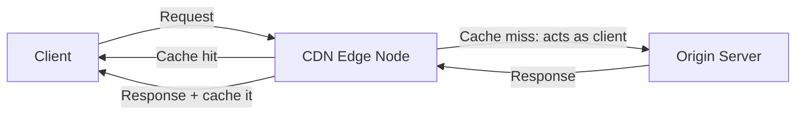
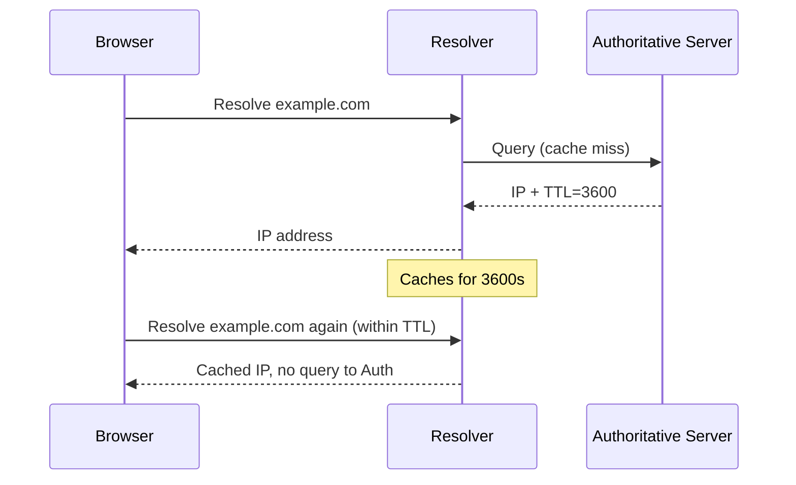
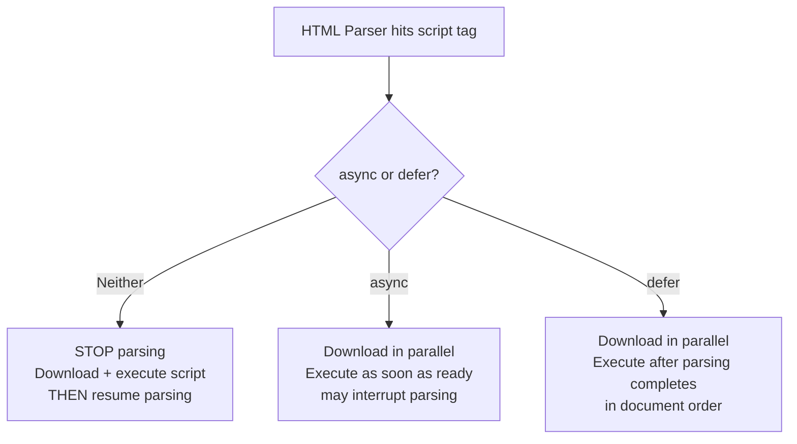

# The Internet — Intermediate Refresher

You already know browsers talk to servers over HTTP and that DNS resolves domain names. This refresher focuses on the details that get glossed over, misremembered, or misused in practice.

## Table of Contents
1. [Client-Server Model — the parts people forget](#1-client-server-model--the-parts-people-forget)
2. [HTTP — nuances beyond GET/POST](#2-http--nuances-beyond-getpost)
3. [Domain Names — registrar vs. registry vs. nameserver](#3-domain-names--registrar-vs-registry-vs-nameserver)
4. [Hosting — what "serverless" actually means](#4-hosting--what-serverless-actually-means)
5. [DNS Resolution Chain — caching and TTL nuances](#5-dns-resolution-chain--caching-and-ttl-nuances)
6. [Browser Rendering — critical rendering path gotchas](#6-browser-rendering--critical-rendering-path-gotchas)
7. [Common Mistakes](#7-common-mistakes)

---

## 1. Client-Server Model — the parts people forget

You know client-server basics. What's commonly missed:

- **Packets aren't guaranteed in-order delivery** — TCP reassembles them in order at the destination, but individual packets can take different physical paths (different routers) and arrive out of order. TCP's sequence numbers handle reordering; UDP doesn't guarantee this at all.
- **"The client" isn't always a browser.** Mobile apps, CLI tools (`curl`), other servers (server-to-server API calls) are all clients in this model. Don't conflate "client" with "browser" in interviews or design docs.
- **CDNs blur the client-server line.** A CDN edge node acts as a server to the client but as a client to your origin server (cache miss → CDN requests from origin). Worth knowing when debugging stale content.



---

## 2. HTTP — nuances beyond GET/POST

### Idempotency and safety — this trips people up in interviews

| Method | Safe (no side effects)? | Idempotent (same result if repeated)? |
|--------|:---:|:---:|
| GET | Yes | Yes |
| HEAD | Yes | Yes |
| OPTIONS | Yes | Yes |
| PUT | No | Yes |
| DELETE | No | Yes |
| POST | No | No |
| PATCH | No | No (technically — depends on implementation) |

**Common mistake:** assuming `PUT` and `POST` are interchangeable. `PUT` replaces the *entire* resource at a known URI and calling it twice produces the same end state. `POST` typically creates a new resource each time (or triggers a non-idempotent action) — calling it twice can create two resources.

### Status codes people misuse

- **401 vs. 403**: `401 Unauthorized` actually means "you're not authenticated" (despite the name — you need to log in). `403 Forbidden` means "you ARE authenticated, but you don't have permission." This mix-up shows up constantly in API design.
- **301 vs. 302**: `301` is a *permanent* redirect (browsers/search engines cache it, update bookmarks). `302` is *temporary* (should be re-checked each time). Using 301 for a temporary redirect can cause stale caching problems that are hard to undo.
- **304 Not Modified**: returned when a client's cached copy (via `If-None-Match` / `If-Modified-Since` headers) is still valid — no body is sent, saving bandwidth. Often forgotten in caching discussions.

### Headers that matter in practice

- `Cache-Control` — governs caching behavior (`no-store`, `max-age=3600`, `must-revalidate`). More authoritative than the older `Expires` header.
- `ETag` — a hash/fingerprint of a resource used for cache validation, paired with `If-None-Match`.
- `Content-Security-Policy` — mitigates XSS by restricting what sources scripts/styles can load from.
- **CORS headers** (`Access-Control-Allow-Origin`, etc.) are *response* headers set by the server, not something the client "requests." A common misconception is thinking you can fix a CORS error purely from frontend code — you can't; the server must opt in.

### Statelessness

HTTP is stateless by design — each request is independent, with no memory of previous requests. This is why sessions, cookies, and tokens (JWTs) exist: they're workarounds bolted on top of a fundamentally stateless protocol to simulate "logged in" state.

---

## 3. Domain Names — registrar vs. registry vs. nameserver

People often conflate these three distinct roles:

- **Registry**: The organization that maintains the master database for a TLD (e.g., Verisign runs `.com`).
- **Registrar**: The company you actually buy your domain from (Namecheap, GoDaddy) — an accredited reseller that talks to the registry on your behalf.
- **Nameserver**: The DNS server that actually holds your domain's DNS records. You can buy a domain from Registrar A but point its nameservers at Registrar/DNS-provider B (e.g., Cloudflare) — these are independent decisions.

**Common mistake:** assuming your domain registrar always hosts your DNS. In practice, many developers register at one company and delegate DNS management to another (e.g., register on Namecheap, use Cloudflare's nameservers for DNS + CDN + DDoS protection).

---

## 4. Hosting — what "serverless" actually means

"Serverless" doesn't mean no servers — it means you don't manage the server. Your code runs in ephemeral, auto-scaled containers/functions managed by the provider (AWS Lambda, Vercel Functions, Cloudflare Workers).

Key distinctions worth knowing:

| Model | You manage | Scales | Example |
|-------|-----------|--------|---------|
| Static hosting | Nothing (just files) | Via CDN | GitHub Pages, Netlify |
| Traditional/VPS | OS, runtime, scaling | Manually | DigitalOcean droplet |
| PaaS | App code only | Automatically | Heroku, Render |
| Serverless | Individual function code | Automatically, per-request | AWS Lambda, Vercel |

**Common mistake:** thinking static hosting means "no server involved." There's always a server — you're just not the one configuring or maintaining it.

---

## 5. DNS Resolution Chain — caching and TTL nuances

You know the chain: browser cache → OS cache → resolver → root → TLD → authoritative. The part people forget is **TTL (Time To Live)**.

Every DNS record has a TTL — the number of seconds a resolver/browser is allowed to cache that answer before re-checking. This is *why* DNS changes don't propagate instantly.



**Common mistake:** changing a DNS `A` record and expecting it to update everywhere instantly. If the old TTL was 24 hours, some resolvers around the world may still serve the old IP for up to 24 hours after the change. Best practice: lower the TTL *before* a planned migration, wait for it to propagate, then make the change.

Also worth knowing:
- **Negative caching**: resolvers cache "this domain doesn't exist" responses too (via the SOA record's minimum TTL), which is why a freshly registered domain can seem to "not exist yet" for a bit.
- **Anycast**: root and TLD servers use anycast routing — the "same" IP address is announced from many physical locations, and your query is routed to the nearest one. This is why DNS resolution is fast globally despite there being "only 13" root server addresses.

---

## 6. Browser Rendering — critical rendering path gotchas

You know: HTML → DOM, CSS → CSSOM → Render Tree → Layout → Paint → Composite. Here's what's commonly missed:

### Render-blocking resources

- **CSS is render-blocking by default.** The browser won't paint anything until CSSOM is fully built, because it doesn't want to paint unstyled content and then repaint (flash of unstyled content). This is why `<link rel="stylesheet">` in `<head>` blocks rendering.
- **JavaScript is parser-blocking by default.** A `<script>` tag (without `async`/`defer`) pauses HTML parsing entirely until the script downloads *and* executes — because the script might use `document.write()` or otherwise modify the DOM the parser hasn't built yet.



**Common mistake:** putting `<script>` tags in `<head>` without `defer`/`async`, tanking First Contentful Paint. Modern best practice is `<script defer>` or placing scripts at the end of `<body>`.

### Reflow vs. repaint — the distinction interviewers probe

- **Reflow (a.k.a. layout)**: recalculating geometry (size/position) — expensive, cascades to children/siblings.
- **Repaint**: redrawing pixels without changing geometry (e.g., `color` or `background-color` change) — cheaper.
- **Composite-only**: changes like `transform` and `opacity` can skip layout AND paint entirely, handled on the GPU compositing layer — this is *why* animating `transform`/`opacity` is far more performant than animating `top`/`left`/`width`.

**Common mistake:** animating `width`/`height`/`top`/`left` for UI transitions, causing layout thrashing, instead of using `transform: translate()`/`scale()` which are composite-only.

### Reading layout properties forces synchronous reflow

Reading properties like `offsetHeight`, `offsetWidth`, or calling `getBoundingClientRect()` immediately after writing a style forces the browser to synchronously recalculate layout right then (instead of batching it) — a performance anti-pattern known as **"layout thrashing"** when done in a loop.

```js
// BAD: forces reflow on every iteration
elements.forEach(el => {
  el.style.width = '100px';       // write
  console.log(el.offsetWidth);    // read → forces synchronous reflow
});

// GOOD: batch reads, then batch writes
const widths = elements.map(el => el.offsetWidth); // all reads first
elements.forEach((el, i) => { el.style.width = '100px'; }); // then all writes
```

---

## 7. Common Mistakes

- Confusing `401` (not authenticated) with `403` (authenticated but not authorized).
- Assuming CORS is fixable purely from the client side — it's a server-side header requirement.
- Assuming DNS changes are instant — TTL caching delays propagation.
- Treating `PUT` and `POST` as interchangeable — idempotency differs.
- Not using `defer`/`async` on scripts, unnecessarily blocking HTML parsing.
- Animating layout properties (`width`, `top`) instead of composite-friendly ones (`transform`, `opacity`).
- Assuming "serverless" means no server is involved.
- Forgetting that registrar, registry, and nameserver/DNS provider can all be different companies.

---

**Where this fits:** First topic in the Frontend roadmap (Internet → HTML → CSS → JavaScript → Version Control → ...) — foundational networking concepts that underpin everything else.
