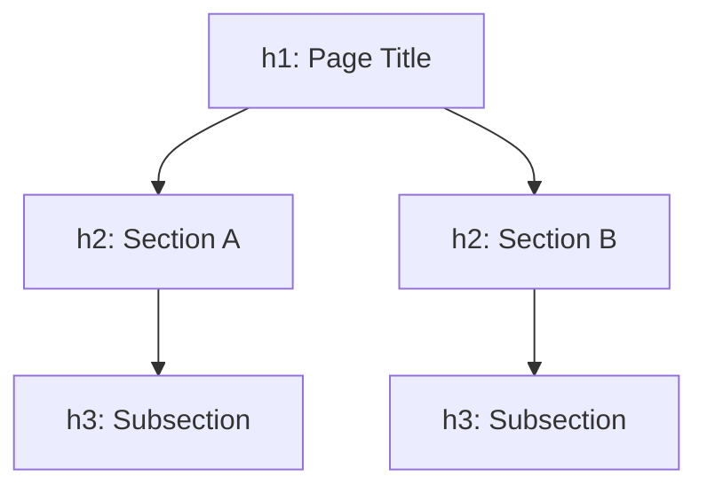
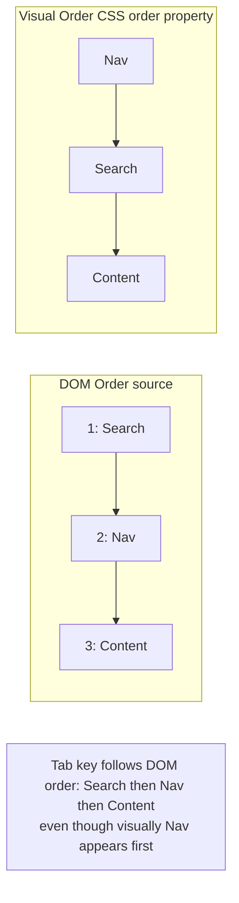

# HTML — Intermediate Refresher

You know tags, attributes, and basic form fields. This refresher targets the details that get half-learned, the semantic distinctions people blur, and the accessibility/SEO nuances that separate "it works" from "it's correct."

## Table of Contents
1. [Basics — the parts people get wrong](#1-basics--the-parts-people-get-wrong)
2. [Semantic HTML — the subtler distinctions](#2-semantic-html--the-subtler-distinctions)
3. [Forms and Validation — edge cases](#3-forms-and-validation--edge-cases)
4. [Accessibility — beyond alt text](#4-accessibility--beyond-alt-text)
5. [SEO — beyond title/description](#5-seo--beyond-titledescription)
6. [Common Mistakes](#6-common-mistakes)

---

## 1. Basics — the parts people get wrong

### Block vs. inline vs. inline-block (default behaviors)

Every element has a default `display` value that governs layout behavior *before* any CSS is applied:

| Category | Default width | Line breaks | Examples |
|---|---|---|---|
| Block | Fills parent | Before & after | `div`, `p`, `h1`-`h6`, `section`, `ul` |
| Inline | Content-sized | None | `span`, `a`, `strong`, `em` |
| Inline-block | Content-sized | None, but respects width/height | `img`, `input`, `button` |

**Common mistake:** trying to set `width`/`height` on a naturally inline element (like `<span>`) and being confused when it's ignored — inline elements ignore box-model sizing unless you change `display`.

### Void elements

Elements like ``, `<br>`, `<input>`, `<hr>`, `<meta>`, `<link>` have no closing tag and cannot contain children — they're "void" by spec, not just "self-closed" by convention. Writing `</img>` is invalid HTML (though browsers are forgiving).

### `id` vs `class` — beyond styling hooks

- `id` must be unique per page; it's also a valid **fragment identifier** (`page.html#section-2`) and a `for`/`aria-labelledby` target.
- Duplicate `id`s are a common bug source: `document.getElementById()` returns only the *first* match, silently masking the duplicate — this is a frequent root cause of "my JS only works on one of these elements" bugs.

### The `<head>` is more than title + meta

Things people forget belong in `<head>`:
- `<link rel="canonical" href="...">` — tells search engines the "real" URL when duplicate content exists at multiple URLs.
- `<link rel="icon">` — favicon.
- `<meta property="og:*">` — Open Graph tags controlling how links preview on social platforms (Slack, Twitter, Discord, etc.) — commonly forgotten until a shared link looks broken.

---

## 2. Semantic HTML — the subtler distinctions

### `<section>` vs `<div>` — the rule people misapply

`<section>` is not "a div with a nicer name." Per spec, a `<section>` should generally have a heading (`h1`-`h6`) — it represents a *thematic grouping of content*. If you're wrapping content purely for styling/layout purposes with no semantic grouping, use `<div>`.

```html
<!-- WRONG: no heading, purely a styling wrapper — should be a div -->
<section class="card-wrapper">
  <p>Some unrelated styled box</p>
</section>

<!-- RIGHT: thematic content with a heading -->
<section>
  <h2>Customer Reviews</h2>
  <p>...</p>
</section>
```

### `<article>` vs `<section>` — the test that resolves the ambiguity

Ask: "Would this content make sense being syndicated/distributed on its own (RSS feed, another site)?" If yes → `<article>`. If it only makes sense as part of the larger page → `<section>`.

A blog post is an `<article>`. The "Ingredients" portion of a recipe is a `<section>` *within* that `<article>` — it doesn't stand alone.

### One `<main>`, one `<h1>` (usually)

- `<main>` should appear exactly once per page and should NOT be nested inside `<header>`, `<footer>`, `<nav>`, `<aside>`, or another `<main>`.
- Historically "one `<h1>` per page" was strict dogma. With HTML5's (now largely abandoned) "outline algorithm," nested `<h1>`s inside `<article>`/`<section>` were technically allowed — but since no browser/AT actually implements the outline algorithm, the practical, accessibility-safe rule remains: **one `<h1>` per page, logically nested headings after that.**



**Common mistake:** skipping heading levels (`h1` straight to `h3`) for visual sizing reasons instead of using CSS to adjust the visual size of a correctly-leveled heading. Screen reader users navigate by heading level — skipped levels are disorienting.

---

## 3. Forms and Validation — edge cases

### The `name` attribute is what actually gets submitted, not `id`

```html
<!-- Common mistake: forgetting `name`, only setting `id` -->
<input id="email" type="email" />  <!-- will NOT be included in form submission -->

<input id="email" name="email" type="email" />  <!-- correct -->
```

`id` is for JS/CSS/label targeting. `name` is the key used in the submitted form data (`FormData`, query string, or request body). Missing `name` is a classic silent bug — the form "submits" but the field is just absent from the payload.

### `novalidate` and bypassing HTML5 validation

```html
<form novalidate>...</form>
```

Disables native browser validation UI entirely — used when you want full control via JavaScript (custom error messages, async validation) instead of the browser's default bubble tooltips.

### `:invalid` / `:valid` / `:user-invalid` CSS pseudo-classes

```css
input:invalid { border-color: red; }
input:valid { border-color: green; }
```

**Common mistake:** using `:invalid` styling without guarding against it firing before the user has even typed anything (an empty `required` field is `:invalid` by default, showing red immediately on page load). Fix with `:not(:placeholder-shown)` or the newer `:user-invalid` pseudo-class, which only matches after user interaction.

### Client-side validation is not security

HTML5 `required`/`pattern` attributes and JS validation are UX conveniences only. They are trivially bypassed (disable JS, use `curl`/Postman directly against your endpoint). **Server-side validation is non-negotiable** — this is a frequent interview/security-review flag.

### `<button>` inside `<form>` defaults to `type="submit"`

```html
<form>
  <input type="text" />
  <button onclick="doSomething()">Click</button> <!-- ALSO submits the form! -->
</form>
```

**Common mistake:** adding a `<button>` for some unrelated JS action inside a `<form>` and forgetting `type="button"` — it defaults to `type="submit"` and unexpectedly triggers form submission/page reload.

```html
<button type="button" onclick="doSomething()">Click</button> <!-- correct, won't submit -->
```

---

## 4. Accessibility — beyond alt text

### Focus order follows DOM order, not visual (CSS) order

If you use CSS (`flex-direction: row-reverse`, `order`, absolute positioning, Grid's `grid-template-areas`) to visually reorder content, keyboard `Tab` order still follows the *source* DOM order. This mismatch between visual order and focus order is a top accessibility failure in real audits.



### `aria-hidden="true"` hides from assistive tech but NOT visually

```html
<div aria-hidden="true">This is still visible on screen, but screen readers skip it entirely.</div>
```

**Common mistake:** confusing `aria-hidden` (hidden from AT, still visible/interactive) with `display: none` (hidden from everyone, removed from accessibility tree automatically) with `visibility: hidden` (invisible but still in layout flow). They solve different problems.

### Focus trapping and `tabindex`

- `tabindex="0"` — adds a naturally-non-focusable element (like a `<div>`) into the normal tab order.
- `tabindex="-1"` — removes an element from *keyboard* tab order, but still allows programmatic focus via `element.focus()` (used for modals, skip links).
- `tabindex` with a **positive value** (e.g., `tabindex="1"`) is almost always an anti-pattern — it overrides natural DOM order and creates confusing, hard-to-maintain tab sequences.

### Live regions for dynamic content

```html
<div aria-live="polite">3 new messages</div>
```

When content changes via JavaScript without a page reload (a notification count, a validation error appearing), screen readers won't announce it unless it's inside an `aria-live` region (`polite` = announce when idle; `assertive` = interrupt immediately).

---

## 5. SEO — beyond title/description

### Canonical URLs prevent duplicate content penalties

```html
<link rel="canonical" href="https://example.com/products/shoes" />
```

If the same content is reachable at multiple URLs (`?ref=twitter`, `/shoes/`, `/shoes`), a canonical tag tells search engines which URL is the "real" one to index and rank, consolidating SEO value instead of splitting it across duplicates.

### `robots.txt` vs `<meta name="robots">` vs `noindex`

- `robots.txt` — a site-wide file suggesting which paths crawlers *shouldn't visit at all* (doesn't guarantee non-indexing if the page is linked elsewhere).
- `<meta name="robots" content="noindex">` — page-level, explicitly tells search engines "don't index this page" even if crawled.
- **Common mistake:** blocking a page in `robots.txt` AND expecting `noindex` to work — if the crawler never visits the page (blocked by robots.txt), it never sees the `noindex` tag, so the page can still get indexed based on external links pointing to it. Use `noindex` alone if you want the page truly out of the index.

### Image SEO beyond `alt`

`loading="lazy"` on below-the-fold images improves page load performance (a ranking factor), while `width`/`height` attributes prevent layout shift (Cumulative Layout Shift — a Core Web Vitals metric).

```html

```

---

## 6. Common Mistakes

- Forgetting `name` on form inputs (only setting `id`) — field silently missing from submission.
- Using `<section>` as a generic styling wrapper instead of `<div>`.
- Skipping heading levels for visual sizing instead of using CSS.
- Confusing `aria-hidden`, `display: none`, and `visibility: hidden`.
- Assuming visual (CSS) order matches keyboard focus order.
- Relying on client-side validation as a security boundary.
- `<button>` without `type="button"` inside a form unexpectedly submitting it.
- Blocking a page via `robots.txt` while also expecting its `noindex` meta tag to be honored.
- Duplicate `id` attributes silently breaking `getElementById`/label associations.

---

**Where this fits:** Second topic in the Frontend roadmap (Internet → HTML → CSS → JavaScript → Version Control → ...) — HTML structure precedes CSS styling.
