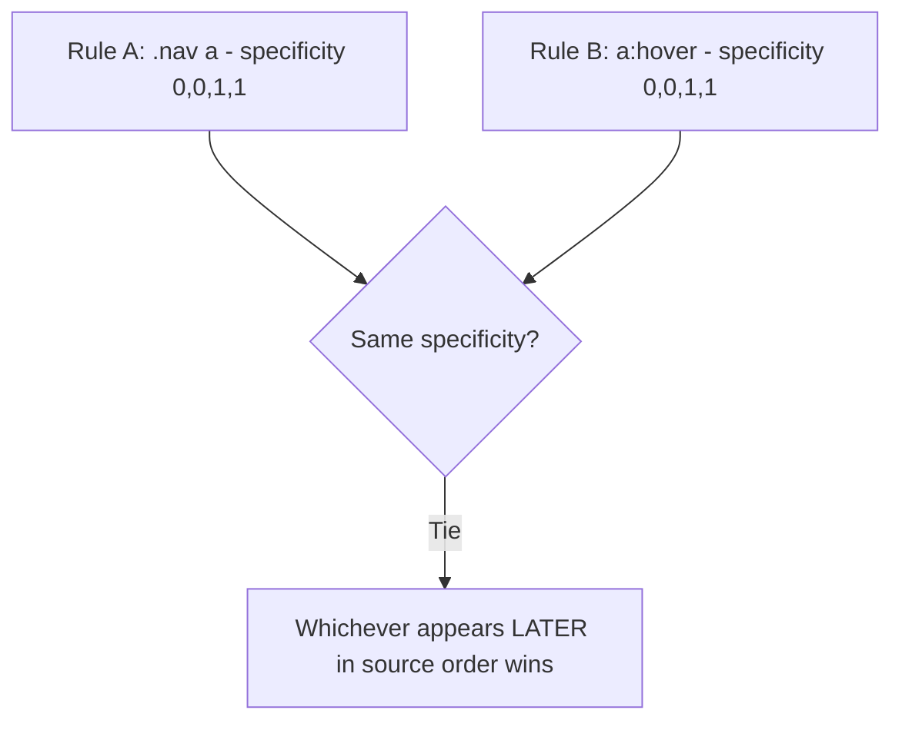
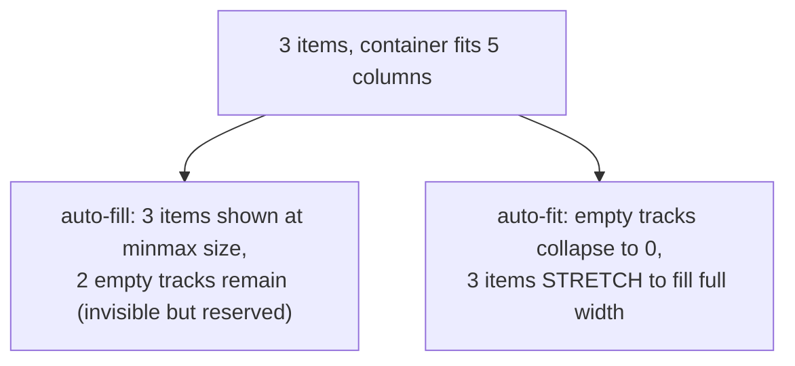

# CSS — Intermediate Refresher

You know selectors, the box model, and roughly how Flexbox/Grid work. This refresher targets specificity edge cases, layout gotchas, and responsive-design details that get half-learned the first time around.

## Table of Contents
1. [Specificity — the parts that actually cause bugs](#1-specificity--the-parts-that-actually-cause-bugs)
2. [The Box Model — gotchas](#2-the-box-model--gotchas)
3. [Flexbox — nuances beyond the basics](#3-flexbox--nuances-beyond-the-basics)
4. [Grid — nuances beyond the basics](#4-grid--nuances-beyond-the-basics)
5. [Responsive Design — details people skip](#5-responsive-design--details-people-skip)
6. [Common Mistakes](#6-common-mistakes)

---

## 1. Specificity — the parts that actually cause bugs

### The specificity tuple, not just "points"

Specificity is more precisely calculated as a tuple `(inline, IDs, classes/attributes/pseudo-classes, elements/pseudo-elements)` — NOT a simple additive score, even though the "points" mental model (1000/100/10/1) works for most cases. The distinction matters because **no number of low-tier selectors can ever outrank a higher tier** — 100 element selectors combined still lose to a single class selector.

```css
/* This has (0,0,0,100) — 100 elements — still LOSES to a single class */
div div div div div div div div /* ...100 divs... */ { color: blue; }

/* This has (0,0,1,0) — ALWAYS wins against the rule above */
.text { color: red; }
```

### `!important` — and why it's a trap

```css
.text { color: red !important; }
```

`!important` overrides normal specificity rules entirely — but the moment one team member reaches for it to "just make it work," it starts an arms race where the only way to override it later is *another* `!important` with equal-or-later source order, or an inline style with `!important`. Treat it as a last resort, and in code review, treat new `!important` usage as a smell worth questioning.

### Specificity of combinators and pseudo-classes — commonly misjudged

```css
a:hover { color: green; }        /* specificity (0,0,1,1): pseudo-class + element */
.nav a { color: blue; }          /* specificity (0,0,1,1): class + element — TIE with above */
```

When specificity ties, **source order** (whichever rule appears later in the cascade) wins — this is why simply reordering CSS rules can silently "fix" or "break" styling, and why many `:hover` styles mysteriously fail to apply (they're defined *before* a tied-specificity rule that comes later).



**Common mistake:** writing `a:hover` before a later `.nav a` rule of equal specificity, then being confused when hover styling silently never appears — the later rule always wins on a tie, regardless of pseudo-classes.

### The cascade layers people forget: origin and importance

Full cascade order (simplified, low to high priority): user-agent stylesheet → author stylesheet → author `!important` → user-agent `!important`. Within the same origin/importance tier, specificity applies; within the same specificity, source order applies. Modern `@layer` (cascade layers) lets you explicitly control ordering between whole groups of rules independent of specificity — worth knowing exists even if you haven't used it yet.

---

## 2. The Box Model — gotchas

### `box-sizing` isn't inherited by default — and neither is the reset universal enough

```css
/* Common "reset" — necessary because box-sizing does NOT cascade to pseudo-elements automatically the way you'd expect */
*, *::before, *::after {
  box-sizing: border-box;
}
```

Forgetting `*::before, *::after` means pseudo-elements can still use `content-box` sizing even when the rest of your page uses `border-box`, causing subtle mismatches in generated content boxes.

### Margin collapsing — the classic "why is there extra space" bug

Adjacent vertical margins between block-level siblings **collapse** into a single margin (the larger of the two), rather than adding together.

```css
.a { margin-bottom: 20px; }
.b { margin-top: 30px; }
/* Gap between .a and .b is 30px (the larger), NOT 50px */
```

Margin collapsing also happens between a parent and its first/last child if there's no padding/border/inline content separating them — a common source of "why is my container's top margin leaking outside it" bugs.

**How to prevent it:** add padding or border to the parent, use `overflow: hidden` / `display: flow-root` on the parent, or switch to `flex`/`grid` (collapsing doesn't apply inside flex/grid containers at all).

### Percentage heights need an explicit parent height

```css
.parent { /* no explicit height set */ }
.child { height: 50%; } /* does nothing meaningful — 50% of "auto" is undefined */
```

**Common mistake:** setting `height: 100%` on a child expecting it to fill the viewport, forgetting that percentage-based heights resolve against the *parent's* computed height — which must itself be explicitly set (or ultimately trace back to `html, body { height: 100% }`).

---

## 3. Flexbox — nuances beyond the basics

### `flex-grow`, `flex-shrink`, `flex-basis` — the shorthand people cargo-cult

```css
.item { flex: 1; }             /* shorthand for: flex-grow:1, flex-shrink:1, flex-basis:0% */
.item { flex: 1 1 auto; }      /* different! flex-basis is 'auto', not 0% */
```

`flex: 1` and `flex: auto` are NOT the same, despite looking similar:
- `flex: 1` → basis starts at `0`, so all items grow purely proportionally to `flex-grow`, ignoring their content size as a starting point.
- `flex: auto` → basis starts at the item's own content size, THEN grows/shrinks from there.

This distinction explains a very common bug: items with different content lengths ending up unequal width even with `flex: 1` set on all of them, if `min-width`/`max-width` constraints interfere, or unexpectedly equal width when developers actually wanted content-based sizing.

### `align-items` vs `align-content` — commonly confused

- `align-items` — aligns items along the cross axis within a **single line**.
- `align-content` — aligns entire **lines** (plural) within the container, only relevant when `flex-wrap: wrap` creates multiple lines and there's extra space in the cross axis.

**Common mistake:** setting `align-content` expecting it to center a single row of items — it does nothing without wrapping and extra cross-axis space.

### `min-width: auto` — the flex overflow gotcha

By default, flex items have an implicit `min-width: auto`, which prevents them from shrinking smaller than their content (e.g., a long unbreakable string or a fixed-size image) — even with `flex-shrink: 1` set. This is *the* most common cause of "my flex item overflows its container and I can't figure out why."

```css
.item {
  flex-shrink: 1;
  min-width: 0; /* explicitly override the implicit auto minimum, allow real shrinking */
  overflow: hidden;
  text-overflow: ellipsis;
}
```

---

## 4. Grid — nuances beyond the basics

### `fr` unit vs `%` — the distinction that matters with gaps

`fr` units distribute *remaining* space after fixed-size tracks and `gap` are subtracted — `%` distributes a percentage of the *total* container width, gap included in neither case automatically adjusting. This is why mixing `fr` and `%` columns with `gap` set can produce unexpected overflow; prefer `fr` consistently when using `gap`.

```css
.grid {
  display: grid;
  grid-template-columns: 200px 1fr 1fr; /* 200px fixed, remaining space split evenly */
  gap: 16px; /* gap is subtracted from available space BEFORE fr calculation */
}
```

### `auto-fill` vs `auto-fit` — the subtle, frequently-asked distinction

```css
.grid {
  display: grid;
  grid-template-columns: repeat(auto-fit, minmax(200px, 1fr));
}
```

Both create as many columns as will fit given `minmax()`. The difference appears when there are **fewer items than possible columns**:
- `auto-fill` keeps the empty tracks in the grid (they just have no content) — items stay their `minmax` size, don't stretch to fill leftover space.
- `auto-fit` collapses empty tracks to `0` width — remaining items DO stretch to fill the leftover space (because `1fr` now has more room to claim).



### Implicit vs. explicit grid

Items placed beyond your defined `grid-template-columns`/`rows` (explicit grid) land in the **implicit grid**, auto-sized by `grid-auto-rows`/`grid-auto-columns` (default `auto`). Forgetting to set these leads to inconsistent row heights when content overflows a defined grid.

---

## 5. Responsive Design — details people skip

### `min-width` vs `max-width` media queries — mobile-first vs desktop-first

```css
/* Mobile-first (preferred): base = mobile, add complexity for larger screens */
@media (min-width: 768px) { ... }

/* Desktop-first (legacy pattern, still seen in older codebases): base = desktop, override for smaller */
@media (max-width: 767px) { ... }
```

**Common mistake:** mixing both approaches in the same codebase, producing overlapping/conflicting breakpoints that are hard to reason about. Pick one strategy (mobile-first is the modern default) and stay consistent.

### `em` vs `rem` in media query breakpoints — a genuinely debated nuance

Some browsers (historically Safari) compute `em`-based media query breakpoints relative to the *browser's default font size setting*, not `16px` flatly — meaning if a user has bumped their browser zoom/font-size preference, `em`-based breakpoints shift earlier than `px`-based ones, which is actually **desirable** for accessibility (content reflows sooner for users who need larger text). This is why many accessibility-conscious teams deliberately prefer `em` over `px` in `@media` queries, despite `px` looking simpler.

### Container queries — beyond media queries

Media queries respond to the **viewport** size. **Container queries** respond to a *containing element's* size — critical for genuinely reusable components (a card that needs different styles depending on whether its parent is a narrow sidebar or a wide main area, regardless of overall viewport size).

```css
.card-container {
  container-type: inline-size;
  container-name: card;
}

@container card (min-width: 400px) {
  .card { flex-direction: row; }
}
```

**Why this matters for interviews:** container queries are a relatively recent (broadly supported since 2023) addition that solves a real limitation media queries always had — component-level responsiveness independent of the viewport.

### Logical properties over physical ones

```css
/* Physical (assumes left-to-right, top-to-bottom reading) */
margin-left: 16px;

/* Logical (adapts automatically to writing-mode/direction, e.g. RTL languages) */
margin-inline-start: 16px;
```

Increasingly used in production for internationalization — `margin-inline-start`/`padding-block-end`/etc. automatically flip for right-to-left languages without duplicating CSS.

---

## 6. Common Mistakes

- Assuming `flex: 1` and `flex: auto` behave the same — they differ in `flex-basis`.
- Not knowing about the implicit `min-width: auto` on flex items causing unwanted overflow.
- Confusing `align-items` (single line) with `align-content` (multiple wrapped lines).
- Reaching for `!important` instead of understanding why a rule isn't applying.
- Forgetting `*::before, *::after` in a `box-sizing: border-box` reset.
- Not knowing about margin collapsing, then "fixing" it with unrelated hacks.
- Setting `height: 100%` on a child without an explicit ancestor height chain.
- Confusing `auto-fill` (keeps empty tracks) with `auto-fit` (collapses empty tracks, items stretch).
- Mixing mobile-first and desktop-first media query strategies inconsistently.
- Not knowing container queries exist for component-level (not viewport-level) responsiveness.

---

**Where this fits:** Third topic in the Frontend roadmap (Internet → HTML → CSS → JavaScript → Version Control → ...) — CSS layout/styling precedes adding interactivity with JavaScript.
