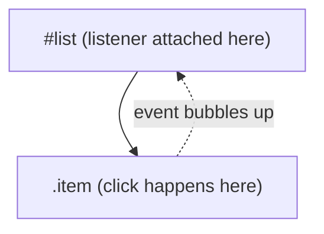

# JavaScript — Intermediate Brush-Up

You know variables, functions, loops, and how to fetch data. This is a refresher on the parts people get subtly wrong or half-learn the first time: scoping quirks, `this` binding, DOM performance traps, and the real differences between fetch and XHR.

## Part 1: The Basics — what people forget

### `let`/`const` vs `var` — it's about scope, not just reassignment

`var` is function-scoped (or global). `let`/`const` are block-scoped. This bites people in loops:

```js
// Classic gotcha
for (var i = 0; i < 3; i++) {
  setTimeout(() => console.log(i), 0);
}
// Logs: 3, 3, 3 — all callbacks share the SAME `i`

for (let i = 0; i < 3; i++) {
  setTimeout(() => console.log(i), 0);
}
// Logs: 0, 1, 2 — each iteration gets its own `i`
```

`let` creates a new binding per loop iteration; `var` does not. This is the single most common `var` gotcha in interviews.

### Truthy/falsy and `==` vs `===`

Falsy values: `false`, `0`, `""`, `null`, `undefined`, `NaN`. Everything else is truthy — including `"0"`, `[]`, and `{}` (empty array/object are truthy, which surprises people).

```js
if ([]) console.log("runs"); // yes, this runs — [] is truthy
```

Always use `===`/`!==`. The one exception people cite is `value == null`, which matches both `null` and `undefined` — but prefer being explicit (`value === null || value === undefined`) unless your team has a convention.

### Hoisting

`var` declarations and function declarations are hoisted (moved to the top of their scope) — but `let`/`const` are hoisted too, just left in a "temporal dead zone" until their line executes.

```js
console.log(x); // undefined (var hoisted, not yet assigned)
var x = 5;

console.log(y); // ReferenceError: Cannot access 'y' before initialization
let y = 5;
```

### `this` binding — the classic trap

Arrow functions don't have their own `this` — they inherit it from the enclosing scope. Regular functions get `this` based on *how they're called*.

```js
const obj = {
  name: "Widget",
  regular: function () {
    console.log(this.name); // "Widget" — this = obj
  },
  arrow: () => {
    console.log(this.name); // undefined — this = outer scope, not obj
  },
};
```

This is why event handlers as class methods often need binding or arrow functions:

```js
class Counter {
  count = 0;

  // Arrow function as class field — `this` stays bound to the instance
  increment = () => {
    this.count++;
  };
}
```

If you used a regular method (`increment() {}`) and passed it as a callback (`button.addEventListener("click", counter.increment)`), `this` inside would be the button, not the instance.

### Equality of objects/arrays

```js
console.log([1,2] === [1,2]); // false — different references
console.log({a:1} === {a:1}); // false — different references
```

Objects/arrays compare by reference, not value. Common source of confusing React/state bugs later.

---

## Part 2: DOM Manipulation — nuances and gotchas

### Event delegation — don't attach 100 listeners

If you have a list of items and want click handling on each, don't loop and attach a listener per item. Attach one listener to the parent and check `event.target`.

```js
// Bad: N listeners, breaks when new items are added dynamically
document.querySelectorAll(".item").forEach((el) => {
  el.addEventListener("click", handleClick);
});

// Good: one listener, works for items added later too
document.querySelector("#list").addEventListener("click", (event) => {
  if (event.target.matches(".item")) {
    handleClick(event);
  }
});
```

This works because events **bubble** up the DOM tree from the target to its ancestors, unless `stopPropagation()` is called.



### `textContent` vs `innerHTML` vs `innerText`

| Property | Parses HTML? | Triggers reflow for styling? | Security risk |
|---|---|---|---|
| `textContent` | No — sets raw text | No | Safe |
| `innerHTML` | Yes | No | **XSS risk** if inserting user input |
| `innerText` | No | Yes (respects CSS visibility, slower) | Safe |

Never do `el.innerHTML = userInput` — that's a textbook XSS vector. Use `textContent`, or sanitize first if you truly need HTML.

### Layout thrashing

Reading a layout property (`offsetHeight`, `getBoundingClientRect()`) right after writing a style forces the browser to recalculate layout synchronously — do this in a loop and performance tanks.

```js
// Bad: forces a layout recalculation on every iteration
items.forEach((item) => {
  item.style.width = "100px";
  console.log(item.offsetHeight); // forces reflow, every time
});

// Better: batch reads, then batch writes
const heights = items.map((item) => item.offsetHeight); // all reads first
items.forEach((item) => { item.style.width = "100px"; });  // all writes after
```

### `querySelectorAll` returns a static NodeList

```js
const items = document.querySelectorAll(".item");
list.appendChild(document.createElement("li")); // adds new .item
console.log(items.length); // unchanged — NodeList didn't grow
```

Compare to `getElementsByClassName`, which returns a **live** HTMLCollection that does update automatically — a frequent source of confusion when debugging.

### `DOMContentLoaded` vs `load`

- `DOMContentLoaded` fires when HTML is parsed, before images/stylesheets finish loading.
- `load` fires only after everything (images, CSS, iframes) has finished loading.

Use `DOMContentLoaded` for "the DOM is ready to query" — it's what you want almost always, and it's much faster than `load`.

---

## Part 3: Fetch API / Ajax — nuances people miss

### fetch() does NOT reject on HTTP error status codes

This is the #1 fetch gotcha:

```js
const response = await fetch("/api/does-not-exist");
console.log(response.ok);     // false
console.log(response.status); // 404
// but the Promise still RESOLVED, not rejected!
```

`fetch` only rejects on network failures (DNS error, no connection, CORS block) — not on 404/500. You must check `response.ok` yourself:

```js
async function getData(url) {
  const response = await fetch(url);
  if (!response.ok) {
    throw new Error(`HTTP error: ${response.status}`);
  }
  return response.json();
}
```

XHR has the same behavior via `status`, but people expect fetch's Promise-based API to "just work" like `axios`, which *does* reject on bad status codes by default — a common source of confusion when switching libraries.

### Aborting requests

```js
const controller = new AbortController();

fetch(url, { signal: controller.signal })
  .catch((err) => {
    if (err.name === "AbortError") console.log("Request cancelled");
  });

controller.abort(); // cancels the fetch
```

XHR has `xhr.abort()` built in directly; fetch needs `AbortController`. Useful for cancelling stale requests (e.g. search-as-you-type).

### Race conditions with async data

```js
// Bug: if the user types fast, an OLDER response can arrive AFTER a newer one
async function search(query) {
  const res = await fetch(`/search?q=${query}`);
  const data = await res.json();
  renderResults(data); // could overwrite newer results with stale ones
}
```

Fix with `AbortController` (cancel the previous request) or by tracking a request ID/timestamp and ignoring stale responses.

### Parallel vs sequential await

```js
// Sequential — slow, each waits for the previous
const a = await fetch(url1);
const b = await fetch(url2);

// Parallel — both fire at once, much faster
const [a, b] = await Promise.all([fetch(url1), fetch(url2)]);
```

Forgetting `Promise.all` when requests don't depend on each other is a very common performance mistake.

### `Promise.all` fails fast; `Promise.allSettled` doesn't

```js
Promise.all([p1, p2, p3]); // rejects immediately if ANY promise rejects
Promise.allSettled([p1, p2, p3]); // always resolves, gives status of each
```

Use `allSettled` when you want all results even if some fail (e.g. loading independent widgets on a dashboard).

---

## Common Mistakes

1. **Using `var` in loops with async callbacks** — leads to shared-variable bugs. Use `let`.
2. **Forgetting `fetch` doesn't throw on 4xx/5xx** — always check `response.ok`.
3. **Setting `innerHTML` with unsanitized user input** — XSS vulnerability.
4. **Attaching individual listeners in a loop instead of delegating** — wastes memory, breaks for dynamically added elements.
5. **Mixing `async/await` with `.then()` unnecessarily** — pick one style per function for readability.
6. **Not awaiting `response.json()`** — it's a Promise too; forgetting `await` gives you a pending Promise object instead of data.
7. **Comparing objects/arrays with `===`** and expecting value equality.
8. **Not handling the AbortError case** when using AbortController, causing unhandled promise rejections.
9. **Using arrow functions for object methods that need `this`** — arrow functions don't bind their own `this`.

---

**Where this fits:** JavaScript → Version Control (Git) → Package Managers → Pick a Framework → Writing CSS → ...
