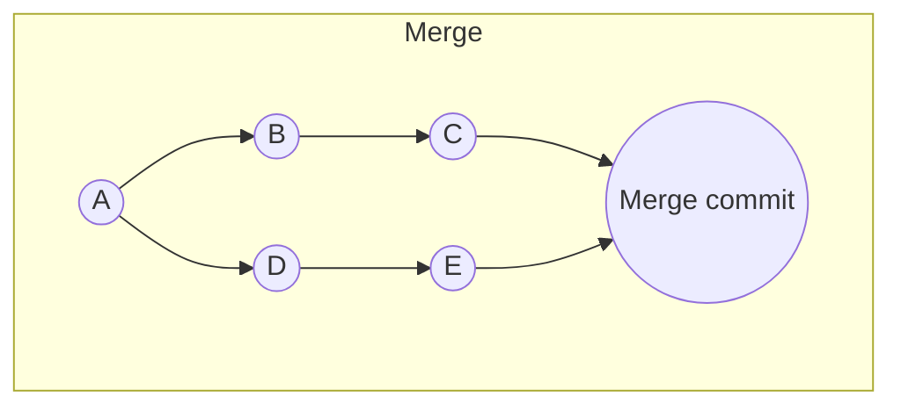
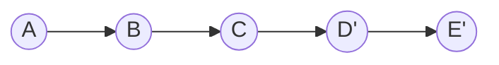

# Version Control — Intermediate Brush-Up

You already do `add`, `commit`, `branch`, `merge`, and `push`/`pull` daily. This is a refresher on what people get wrong later: rebase vs merge, detached HEAD, resetting safely, and what hosting platforms actually add beyond "storage."

## Part 1: Git Fundamentals — the nuances

### `git merge` vs `git rebase`

Both integrate changes from one branch into another, but they produce very different history.



**Merge** creates a new "merge commit" that ties both histories together. Nothing is rewritten — safe, but the history gets a branching graph with merge bubbles.

**Rebase** replays your branch's commits *on top of* the target branch, producing a linear history:

```bash
git checkout feature
git rebase main
```



Note `D'` and `E'` — rebase doesn't move the original commits, it creates **new commits** with new hashes that replay the same changes.

### The golden rule of rebase

**Never rebase a branch that other people have already pulled/based work on.** Because rebase rewrites commit hashes, anyone with the old commits will get massive conflicts and duplicate history when they try to sync. Rebase is safe for your own local, not-yet-pushed, or not-yet-shared branches. Merge is safe for shared/public branches.

```bash
# Safe: cleaning up your own feature branch before opening a PR
git checkout feature/my-work
git rebase main

# Dangerous: rebasing main or any branch others are pulled from
git checkout main
git rebase feature   # don't do this on a shared branch
```

### Interactive rebase — cleaning up commits before a PR

```bash
git rebase -i HEAD~3
```

Opens an editor letting you `squash` (combine), `reword`, `drop`, or `reorder` your last 3 commits. Extremely common for turning "wip", "fix typo", "actually fix it" into one clean commit before review.

### `git reset` — the three modes, and why they matter

```bash
git reset --soft HEAD~1   # undo the commit, keep changes staged
git reset --mixed HEAD~1  # undo the commit AND unstage (this is the default)
git reset --hard HEAD~1   # undo the commit AND discard all changes — DESTRUCTIVE
```

`--hard` throws away uncommitted work permanently (unless you can recover it via `git reflog`). This is the most dangerous everyday Git command — always double check you're not sitting on unsaved work before running it.

### `git revert` vs `git reset`

- `reset` rewrites history — removes commits as if they never happened. Fine for local/unpushed work.
- `revert` creates a **new commit** that undoes a previous commit's changes, without altering history. Safe for shared branches, because nobody's history gets rewritten.

```bash
git revert <commit-hash>   # safe to use on shared branches
```

### Detached HEAD state

If you `git checkout <commit-hash>` directly (instead of a branch name), you enter a "detached HEAD" state — you're no longer on any branch. Any commits you make here can be lost once you check out something else, unless you create a branch to hold them:

```bash
git checkout <commit-hash>   # detached HEAD
git checkout -b rescue-branch  # save your work onto a real branch
```

### `git stash` — shelving work temporarily

```bash
git stash            # save uncommitted changes, revert working directory to clean
git stash pop         # bring them back
git stash list        # see all stashes
```

Useful when you need to quickly switch branches without committing half-finished work.

### `.gitignore` gotcha

Adding a pattern to `.gitignore` only stops **untracked** files from being tracked. If a file is already tracked, `.gitignore` won't remove it — you must explicitly untrack it:

```bash
git rm --cached path/to/file
```

### Merge conflicts — resolving with intention

```
<<<<<<< HEAD
const greeting = "Hello";
=======
const greeting = "Hi there";
>>>>>>> feature/new-greeting
```

Everything between `<<<<<<< HEAD` and `=======` is your current branch's version; between `=======` and `>>>>>>> branch-name` is the incoming version. Delete the markers, keep (or combine) the correct code, then:

```bash
git add <file>
git commit          # or `git rebase --continue` if you were mid-rebase
```

---

## Part 2: VCS Hosting — beyond the basics

### PR/MR workflows: squash vs merge commit vs rebase-and-merge

Most hosting platforms give you a choice for how a Pull Request gets integrated:

| Strategy | Result |
|---|---|
| **Merge commit** | Preserves all individual commits + adds a merge commit |
| **Squash and merge** | Combines all PR commits into a single commit on the target branch |
| **Rebase and merge** | Replays PR commits individually onto target, no merge commit, linear history |

Squash is popular for keeping `main` history clean (one commit per feature); it also means you lose the granular commit-by-commit history unless you dig into the PR itself.

### Protected branches & required reviews

Teams configure `main` (or `release`) branches to reject direct pushes, requiring all changes to go through a reviewed PR, often with required status checks (CI passing) before merge is even allowed. This is standard on any team beyond a solo project.

### Fork vs branch

- **Branch**: used when you have write access to the repository directly (common on internal team repos).
- **Fork**: creates your own full copy of someone else's repository under your account; used for open-source contributions where you don't have write access. You push to your fork, then open a PR from your fork back to the original repo.

### CI/CD triggered by hosting platforms

GitHub Actions, GitLab CI/CD, and Bitbucket Pipelines all let you define workflows (YAML files, e.g. `.github/workflows/*.yml`) that automatically run on events like `push` or `pull_request` — running tests, linting, builds, and deployments. This is the "CD" glue that makes hosting platforms more than just Git storage.

### Rewriting pushed history

If you must rewrite history that's already pushed (rare — e.g. removing an accidentally committed secret):

```bash
git push --force-with-lease
```

Prefer `--force-with-lease` over plain `--force` — it fails safely if someone else has pushed new commits you don't have locally yet, preventing you from silently discarding their work.

---

## Common Mistakes

1. **Rebasing a shared/public branch** — rewrites history other people have already based work on, causing conflict chaos.
2. **Using `git reset --hard` without checking for uncommitted work first** — permanently destroys changes.
3. **Force-pushing with plain `--force`** instead of `--force-with-lease`, silently overwriting teammates' commits.
4. **Committing directly to `main`** on team projects instead of using a feature branch + PR.
5. **Not writing meaningful commit messages** ("fix", "update", "asdf") — makes `git log`/`git blame` useless later.
6. **Forgetting `.gitignore` doesn't untrack already-tracked files** — secrets/build artifacts stay in history.
7. **Resolving merge conflicts by blindly accepting "theirs" or "ours"** without reading both sides.
8. **Confusing `git pull` with `git fetch`** — `pull` = `fetch` + `merge` (or rebase, if configured); `fetch` alone just downloads without touching your working branch.

---

**Where this fits:** JavaScript → Version Control (Git) → Package Managers → Pick a Framework → Writing CSS → ...
