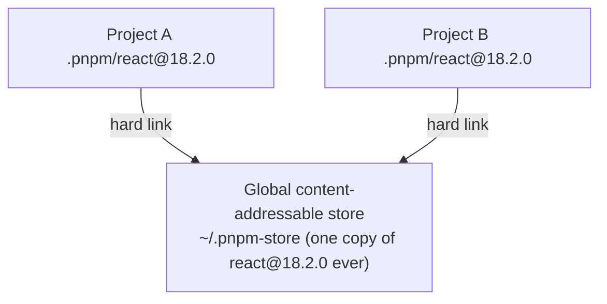

# Package Managers — Intermediate Brush-Up

You know `npm install` and what `package.json` does. Here's what people get wrong: semver range gotchas, the difference between lockfiles and version ranges, npm's flat `node_modules` and "phantom dependencies," and how pnpm's strict store actually changes behavior (not just speed).

## Part 1: package.json and dependency resolution — nuances

### Semver ranges — what `^` and `~` actually mean

```json
{
  "dependencies": {
    "axios": "^1.4.0",
    "lodash": "~4.17.21",
    "react": "18.2.0"
  }
}
```

| Prefix | Meaning | Example matches |
|---|---|---|
| `^1.4.0` | Compatible with 1.4.0 — allows minor/patch upgrades | `1.4.1`, `1.9.0`, not `2.0.0` |
| `~4.17.21` | Allows only patch upgrades | `4.17.22`, not `4.18.0` |
| `1.2.3` (exact) | Only that exact version | `1.2.3` only |
| `*` or `latest` | Any version — dangerous, avoid | anything |

Gotcha: `^0.x.y` (a pre-1.0 package) behaves differently — caret only allows patch bumps below version 1.0.0, since the package hasn't hit a stable API yet. `^0.4.0` allows `0.4.x` but not `0.5.0`.

### `package.json` ranges vs the lockfile — the actual source of truth

`package.json` describes *acceptable* ranges. The **lockfile** (`package-lock.json`, `yarn.lock`, `pnpm-lock.yaml`) pins the *exact resolved* version tree that was actually installed, including every nested dependency. `npm install` respects the lockfile if one exists and is compatible; it only re-resolves when the lockfile is missing or `package.json` has changed incompatibly.

```bash
npm ci     # installs EXACTLY what's in package-lock.json, no resolution, fails if out of sync
npm install # may update the lockfile if package.json changed
```

**Use `npm ci` in CI/CD pipelines**, not `npm install` — it's faster, deterministic, and fails loudly instead of silently drifting if the lockfile is stale.

### Dependency resolution conflicts

Two packages can require different, incompatible versions of the same sub-dependency. npm resolves this by allowing **multiple copies to coexist** nested inside each other's `node_modules` when versions truly conflict — this is why deeply nested `node_modules` still exists even with npm's modern flattening (dedupe) strategy.

---

## Part 2: npm vs pnpm vs yarn — how they actually differ

### npm/yarn classic: flat `node_modules` and phantom dependencies

Modern npm (v3+) and classic yarn "hoist" dependencies — instead of nesting every dependency inside its parent's `node_modules`, they flatten as many as possible into the top-level `node_modules`, to save space and improve resolution speed.

```
node_modules/
  react/
  axios/
  follow-redirects/   ← actually a dependency OF axios, but hoisted to top level
```

**The gotcha ("phantom dependencies"):** because `follow-redirects` sits at the top level, your code can `import` it directly even though you never listed it in your own `package.json`. It works — until axios stops depending on it, or you install on a machine where hoisting resolved differently, and suddenly your unlisted import breaks with no warning. This is one of the most common "works on my machine" bugs in JS.

```js
// This "works" today but is NOT a real dependency of your project
import followRedirects from "follow-redirects"; // never declared in package.json!
```

### pnpm: strict, symlinked `node_modules` — fixes phantom dependencies by design

pnpm creates a **non-flat** `node_modules` using symlinks: your top-level `node_modules` only contains symlinks to packages you *actually* declared in `package.json`. Nested dependencies live in a hidden `.pnpm` folder and are only reachable by the packages that actually declared them.

```
node_modules/
  react -> .pnpm/react@18.2.0/node_modules/react
  axios -> .pnpm/axios@1.4.0/node_modules/axios
  .pnpm/
    axios@1.4.0/node_modules/
      axios/
      follow-redirects/   ← only visible to axios, not to your app code
```

Result: if you try to `import` a package you never declared, it simply **fails to resolve** — pnpm surfaces phantom-dependency bugs immediately instead of letting them silently work until they don't. This is a correctness feature, not just an implementation detail.

### The content-addressable store — mechanics, not just "it's faster"



Packages are stored once, keyed by content hash. Every project needing that exact version gets a **hard link** (same file on disk, different directory entry) — not a copy. This is why pnpm installs are both fast (no re-downloading/copying identical files) and disk-efficient. It also means editing a file inside one project's `node_modules` in place could theoretically affect the shared store — pnpm defends against this by making the store read-only by default.

### Workspaces / monorepos

All three support "workspaces" (multiple packages in one repo sharing a root `node_modules`), but with different maturity:

```json
// package.json (npm/yarn workspaces)
{
  "workspaces": ["packages/*"]
}
```

```yaml
# pnpm-workspace.yaml
packages:
  - "packages/*"
```

pnpm's workspace implementation is generally considered the most robust for large monorepos — it was built with strictness and monorepo scale as first-class goals from the start, whereas npm workspaces was added later and is comparatively basic.

### Install speed and disk usage — why the numbers differ

| | npm | yarn (classic) | pnpm |
|---|---|---|---|
| Duplicate package copies across projects | Yes | Yes | No (hard-linked from single store) |
| Resolution algorithm | Hoisting/dedupe (can still nest on conflicts) | Hoisting | Strict symlink structure |
| Typical disk usage across many projects | Highest | High | Lowest (often dramatically) |
| Phantom dependency risk | Yes | Yes | No (blocked by design) |
| CI install speed (with lockfile, cache warm) | Good | Good | Usually fastest |

### `overrides` / `resolutions` — forcing a specific nested version

Sometimes you need to force every package in the tree to use a specific version of a sub-dependency (e.g. patching a security vulnerability in a transitive dependency):

```json
// npm
{ "overrides": { "follow-redirects": "1.15.4" } }

// yarn classic
{ "resolutions": { "follow-redirects": "1.15.4" } }

// pnpm
{ "pnpm": { "overrides": { "follow-redirects": "1.15.4" } } }
```

---

## Common Mistakes

1. **Not committing the lockfile** — causes different installs on different machines/CI, "works on my machine" bugs.
2. **Using `npm install` in CI instead of `npm ci`** — slower, and can silently update the lockfile instead of failing on drift.
3. **Relying on phantom dependencies** (importing a package never listed in `package.json`) — works under npm/yarn's flat hoisting until it silently breaks.
4. **Mixing package managers in one project** (e.g. both `package-lock.json` and `yarn.lock` present) — causes inconsistent installs; pick one and delete the others.
5. **Using `*` or no version constraint** — makes builds non-reproducible over time as new majors get pulled in.
6. **Manually editing files inside `node_modules`** — changes vanish on next install, and with pnpm's hard-linked store, could theoretically affect other projects.
7. **Not understanding `devDependencies` vs `dependencies`** — shipping dev tools (like a bundler) into a production `node_modules` install unnecessarily bloats deploys.
8. **Ignoring `overrides`/`resolutions` when a security advisory flags a deeply nested dependency**, instead trying (and failing) to fix it at the top level.

---

**Where this fits:** JavaScript → Version Control (Git) → Package Managers → Pick a Framework → Writing CSS → ...
