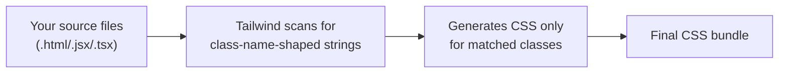

# Writing CSS (Intermediate)

You already know Tailwind, BEM, and Sass exist and roughly what they do. This guide is a brush-up focused on the details people forget, misconfigure, or half-learn the first time around — the stuff that actually bites you in a real project.

---

## 1. Tailwind CSS — beyond "utility classes in HTML"

### The mental model refresher

Tailwind generates CSS at **build time** by scanning your source files for class name strings and emitting only the utilities it finds. This is the single most important fact about Tailwind, because it explains almost every gotcha below.



### Gotcha #1 — the `content` (purge) config

Tailwind needs to know **which files to scan**. If a file isn't listed in `content` (Tailwind v3) or isn't picked up by the default detection (v4), its classes get dropped from the final build — even though they render fine in dev with hot-reload cached styles.

```js
// tailwind.config.js (v3)
module.exports = {
  content: [
    './index.html',
    './src/**/*.{js,ts,jsx,tsx}',
  ],
  theme: { extend: {} },
  plugins: [],
};
```

**Classic bug**: it works in `npm run dev` but the styles disappear in the production build. Cause: a component lives in a directory not covered by the `content` glob (e.g. a `packages/ui` folder in a monorepo), or styles are pulled from a `.mdx` file that isn't in the glob.

### Gotcha #2 — dynamically constructed class names

Tailwind's scanner works on **static string matching**, not on your actual JavaScript logic. It cannot resolve variables at build time.

```jsx
// BROKEN — Tailwind cannot see this string, so text-red-500 / text-green-500
// never make it into the generated CSS.
const color = isError ? 'red' : 'green';
<p className={`text-${color}-500`}>Status</p>
```

```jsx
// CORRECT — write the full, literal class names somewhere Tailwind can scan them.
const className = isError ? 'text-red-500' : 'text-green-500';
<p className={className}>Status</p>
```

Rule of thumb: **Tailwind must be able to find the complete class name as a literal substring in your source.** Anything assembled via string concatenation/interpolation at runtime is invisible to the scanner.

### Gotcha #3 — specificity fights with `@apply` / custom CSS

Mixing Tailwind utilities with hand-written CSS classes on the same element causes ordinary CSS specificity/cascade rules to apply — Tailwind utilities are not automatically "more important."

```css
/* If .btn is defined AFTER Tailwind's utilities in the cascade,
   and has equal specificity, it can silently override bg-blue-500. */
.btn {
  background-color: gray;
}
```

Fix: use Tailwind's `important` modifier sparingly (`!bg-blue-500`), or better, keep utilities as the single source of truth and avoid competing hand-written classes on the same element.

### Gotcha #4 — arbitrary values need exact bracket syntax

```html
<div class="top-[117px]">        <!-- works -->
<div class="top-[ 117px ]">      <!-- broken: spaces inside brackets break parsing -->
```

---

## 2. BEM — nuances people get wrong

### It's a convention, not a validator

Nothing enforces BEM for you. Its value only exists if the whole team follows it consistently — a single `.title` slipped in without the block prefix reintroduces the exact collision risk BEM exists to prevent.

### Common mistake: nesting elements inside elements

```html
<!-- WRONG: implies element-of-element, which BEM explicitly avoids -->
<div class="card__header__title"></div>
```

BEM's rule: elements belong to the **block**, not to each other. Flatten it:

```html
<!-- CORRECT -->
<div class="card__title"></div>
```

Even if `title` is visually nested inside `header` inside `card`, in BEM naming it's still just `card__title` — there's no such thing as an element of an element.

### Common mistake: modifier without the base class

```html
<!-- WRONG: --disabled alone carries no base styles -->
<button class="button--disabled">Submit</button>
```

```html
<!-- CORRECT: modifier only adds/overrides on top of the base -->
<button class="button button--disabled">Submit</button>
```

A modifier class is meant to be applied **alongside** the base block/element class, never instead of it.

### When BEM starts to hurt

Deeply nested UI (cards inside lists inside panels) produces long, awkward class names (`panel__list-item__card__title--highlighted`). In practice, most teams stop nesting BEM more than one or two levels and treat sub-components as their own blocks instead.

---

## 3. Sass — what people forget

### `@use` vs `@import` (this trips up a lot of people)

`@import` in Sass is **deprecated** (not the same as CSS's native `@import`). Modern Sass code should use `@use`:

```scss
// OLD (deprecated, global namespace pollution, can double-include files)
@import 'variables';
@import 'mixins';
```

```scss
// NEW (namespaced, loaded once, explicit)
@use 'variables' as vars;
@use 'mixins' as mix;

.button {
  color: vars.$primary-color;
  @include mix.flex-center;
}
```

`@use` namespaces everything you import (`vars.$primary-color` instead of a bare `$primary-color`), which avoids naming collisions between partials — a problem `@import` had no answer for.

### Nesting overuse

Nesting mirrors HTML structure but excessive nesting produces high-specificity selectors that are hard to override later:

```scss
// Avoid this — 4 levels deep, generates
// .page .sidebar .widget .widget__title { ... } (heavy specificity)
.page {
  .sidebar {
    .widget {
      .widget__title { color: red; }
    }
  }
}
```

Sass style guides generally recommend nesting no more than 2–3 levels, and combining nesting with BEM-style flat naming instead of relying on descendant selectors for scoping.

### `$variables` vs CSS custom properties

Sass variables (`$primary-color`) are resolved **at compile time** — they don't exist in the shipped CSS and cannot be read or changed at runtime (e.g. by JavaScript, or media queries doing "theme switching"). Native CSS custom properties (`--primary-color`) are resolved **at runtime** in the browser and can be changed dynamically (e.g. dark mode toggles). Many modern codebases use Sass for build-time logic (mixins, loops) but native custom properties for themeable values.

---

## 4. PostCSS — the part people gloss over

PostCSS is a transformation pipeline, and Tailwind itself runs as a PostCSS plugin. A typical `postcss.config.js`:

```js
module.exports = {
  plugins: {
    tailwindcss: {},
    autoprefixer: {},
  },
};
```

**Order matters.** Plugins run in the order listed. Putting `autoprefixer` before `tailwindcss` means it prefixes CSS that hasn't been generated yet — Tailwind should generally run first so autoprefixer sees the final utility output.

**Gotcha**: Autoprefixer relies on a `browserslist` config (in `package.json` or `.browserslistrc`) to know which browsers to target. Forgetting this means Autoprefixer either adds unnecessary prefixes for browsers nobody uses, or misses prefixes for ones you actually support.

```json
// package.json
{
  "browserslist": ["> 0.5%", "last 2 versions", "not dead"]
}
```

---

## 5. CSS Modules / Styled Components / CSS-in-JS — brush-up

- **CSS Modules**: class names are hashed at build time (`.title` → `.Card_title__a3F2x`). Common mistake: trying to reference a CSS Modules class from **outside** its own file (e.g. targeting a child component's internal class from a parent) — it won't work because the hashed name is private to that module. Use the `:global()` escape hatch only when you deliberately need a global class.

- **Styled Components / CSS-in-JS runtime cost**: traditional CSS-in-JS libraries generate styles at **runtime** in the browser (or need a Babel/SWC plugin for build-time extraction), which has a real performance cost on large pages — this is why newer approaches (Tailwind, CSS Modules, "zero-runtime" CSS-in-JS like vanilla-extract or Panda CSS) have gained popularity for performance-sensitive apps. Know this trade-off; it comes up in architecture discussions.

- **Common mistake**: mixing global CSS resets with CSS Modules/Styled Components and being surprised when global selectors "leak" into scoped components — scoping only protects your own generated class names, not element selectors like `button` or `h1` written globally.

---

## Common mistakes summary

| Mistake | Why it happens | Fix |
|---|---|---|
| Tailwind classes missing in prod build | File not covered by `content` glob | Widen/verify the glob paths |
| Dynamic Tailwind class strings render unstyled | Build-time scanner can't resolve runtime variables | Use full literal class name strings |
| BEM element-of-element naming | Copying visual nesting into class names | Flatten to `block__element` |
| BEM modifier used alone | Forgetting the base class is required | Always pair modifier with base class |
| Sass `@import` warnings | Legacy tutorials still teach it | Use `@use`/`@forward` |
| Autoprefixer prefixes wrong/missing | No `browserslist` config | Add one to `package.json` |
| CSS Modules class referenced cross-file | Assuming class names are global | Pass className as a prop, or use `:global()` intentionally |

---

**Where this fits**: Pick a Framework → **Writing CSS** → Build Tools → Testing → Authentication Strategies.
