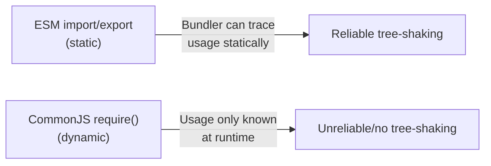

# Build Tools (Intermediate)

You already know that bundlers exist to combine, transpile, and optimize your code, and that Vite/Webpack are common choices. This is a brush-up on what actually differs between them in practice, and the config mistakes people repeatedly make.

---

## 1. The four jobs, refreshed

| Job | What it actually solves |
|---|---|
| Bundling | Fewer network requests, resolved module graph |
| Transpiling | New syntax (TS, JSX, top-level await) → target-compatible JS |
| Tree-shaking | Dead code elimination based on static `import`/`export` analysis |
| Dev server + HMR | Sub-second feedback loop without full reloads or state loss |

The nuance people forget: **tree-shaking depends on static analysis.** It only works reliably with ESM (`import`/`export`), because the bundler can determine at build time what's used without running the code. CommonJS (`require`/`module.exports`) is dynamic, so tree-shaking through CommonJS modules is unreliable or impossible in many cases. This is one of the real reasons the ecosystem pushed toward ESM.



---

## 2. Vite vs Webpack — where the real differences are

### Dev-time architecture (the big one)

- **Webpack**: bundles your *entire* app (or at least a big dependency graph) before serving anything, even in dev mode. On a large app, this means a noticeable wait before the first page loads, and rebuilds on file change can also be slow because chunks of the bundle need to be reconstructed.
- **Vite**: in dev, does **not** bundle at all. It serves native ES modules straight to the browser and transforms files on-demand, per-request, using esbuild (which is written in Go and extremely fast for transpilation, though it doesn't do full type-checking). This is why Vite's dev server starts near-instantly regardless of project size.

For production, both eventually produce a real bundle — Vite delegates to Rollup for its production build, which is a *different* tool with different plugin APIs than what Vite uses in dev (esbuild). This is a real gotcha:

**Gotcha: dev and prod can behave differently.** A plugin or transform quirk that only exists in Rollup (prod) or only in esbuild (dev) can cause "works in dev, breaks in build" bugs. Always test the production build (`vite build && vite preview`) before shipping, not just the dev server.

### Config gotchas

**Webpack** — the classic mistake is misconfiguring loaders order or missing a loader for a file type:

```js
module.exports = {
  module: {
    rules: [
      // loaders run right-to-left / bottom-to-top within a rule
      { test: /\.css$/, use: ['style-loader', 'css-loader'] },
      // WRONG order would break CSS processing —
      // css-loader must resolve imports/urls before style-loader injects into DOM
    ],
  },
};
```

**Vite** — a common mistake is forgetting that `import.meta.env` variables must be prefixed with `VITE_` to be exposed to client code (this is a deliberate security boundary, not a bug):

```env
# .env
VITE_API_URL=https://api.example.com   # exposed to client
SECRET_KEY=abc123                       # NOT exposed — stays server-only
```

```js
console.log(import.meta.env.VITE_API_URL); // works
console.log(import.meta.env.SECRET_KEY);   // undefined, by design
```

Another Vite gotcha: **pre-bundling of dependencies.** Vite pre-bundles `node_modules` dependencies with esbuild on first run (cached in `node_modules/.vite`). Adding a new dependency sometimes requires a server restart (or Vite auto-detects and re-optimizes, but occasionally you'll see stale-dependency errors) — clearing that cache folder is a common troubleshooting step.

### Rollup and Parcel — where they actually fit

- **Rollup**: still the go-to for **library authors** because its output is minimal and clean, without bundler-runtime overhead — important when your bundle is going to be `import`ed into someone else's app, not run standalone.
- **Parcel**: "zero config" is real for simple cases but becomes a liability once you need fine-grained control (custom loaders, complex code-splitting rules) — the trade-off is convenience vs control, same trade-off you'll see repeated across the whole tooling landscape.

### esbuild and SWC — not full bundlers for complex apps

Both are valued for raw transform/bundle speed (Go and Rust respectively, vs JS-based tools). The nuance: **esbuild's bundler is fast but has historically lacked some of Webpack/Rollup's advanced code-splitting and plugin ecosystem maturity** — which is exactly why Vite uses esbuild only for dev-time transforms and dependency pre-bundling, while still relying on Rollup for the more complex production bundling logic. Don't assume "esbuild is faster" automatically means "use esbuild directly for everything" — it's commonly used as an internal engine inside other tools rather than the top-level tool itself.

SWC is the same story on the transpilation side — Next.js replaced Babel with SWC for speed, but the underlying job (JS/TS/JSX → target JS) is conceptually the same as Babel always did.

---

## 3. ESLint vs Prettier — the conflict people hit

### The overlap problem

Both tools *can* have opinions about formatting (ESLint has stylistic rules like `indent`, `quotes`, `semi`). Running both without coordination causes them to fight — ESLint flags something as an error, then Prettier reformats it differently, causing a formatting rule to fire again.

**Fix**: disable ESLint's stylistic rules and let Prettier own formatting entirely.

```json
// .eslintrc.json
{
  "extends": [
    "eslint:recommended",
    "eslint-config-prettier"
  ]
}
```

`eslint-config-prettier` disables every ESLint rule that would conflict with Prettier — it does not add new rules, it only turns off ones that clash. This distinction trips people up: it's a *disabling* config, not a Prettier-integration plugin (that's a separate package, `eslint-plugin-prettier`, which actively runs Prettier as an ESLint rule — usually unnecessary and a bit slower; most modern setups run Prettier as a separate step instead).

### Common mistakes

| Mistake | Consequence | Fix |
|---|---|---|
| Not installing `eslint-config-prettier` | ESLint and Prettier disagree on formatting, endless diff noise | Install it, put `"prettier"` last in `extends` |
| Running Prettier as an ESLint rule (`eslint-plugin-prettier`) unnecessarily | Slower lint runs, formatting errors reported as lint errors | Run Prettier as a separate script/pre-commit step |
| No `.prettierignore` / `.eslintignore` | Linting/formatting generated files (`dist/`, `node_modules/`) | Add ignore files |
| Relying on IDE auto-format only | Inconsistent formatting across contributors with different editor setups | Enforce via CI (`prettier --check`) and/or pre-commit hook |

### CI enforcement example

```json
// package.json scripts
{
  "lint": "eslint . --max-warnings=0",
  "format:check": "prettier --check ."
}
```

Running these in CI (not just locally) is what actually prevents style drift across a team — local-only enforcement degrades quickly once more than one or two people are relaxed about running it.

---

## Common mistakes summary

| Mistake | Why it happens | Fix |
|---|---|---|
| "Works in dev, breaks in build" (Vite) | Dev uses esbuild, prod uses Rollup — different engines | Always test `vite build && vite preview` before shipping |
| Env variable is `undefined` in client code (Vite) | Missing `VITE_` prefix | Prefix client-exposed vars with `VITE_` |
| CSS not processing correctly (Webpack) | Loader order wrong (loaders apply right-to-left) | Order loaders so the last-applied one is listed first |
| Tree-shaking not working | Code uses CommonJS (`require`) instead of ESM | Use `import`/`export` syntax |
| ESLint and Prettier fighting on save | No conflict-resolution config installed | Add `eslint-config-prettier`, run Prettier separately |
| Stale dependency errors after adding a package (Vite) | Stale pre-bundle cache | Clear `node_modules/.vite`, restart dev server |

---

**Where this fits**: Pick a Framework → Writing CSS → **Build Tools** → Testing → Authentication Strategies.
