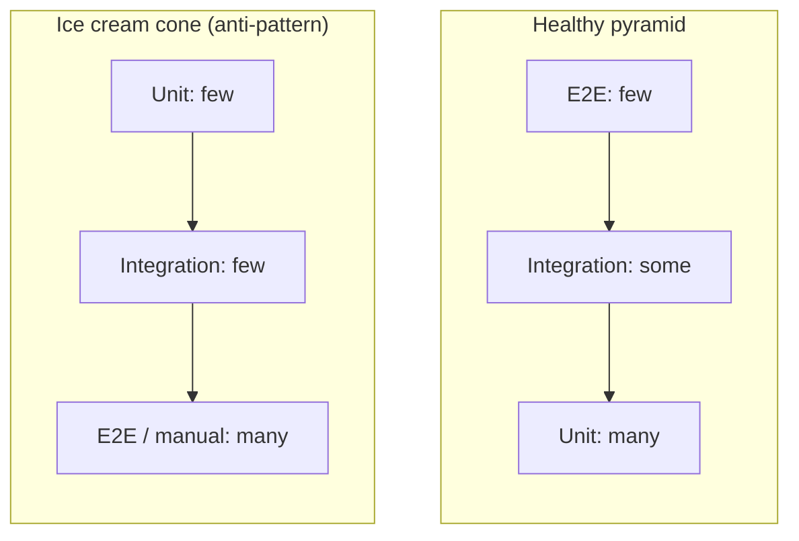

# Testing (Intermediate)

You already know the testing pyramid and have written unit tests and probably a few E2E tests. This is a brush-up on the nuances that actually matter day-to-day: why tests go flaky, what "integration" really means in a frontend context, and where Playwright and Cypress genuinely diverge.

---

## 1. The pyramid — the nuance people skip

The classic pyramid (many unit, some integration, few E2E) is a guideline, not a law. Two things people forget:

- **The "ice cream cone" anti-pattern**: teams under time pressure often invert the pyramid — few unit tests, tons of manual/E2E testing — which makes the suite slow, flaky, and expensive to maintain. If your CI takes 40 minutes because everything is E2E, that's the ice cream cone, not the pyramid.
- **Frontend "integration" tests are often mislabeled unit tests.** A React component test that renders a component tree with several child components and a bit of state management, using Testing Library, is arguably an integration test (multiple units collaborating) even though it runs inside your fast unit-test runner (Vitest/Jest) — it doesn't require a real browser or backend to be "integration."



---

## 2. Vitest vs Jest — real differences, not just syntax

The API is nearly identical, but the runtime differs in ways that matter:

| | Vitest | Jest |
|---|---|---|
| Module resolution | Uses Vite's resolver/transform pipeline directly — same config as your app | Separate transform pipeline (Babel or ts-jest), can drift from your actual build config |
| ESM support | Native, first-class | Historically CommonJS-first; ESM support improved but still has rough edges |
| Speed | Generally faster, especially in watch mode (uses Vite's HMR-like re-run) | Slower on large suites, though caching helps |
| Globals (`test`, `expect`) | Off by default — must `import` or set `globals: true` in config | On by default |

### Gotcha: config drift between app build and test build

If your app uses Vite but your tests use Jest with a separately configured Babel transform, path aliases (`@/components/...`), CSS imports, and env variable handling can behave *differently* in tests than in the real app — a test can pass while the equivalent code path is broken in the actual build, or vice versa. This is the strongest practical argument for using Vitest in a Vite app: one less pipeline to keep in sync.

### Gotcha: mocking timers and dates

```js
import { vi, test, expect } from 'vitest';

test('debounced function fires once after delay', () => {
  vi.useFakeTimers();
  const fn = vi.fn();
  const debounced = debounce(fn, 300);

  debounced();
  debounced();
  debounced();

  vi.advanceTimersByTime(300);
  expect(fn).toHaveBeenCalledTimes(1);

  vi.useRealTimers(); // forgetting this leaks fake timers into the next test
});
```

Forgetting `vi.useRealTimers()` (or Jest's equivalent `jest.useRealTimers()`) after a test is a classic cause of tests that pass in isolation but fail when run as part of the full suite — because fake timers bleed into subsequent tests.

---

## 3. Common causes of flaky tests

Flaky = sometimes passes, sometimes fails, with no code change in between. This is one of the most common real-world testing pain points.

| Cause | Example | Fix |
|---|---|---|
| Asserting before async work finishes | Checking DOM immediately after a state update triggered by a promise | Use `await screen.findBy...` (Testing Library) instead of `getBy...`, or explicit `waitFor` |
| Hardcoded waits (`sleep(1000)`) | Assuming an animation/API always finishes in exactly 1s | Wait for a specific condition/element instead of a fixed time |
| Shared/leaked state between tests | A mock or global variable not reset between tests | Reset mocks in `beforeEach`/`afterEach` |
| Test order dependency | Test B only passes if Test A ran first and left data behind | Each test should set up its own state independently |
| Real network calls in unit tests | Test hits a real API that's sometimes slow/down | Mock network calls (e.g. with `msw`) |
| Non-deterministic data | Using `Date.now()` or `Math.random()` directly in assertions | Freeze time, seed randomness, or inject as a dependency |

```js
// FLAKY: assumes the async update has already happened
test('shows welcome message', () => {
  render(<Profile />);
  expect(screen.getByText('Welcome')).toBeInTheDocument(); // may run before fetch resolves
});

// FIXED: waits for the element to appear
test('shows welcome message', async () => {
  render(<Profile />);
  expect(await screen.findByText('Welcome')).toBeInTheDocument();
});
```

---

## 4. Playwright vs Cypress — where they actually diverge

Both automate real browsers and both are excellent choices; the differences matter when picking one for a specific team/project.

| Aspect | Playwright | Cypress |
|---|---|---|
| Execution model | Runs outside the browser, communicates via browser automation protocols (CDP, etc.) | Runs *inside* the browser's execution context (except for some newer modes) |
| Cross-origin navigation | Handles natively | Historically restrictive — Cypress traditionally struggled with multi-origin flows (improved in later versions with `cy.origin()`) |
| Multi-tab / multi-window testing | First-class support | Limited/awkward |
| Auto-waiting | Built into every action/assertion by default | Also has auto-retrying assertions, but historically required more explicit waiting patterns in certain cases |
| Parallelization | Built-in, free | Requires Cypress Cloud (paid) for full parallel/dashboard features, though open-source parallel running via other CI tricks is possible |
| Browser engines | Chromium, Firefox, WebKit — real engine coverage including Safari | Chromium family primarily; Firefox/WebKit support more limited |
| Debugging experience | Trace viewer (step-by-step timeline with DOM snapshots, network, console) | Time-travel debugger in the Cypress UI (also strong) |

### Gotcha: testing across subdomains / OAuth redirects

If your app redirects to a third-party OAuth provider (Google, GitHub login) during a login flow, this used to be a much harder scenario in Cypress specifically, due to its in-browser execution model creating cross-origin restrictions. Playwright, running outside the browser as an automation controller, handles this more naturally. Know this trade-off if a team's E2E suite needs to test real OAuth flows.

### Common mistake: over-testing with E2E instead of unit/integration

A very common intermediate mistake is writing E2E tests for things that unit tests could check much faster and more reliably — e.g. form validation logic, or component-level conditional rendering. Reserve E2E for testing that the pieces genuinely work together across the real stack (routing, API calls, auth), not for logic a unit test could isolate.

---

## Common mistakes summary

| Mistake | Consequence | Fix |
|---|---|---|
| Ice-cream-cone test distribution | Slow, flaky, expensive CI | Push logic coverage down to unit tests |
| Config drift between app + test build (Jest in a Vite app) | Tests pass, app breaks (or vice versa) | Prefer Vitest in Vite apps, or carefully mirror config |
| Forgetting to reset fake timers/mocks | Cross-test contamination, order-dependent flakiness | Reset in `beforeEach`/`afterEach` |
| Asserting before async state settles | Flaky pass/fail | Use `findBy`/`waitFor` instead of synchronous `getBy` |
| Hardcoded `sleep()` waits in E2E | Slow and still flaky under load | Wait on conditions/elements, not fixed time |
| Testing OAuth/cross-origin flows in Cypress | Historically brittle due to in-browser execution model | Consider Playwright, or use Cypress's `cy.origin()` |
| Using E2E for logic unit tests could cover | Slow suite, unclear failure cause | Move pure logic/validation checks to unit tests |

---

**Where this fits**: Pick a Framework → Writing CSS → Build Tools → **Testing** → Authentication Strategies.
