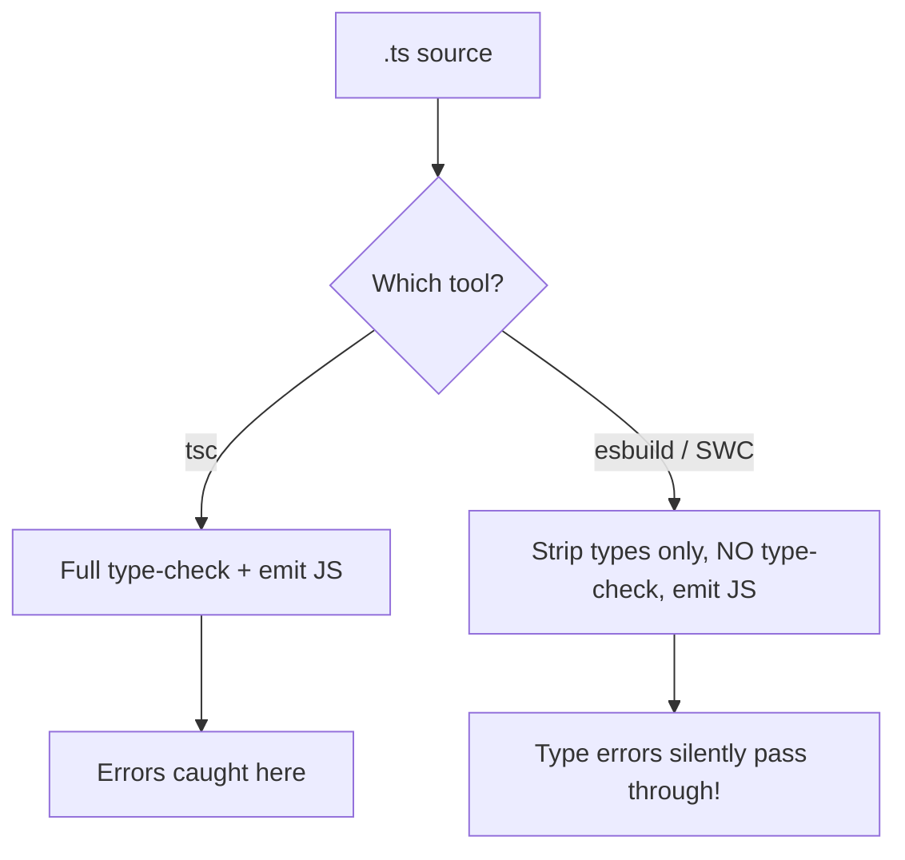

# Type Checkers (TypeScript) — Intermediate Brush-Up

You already write TypeScript day-to-day. This is a refresher on the parts that get abused or half-understood: `any` overuse, structural typing surprises, generic constraints, and the build-pipeline split that causes "but it compiled!" confusion.

## The `any` escape hatch — and why it's a trap

`any` opts a value **out of type checking entirely** — it's not "unknown type, checked dynamically," it's "TypeScript, stop checking this." Once something is `any`, it silently infects everything it touches.

```typescript
function processUser(user: any) {
  return user.name.toUpperCase(); // no error, even if `user` is undefined or `name` is a number
}

processUser(null); // compiles fine, crashes at runtime — exactly the bug TS exists to prevent
```

**Common mistake:** reaching for `any` to silence an error under deadline pressure, rather than modeling the actual type — this reintroduces the exact runtime-crash class TypeScript is meant to eliminate, but now with false confidence because the code "type-checks."

### `unknown` is the safer alternative

`unknown` also accepts any value, but forces you to **narrow** the type before using it — you can't call methods or access properties without a type guard first.

```typescript
function processUser(user: unknown) {
  if (typeof user === 'object' && user !== null && 'name' in user) {
    // narrowed — safe to access, TS now tracks what's known
  }
  // user.name; // Error: 'user' is of type 'unknown' — forces the check above
}
```

**Common mistake:** treating `unknown` and `any` as interchangeable "I don't know the type" escape hatches — `unknown` still enforces safety at the point of use; `any` does not.

## Structural typing — TypeScript's biggest surprise for people from nominally-typed languages

TypeScript uses **structural typing** ("duck typing"): if an object has the right shape, it satisfies the interface, regardless of name or explicit declaration.

```typescript
interface Point { x: number; y: number; }

function logPoint(p: Point) { console.log(p.x, p.y); }

const point3D = { x: 1, y: 2, z: 3 };
logPoint(point3D); // OK! Extra properties on an existing variable are fine — structural match

logPoint({ x: 1, y: 2, z: 3 });
// Error on an object LITERAL: "Object literal may only specify known properties,
// and 'z' does not exist in type 'Point'."
```

**Common mistake:** being confused why the exact same shape errors as a literal but not as a variable — this is "excess property checking," which only applies to object literals assigned/passed directly, not to values passed via a variable. It's a deliberate TS heuristic to catch likely typos, not a fundamental rule.

## `interface` vs `type` — the parts that actually differ

| | `interface` | `type` |
|---|---|---|
| Declaration merging | Yes — multiple `interface X` declarations merge | No — duplicate `type X` is an error |
| Union/intersection types | No | Yes (`type A = B \| C`) |
| Extending | `extends` keyword | `&` intersection |
| Use for object shapes that might be extended (e.g. public API/library types) | Preferred | Works, but no merging |

```typescript
interface Config { debug: boolean; }
interface Config { verbose: boolean; } // merges — Config now has both properties
// Doing the equivalent with `type` is a compile error (duplicate identifier)
```

**Common mistake:** treating these as fully interchangeable — declaration merging is occasionally load-bearing (e.g., augmenting a third-party library's types), and only `interface` supports it.

## Generics: constraints people skip

Unconstrained generics let anything through, silently defeating the purpose:

```typescript
// Too loose — T could be anything, including something without a `.length`
function logLength<T>(item: T) {
  console.log(item.length); // Error: Property 'length' does not exist on type 'T'
}

// Constrained — T must have a `.length` property
function logLength<T extends { length: number }>(item: T) {
  console.log(item.length); // OK
}

logLength("hello");      // OK, strings have .length
logLength([1, 2, 3]);    // OK, arrays have .length
logLength(42);           // Error: number doesn't satisfy the constraint
```

**Common mistake:** writing generic functions with no constraint (`<T>`) when the function body actually needs specific members on `T`, then reaching for `any` inside the function body to make the error go away instead of adding `extends`.

## The build pipeline split — where "but it compiled" bugs come from



Modern bundlers (Vite, Next.js, esbuild, SWC-based toolchains) transpile TypeScript by **stripping types**, not by fully type-checking — for speed. This means a dev server or production build can succeed with type errors still present in the code.

```json
// package.json — the pattern that actually catches type errors in CI
{
  "scripts": {
    "build": "vite build",       // fast, strips types, doesn't fail on type errors
    "typecheck": "tsc --noEmit"  // separate, full type-check pass — wire this into CI
  }
}
```

**Common mistake:** assuming a green `npm run build` means the code is type-safe, when the bundler in use never actually type-checked it — only `tsc --noEmit` (or an IDE's live type-checking) does that. This is also why some teams get surprised in production by a type error that "should have been caught."

### `isolatedModules` and single-file transpilation

Fast transpilers process one file at a time — they can't see across files, which breaks certain TS features that need whole-program knowledge (e.g., `const enum`, type-only re-exports without `export type`). The `isolatedModules: true` compiler option makes `tsc` itself flag code that wouldn't survive single-file transpilation, so you catch the incompatibility in the type-checking pass rather than as a silent miscompile from esbuild/SWC.

## Common mistakes summary

- Using `any` to silence an error instead of modeling the real type, or reaching for it instead of `unknown`.
- Being surprised by excess property checking on object literals vs. variables (both are structurally fine — only literals get the extra check).
- Assuming `interface` and `type` are always interchangeable — only `interface` supports declaration merging.
- Writing unconstrained generics (`<T>`) and reaching for `any` inside the body instead of adding `extends`.
- Trusting a successful bundler build (esbuild/SWC/Vite) as proof of type safety — it isn't; run `tsc --noEmit` separately, ideally in CI.
- Ignoring `isolatedModules` warnings, then hitting a real single-file-transpilation bug later.

## Where this fits

Type Checkers sits alongside Web Components, after Web Security Basics, in the frontend roadmap.
