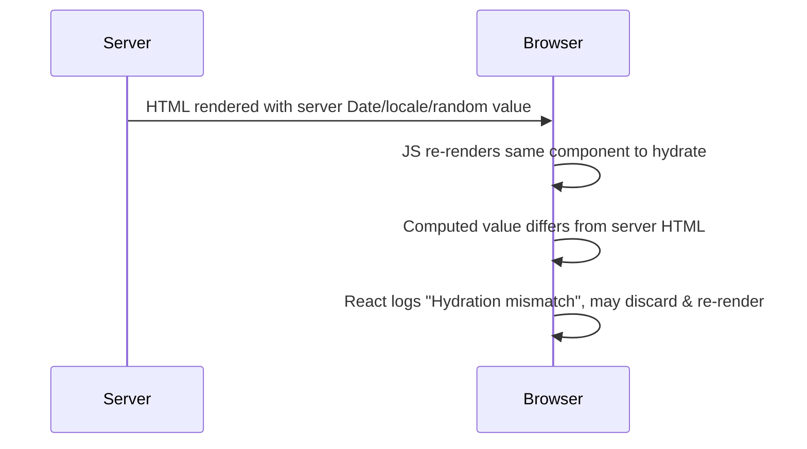

# Server-Side Rendering (SSR) — Intermediate

You already know SSR renders HTML on the server instead of the browser, and that it helps SEO and first paint. This tier focuses on the parts people get fuzzy on after their first exposure: the exact hydration handshake, mismatch bugs, and how the mainstream frameworks actually differ.

## 1. Recap of the flow (fast)

- CSR: server sends empty shell → browser downloads/runs JS → JS fetches data → JS renders DOM.
- SSR: server runs your component tree, fetches data, produces full HTML → browser paints it → JS bundle loads and **hydrates** (attaches listeners/state to existing DOM nodes instead of re-creating them).
- TTFB (Time To First Byte) is typically *slower* for SSR than a static CSR shell (server does real work per request), but **First Contentful Paint (FCP)** is typically *faster* because there's no client-side data-fetch waterfall before anything shows.

## 2. Hydration mismatches — the thing that bites people

Hydration assumes the HTML the server sent is *identical* to what the client would render given the same props/state. If it isn't, you get a **hydration mismatch**: React (or Vue/Svelte) detects the DOM doesn't match its virtual representation and either patches it (slow, can cause visible flicker) or, in stricter modes, throws a warning/error and re-renders from scratch client-side — silently discarding the SSR benefit you paid server CPU for.



### Common causes

```jsx
// 1. Non-deterministic values rendered directly
function Timestamp() {
  return <span>{new Date().toLocaleString()}</span>; // server time != client render time
}

// 2. Browser-only APIs used during render
function WindowWidth() {
  return <span>{window.innerWidth}</span>; // `window` doesn't exist on the server at all — this crashes SSR
}

// 3. Conditionally rendering based on localStorage/auth cookies read differently
function Greeting() {
  const isDark = localStorage.getItem('theme') === 'dark'; // not available server-side
  return <div className={isDark ? 'dark' : 'light'}>Hi</div>;
}

// 4. Non-deterministic list ordering (e.g. Object.keys on an object with unstable iteration,
//    or Math.random() used to pick a key)
```

### The fix pattern

Defer client-only or non-deterministic rendering to *after* hydration, using an effect:

```jsx
function Timestamp() {
  const [time, setTime] = React.useState(null); // render null on server AND on first client render

  React.useEffect(() => {
    setTime(new Date().toLocaleString()); // runs only in the browser, after hydration
  }, []);

  return <span>{time ?? '—'}</span>; // server and first client render match: both show "—"
}
```

This guarantees the server-rendered markup and the *first* client render are identical (both show the placeholder), avoiding the mismatch. The real value fills in a tick later via `useEffect`, which only ever runs client-side.

For browser-only globals (`window`, `document`, `localStorage`), guard with `typeof window !== 'undefined'` checks, or move the logic entirely into `useEffect`/lifecycle hooks that don't run during SSR.

## 3. Framework differences that actually matter

| Framework | Rendering model | Hydration strategy | Notable gotcha |
|---|---|---|---|
| **Next.js** | Per-route: SSR (`getServerSideProps`), SSG (`getStaticProps`), or ISR (Incremental Static Regeneration). App Router adds React Server Components (RSC). | Full hydration by default; App Router streams + Suspense-based selective hydration | Mixing Pages Router and App Router conventions in the same project causes confusion — `getServerSideProps` doesn't exist in App Router, it's replaced by `fetch` in Server Components |
| **Nuxt.js** | Same idea as Next but for Vue; `asyncData`/`useAsyncData` | Full hydration | `useAsyncData` calls must be deduplicated by key or they refetch on client needlessly |
| **SvelteKit** | `load` functions per route, run on server and/or client | Lighter hydration — Svelte compiles to imperative DOM updates, no virtual DOM diffing overhead | `load` functions run on *both* server and client during client-side navigation — don't assume server-only |
| **Astro** | Static HTML by default, **no hydration unless you opt in** | "Islands architecture" — only components with a `client:*` directive hydrate | Forgetting a `client:*` directive means your interactive component silently ships zero JS and does nothing |

### Astro's islands directives (the part people forget)

```astro
<Counter client:load />     <!-- hydrate immediately on page load -->
<Counter client:idle />     <!-- hydrate when the browser is idle (requestIdleCallback) -->
<Counter client:visible />  <!-- hydrate when it scrolls into viewport (great for below-the-fold widgets) -->
<Counter client:media="(max-width: 768px)" />  <!-- hydrate only under a media query -->
```

This is the opposite default of Next.js/Nuxt/SvelteKit: those hydrate everything by default, Astro hydrates *nothing* by default. Mixing up this mental model is a common source of "why isn't my Astro component interactive" bugs — the answer is almost always a missing `client:*` directive.

## 4. React Router vs SSR frameworks — the nuance

Modern React Router (v7, post-Remix-merge) supports SSR natively via loaders (`loader`/`action` functions per route, conceptually similar to `getServerSideProps`). The old assumption "React Router = pure CSR SPA" is no longer universally true — check which mode a given project is configured in (`ssr: true/false` in the Vite/React Router config) before assuming.

The durable distinction isn't "which library" but **which rendering mode is configured**:
- Client-only SPA (any router): blank shell + full CSR waterfall.
- SSR mode: server produces HTML per request, then hydrates.
- SSG mode: HTML produced at *build* time, not per request (see the Static Site Generators topic).

## 5. Common mistakes

- **Fetching data twice** — fetching in `getServerSideProps`/`loader` on the server, then *again* in a `useEffect` on mount because the developer forgot the server already provided it. Wastes a request and can cause a flash of different content.
- **Assuming SSR = fast** — SSR adds server compute per request. Under load, an unoptimized SSR endpoint can be *slower* than a cached static page. Caching (CDN edge caching, `stale-while-revalidate`) is usually paired with SSR in production, not left out.
- **Leaking server-only secrets into client bundles** — putting an API key used inside `getServerSideProps` into a shared config file that also gets imported by client components bundles it into the JS sent to the browser.
- **Ignoring streaming** — treating SSR as "wait for everything, then send one HTML blob" when React 18+ / Next.js App Router support streaming SSR with `Suspense`, sending the shell first and streaming slow parts in after. Not using it means slow data fetches block the *entire* page instead of just their section.
- **Testing only in dev mode** — hydration mismatches are often silently patched over in development with a console warning but behave differently (or are more visible/jarring) in production builds.

---
**Where this fits:** Web Components / Type Checkers → SSR → GraphQL → Static Site Generators → PWAs → Mobile Apps / Desktop Apps
