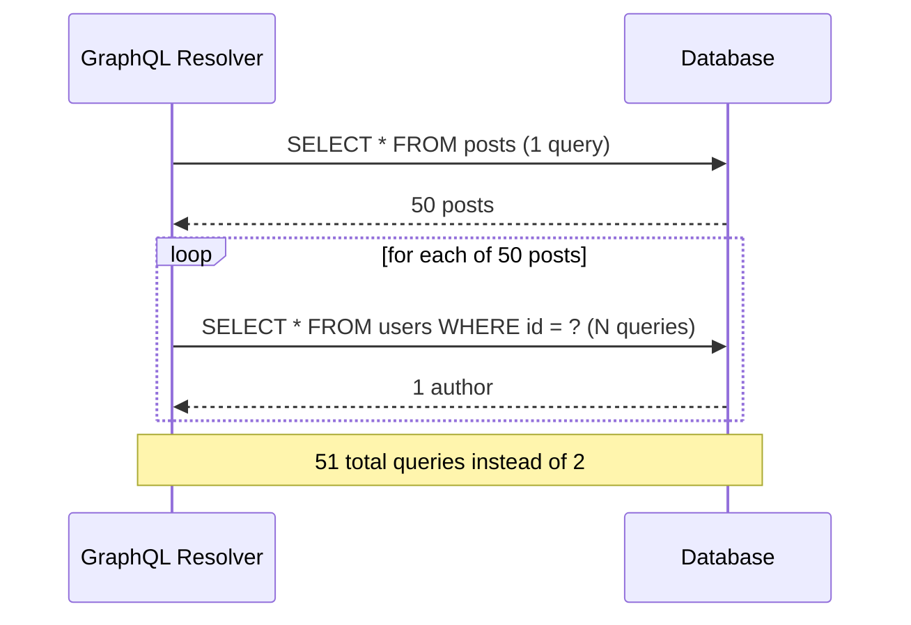

# GraphQL — Intermediate

You already know GraphQL uses one endpoint, a typed schema, and lets clients request exact fields via queries/mutations. This tier covers the sharp edges: the N+1 problem, caching nuances, and where Apollo/Relay differ in practice.

## 1. Fast recap

- Single endpoint (typically `POST /graphql`), operation determined by the query body, not the URL.
- Query = read, Mutation = write, Subscription = real-time/streaming updates (via WebSockets typically).
- Client specifies exact fields → no over-fetching; nested fields across relations in one request → no under-fetching.
- Resolvers are per-field functions on the server; a query resolves by walking the resolver tree.

## 2. The N+1 problem — GraphQL's most infamous gotcha

GraphQL's flexibility is also its trap. Because each field has its own resolver, a naive resolver implementation triggers **one database query per item**, on top of the initial query — the classic N+1 problem, just relocated from REST/ORM code into GraphQL resolvers.

```graphql
query {
  posts {
    title
    author {
      name
    }
  }
}
```

If `posts` returns 50 posts, and the `author` resolver naively does `db.users.findById(post.authorId)` independently for each post, you get:

- 1 query to fetch the 50 posts
- 50 separate queries, one per post, to fetch each author



### The fix: DataLoader (batching + caching)

The standard solution is **batching** — collect all the individual `author` lookups requested during a single tick of the event loop, then issue *one* batched query (`WHERE id IN (...)`) instead of N separate ones. Facebook's `dataloader` library (and equivalents in other languages) does exactly this:

```js
const userLoader = new DataLoader(async (userIds) => {
  const users = await db.users.findByIds(userIds); // one batched query
  return userIds.map(id => users.find(u => u.id === id));
});

// Resolver becomes:
const resolvers = {
  Post: {
    author: (post) => userLoader.load(post.authorId), // batched + cached per-request
  },
};
```

`DataLoader` also caches within the request, so if the same `userId` is requested twice in one query, it's only fetched once. This turns 51 queries into 2.

## 3. Caching — normalized cache vs REST's URL-based cache

REST caching is easy to reason about because a URL is a natural cache key (`GET /users/7` → cache under `"users/7"`). GraphQL has one endpoint, so naive HTTP caching (which keys on URL) doesn't work the same way — every query is a `POST` to the same URL with a different body.

Apollo Client and Relay both solve this with a **normalized in-memory cache**: every object with an `id` (or a configured key field) is stored once, flattened, keyed by `__typename:id`. Multiple queries that reference the same object (e.g., the same `Post`) share the same cache entry, so updating it in one place updates it everywhere it's displayed.

```graphql
query {
  post(id: 42) { id title }
}
```
```graphql
query {
  post(id: 42) { id title author { name } }
}
```

Both queries' `Post:42` entries merge in the normalized cache — Apollo/Relay recognize they're the same object via `id` + `__typename` and store one merged record rather than two separate cache blobs.

## 4. Apollo Client vs Relay — practical differences

| | Apollo Client | Relay Modern |
|---|---|---|
| Setup | Minimal — install, wrap in `ApolloProvider`, write `gql` queries anywhere | Requires `relay-compiler` build step, strict conventions |
| Data declaration | Queries typically written per-page/component ad hoc | **Fragment colocation** — every component declares a `graphql` fragment for exactly the data it needs; parent queries spread child fragments |
| Over-fetching risk | Higher — nothing stops two components independently querying overlapping fields inefficiently | Lower — compiler statically analyzes fragment usage, dead fields get flagged/stripped |
| Pagination | Manual (`fetchMore`, merge functions) unless using newer field policies | Built-in `@connection` / `usePaginationFragment` conventions (Relay assumes Relay-style cursor pagination in the schema) |
| Learning curve | Gentler | Steeper, but scales better on very large codebases with many teams |
| Typical use case | Most apps, faster to ship | Large orgs (Facebook-scale) wanting compile-time guarantees about data usage |

### Relay fragment colocation example

```jsx
// PostCard.jsx — this component declares exactly what IT needs
const postCardFragment = graphql`
  fragment PostCard_post on Post {
    title
    author { name }
  }
`;

// ParentPage.jsx — spreads the child's fragment without knowing its exact fields
const query = graphql`
  query ParentPageQuery {
    post(id: "42") {
      ...PostCard_post
    }
  }
`;
```

If `PostCard` later needs an extra field, it changes *only its own fragment* — the parent query doesn't need editing. This is the core Relay pitch: colocation prevents both over-fetching (unused fields) and under-fetching (forgetting a field a child needs) as the app grows.

## 5. Common mistakes

- **Ignoring N+1** until production load reveals it — always assume resolvers for relational fields need batching (DataLoader or equivalent) once real data volume shows up.
- **Treating GraphQL as automatically fast** — a single overly-broad query can still be more expensive server-side than several small REST calls, especially with deep nesting or unbounded list fields (query depth/complexity limiting is a real production concern).
- **Not paginating list fields** — `posts { title }` with no `first`/`limit` argument can return unbounded results; schemas should enforce pagination arguments.
- **Missing `id` field in queries** — if you forget to request `id` on an object, Apollo/Relay's normalized cache can't identify/merge it correctly, causing stale or duplicated cache entries.
- **Conflating GraphQL with "always better than REST"** — GraphQL adds real complexity (schema design, resolver batching, query complexity limits, caching nuances) that's not worth it for very simple CRUD APIs.
- **Forgetting mutations need explicit cache updates** — after a mutation, Apollo doesn't always know which cached queries to refresh unless you specify `refetchQueries`, cache `update` functions, or rely on normalized-cache auto-merge via returned `id` fields.

---
**Where this fits:** Web Components / Type Checkers → SSR → GraphQL → Static Site Generators → PWAs → Mobile Apps / Desktop Apps
