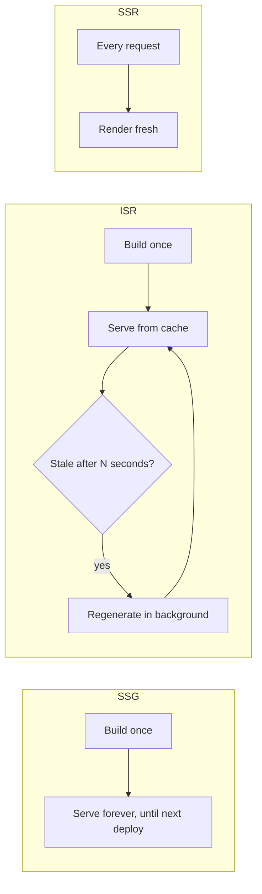

# Static Site Generators (SSG) — Intermediate

You already know SSG pre-builds HTML at build time rather than per request (SSR) or in-browser (CSR). This tier covers the nuances: where the "build time vs server time vs client time" line actually gets blurry, ISR as a hybrid, and the gotchas each tool has in practice.

## 1. The three rendering times, precisely

| Time | What happens | Who pays the cost |
|---|---|---|
| **Build time** (SSG) | Pages rendered once when you run `build`, output as static files | You (once, during CI/deploy) |
| **Request/server time** (SSR) | Pages rendered fresh on every incoming request | Your server, per request |
| **Client time** (CSR) | Pages rendered in the visitor's browser after JS loads | The visitor's device |

The line blurs with **hybrid approaches**:

- **ISR (Incremental Static Regeneration, Next.js)**: pages are statically generated but can be *regenerated in the background* after a configured time window, without a full rebuild. First visitor after the window sees the stale cached page while regeneration happens; subsequent visitors get the fresh one.
- **On-demand ISR / on-demand revalidation**: a webhook (e.g., from a CMS on publish) triggers regeneration of a specific page immediately, instead of waiting for a time window.
- **Astro's hybrid rendering**: per-route opt-in to SSR (`export const prerender = false`) inside an otherwise fully static site.
- **Client-side hydration of static shells**: a statically generated page that then fetches personalized data client-side after load (e.g., "static shell + client-fetched user greeting") — common for e-commerce category pages that are 95% static but need a live cart count.



## 2. Next.js SSG in practice — the parts people forget

- `getStaticProps` runs at build time **and** during `next build`'s revalidation window if `revalidate` is set — mixing this up with `getServerSideProps` (always per-request) is the single most common Next.js rendering-mode confusion.
- `getStaticPaths`'s `fallback` option matters:
  - `fallback: false` → any path not returned by `getStaticPaths` 404s.
  - `fallback: true` → Next.js serves a loading state, then generates and caches the page on first request (good for very large catalogs where pre-building every page at build time would be too slow).
  - `fallback: 'blocking'` → like SSR for the first request to a new path, then cached like SSG afterward.
- Setting `revalidate: 60` in `getStaticProps` turns plain SSG into **ISR** — the page is regenerated at most once every 60 seconds, on demand, not proactively.
- App Router (Next.js 13+) replaces `getStaticProps` with `fetch` + `export const revalidate = 60` inside Server Components — same underlying concept, different API surface. Don't mix Pages Router and App Router mental models in the same project.

```jsx
// App Router equivalent of ISR
export const revalidate = 60; // regenerate at most once per 60s

export default async function Page() {
  const data = await fetch('https://api.example.com/posts', {
    next: { revalidate: 60 }, // per-fetch override also possible
  }).then(r => r.json());
  return <PostList posts={data} />;
}
```

## 3. Astro's hybrid model

Astro defaults to fully static output (`output: 'static'`), but supports a `'hybrid'` mode where most routes are static and specific ones opt into server rendering:

```astro
---
// src/pages/dashboard.astro
export const prerender = false; // opt this ONE route out of static generation
const user = await getUserFromSession(Astro.request);
---
<h1>Welcome back, {user.name}</h1>
```

The gotcha: forgetting `prerender = false` on a route that legitimately needs per-request data means Astro tries to render it once at build time with no request context available — session/cookie-dependent code either errors or silently bakes in build-time values for every visitor.

## 4. VuePress and Eleventy nuances

- **VuePress** ships a full Vue runtime for interactive bits by default (VuePress 1.x); VuePress 2 improves this, but it's still heavier by default than Eleventy for pure-content sites, because it assumes Vue-powered theming. It shines specifically for docs sites that want versioned nav, built-in search, and Vue components embedded in Markdown — using it for a marketing site with no docs-like structure is over-engineering.
- **Eleventy** has zero client-side framework assumption — it's a templating/build pipeline, not a UI framework. Because of this, adding *any* interactivity is entirely your responsibility (vanilla JS, Alpine.js, htmx, or hydrating framework islands via a plugin). People coming from Next.js/Astro sometimes expect built-in component hydration and are surprised Eleventy has none by default.

## 5. Common mistakes

- **Choosing SSG for highly personalized content** — trying to pre-build a static page per logged-in user (e.g., "my orders" page) doesn't scale; that's an SSR or CSR-with-client-fetch use case, not SSG.
- **Confusing ISR's `revalidate` with "real-time"** — `revalidate: 60` means "at most once per 60 seconds," not "instantly on every content change." For instant updates, use on-demand revalidation (webhook-triggered) instead of relying purely on the time window.
- **Build times exploding** — SSG that queries a CMS per page during `getStaticProps`/`getStaticPaths` for thousands of pages can make builds take many minutes; incremental/on-demand approaches (Next.js `fallback: 'blocking'`, ISR) exist specifically to avoid needing to pre-build everything upfront.
- **Forgetting cache invalidation on redeploy** — CDN-level caching in front of a static host can serve stale content after a new deploy if cache headers/purge aren't configured correctly.
- **Assuming "static" means "no JavaScript"** — SSG describes *how HTML is produced*, not whether JS ships. A Next.js SSG page still hydrates like any SSR page unless you're using an islands-based tool (Astro) that opts out of JS per component.
- **Picking Eleventy/VuePress expecting component-level interactivity out of the box** — both are content/templating-first; interactivity is bolted on deliberately, unlike React/Vue-framework-first tools.

---
**Where this fits:** Web Components / Type Checkers → SSR → GraphQL → Static Site Generators → PWAs → Mobile Apps / Desktop Apps
