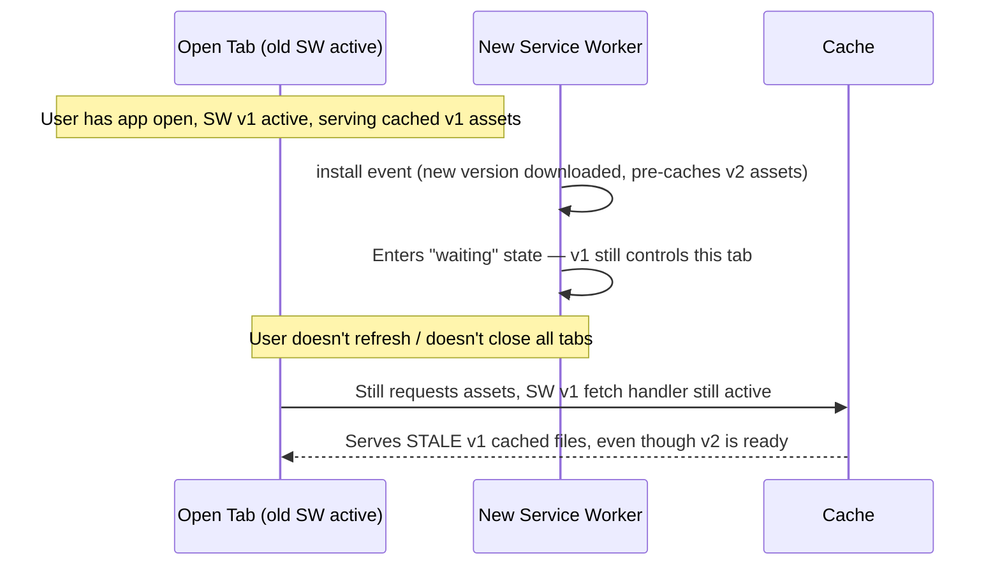

# Progressive Web Apps (PWAs) — Intermediate

You already know the three pillars (Service Worker, Manifest, HTTPS) and the basic install → activate → fetch lifecycle. This tier covers what actually goes wrong in practice: stale cache bugs, cache strategy tradeoffs, and update-lifecycle gotchas.

## 1. Fast recap

- Service Worker: background script intercepting `fetch` events, enabling offline/caching, requires HTTPS.
- Manifest: `manifest.json` describing install metadata (name, icons, `display`, `start_url`).
- Lifecycle: `install` (pre-cache) → `activate` (cleanup) → `fetch` (intercept every request).

## 2. The stale cache problem — the #1 real-world PWA bug

The lifecycle diagram in the beginner tier hides a crucial detail: **a new service worker doesn't take control of already-open pages immediately.** By default, a new service worker installs in the background but stays in a `waiting` state until *all* tabs running the old version are closed. Meanwhile, your cache-first strategy keeps serving the *old* cached files — so users can be stuck on an outdated version of your app for a long time, even after you've deployed a fix.



### Fixes

```js
// In the new service worker: skip the waiting phase and activate immediately
self.addEventListener('install', (event) => {
  self.skipWaiting(); // don't wait for old tabs to close
  event.waitUntil(/* pre-cache new files */);
});

self.addEventListener('activate', (event) => {
  event.waitUntil(
    self.clients.claim() // take control of already-open pages immediately
  );
});
```

```js
// In the page's registration code: listen for updates and prompt the user (or auto-reload)
navigator.serviceWorker.register('/sw.js').then(registration => {
  registration.addEventListener('updatefound', () => {
    const newWorker = registration.installing;
    newWorker.addEventListener('statechange', () => {
      if (newWorker.state === 'installed' && navigator.serviceWorker.controller) {
        // A new version is ready — prompt user to refresh, or auto-reload
        console.log('New content available, please refresh.');
      }
    });
  });
});
```

`skipWaiting()` + `clients.claim()` gets updates live faster, but has its own tradeoff: it can swap the active service worker mid-session while a page is still using old JS in memory, occasionally causing version-mismatch errors between the page's loaded JS and the API/cache the new SW serves. Many production setups instead show a "New version available — refresh" toast and let the user control the reload.

## 3. Cache strategies — pick per resource type, not globally

A single "cache-first for everything" strategy (as shown in beginner examples) is naive. Different resource types need different strategies:

| Strategy | Behavior | Best for |
|---|---|---|
| **Cache-first** | Serve from cache if present, only hit network on cache miss | Static assets: fonts, icons, CSS/JS bundles with hashed filenames |
| **Network-first** | Try network, fall back to cache on failure | HTML pages, content that changes often but should still work offline |
| **Stale-while-revalidate** | Serve from cache immediately, *then* fetch fresh version in background to update cache for next time | API responses, content where slightly-stale-but-instant beats fresh-but-slow |
| **Network-only** | Never cache, always go to network | Non-idempotent requests (POST/analytics), truly real-time data |
| **Cache-only** | Never touch network | Pre-cached app-shell assets guaranteed to exist |

```js
// Stale-while-revalidate example
self.addEventListener('fetch', (event) => {
  event.respondWith(
    caches.open(CACHE_NAME).then(async (cache) => {
      const cachedResponse = await cache.match(event.request);
      const networkFetch = fetch(event.request).then(networkResponse => {
        cache.put(event.request, networkResponse.clone()); // update cache for next time
        return networkResponse;
      });
      return cachedResponse || networkFetch; // serve cached instantly if available
    })
  );
});
```

Using cache-first on an API endpoint that returns frequently-changing data is a classic mistake — users see stale data indefinitely because the cached response is always returned before the network is even checked.

## 4. Cache versioning gotcha

Forgetting to bump `CACHE_NAME` (e.g., `my-app-cache-v1` → `v2`) on deploy means the `activate` handler's cleanup logic (`keys.filter(key => key !== CACHE_NAME)`) never identifies the old cache as "old" — it just keeps adding to the same cache bucket indefinitely, or worse, `cache.addAll()` in `install` may silently no-op if the browser thinks nothing changed. Always tie the cache name to a build hash or version number, not a hardcoded string you might forget to update.

## 5. Manifest details people skip

- `display: 'standalone'` vs `'minimal-ui'` vs `'fullscreen'` vs `'browser'` — control how much browser chrome remains after install; `'standalone'` is the most common "feels native" choice.
- `start_url` should typically include a query param (e.g., `/?source=pwa`) so analytics can distinguish installed-app launches from regular browser visits.
- Maskable icons (`"purpose": "maskable"`) matter on Android — without them, your icon can get awkwardly cropped inside the OS's icon mask shape.
- `scope` restricts which URLs are considered "inside" the installed app; navigating outside it can kick the user back into a regular browser tab.

## 6. Common mistakes

- **Cache-first on everything**, including API responses that change — leads to indefinitely stale data (see cache strategy table above).
- **Not calling `skipWaiting()`/`clients.claim()`**, then wondering why users report "the fix isn't showing up" days after deploy — they simply haven't closed all tabs.
- **Forgetting to version the cache name**, causing old and new assets to coexist in the same cache bucket, or cleanup logic to never fire.
- **Testing only on `localhost`** and being surprised HTTPS-related registration failures show up in production — remember `localhost` is a special exception, not proof HTTPS isn't required elsewhere.
- **Precaching too aggressively** (entire app bundle including rarely-used routes) — bloats install time and storage; better to cache the app shell + critical path, and cache other routes on first visit (runtime caching).
- **No fallback offline page** — if a network-first HTML strategy has no cached fallback, users see a browser error page instead of a graceful offline experience.

---
**Where this fits:** Web Components / Type Checkers → SSR → GraphQL → Static Site Generators → PWAs → Mobile Apps / Desktop Apps
