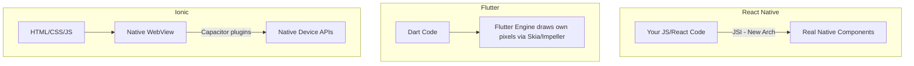

# Mobile Apps (Intermediate)

You know the basics of React and probably built a small app or prototype with one of these frameworks before. This is a brush-up on the parts people forget, misjudge, or half-understand — the stuff that bites you once you go past a toy project.

## How web skills transfer — the nuance

The transfer isn't as clean as "you already know React so you're done." What transfers:

- Component thinking, hooks, unidirectional data flow, state management patterns (Redux/Zustand/Context all still apply).
- JSX syntax and conditional rendering patterns.

What does **not** transfer cleanly:

- CSS. Flexbox is the *only* layout system in React Native (no CSS Grid, no floats). Percentage-based widths behave differently. No cascading — styles don't inherit from parent to child like CSS does.
- The DOM. There's no `document`, no `window.location`, no CSS selectors. Debugging tools are different (Flipper, React Native DevTools instead of browser DevTools).
- Navigation. There's no URL/history stack by default — you need a router library (React Navigation) that manages a native-style stack, tabs, and modals.

## React Native — what people forget

**The bridge / New Architecture.** Historically, React Native ran JS on one thread and native code on another, communicating over an asynchronous "bridge" that serialized data to JSON. This caused real performance problems for anything chatty (e.g., syncing scroll position to a native animation). The **New Architecture** (Fabric renderer + TurboModules + JSI) replaced the bridge with direct, synchronous JS-to-native calls, removing a lot of the old performance ceiling. If you learned React Native years ago, the mental model of "everything crosses an async bridge" is now outdated for apps on the new architecture — but you'll still encounter both in the wild.

**Common mistakes:**

- Using `ScrollView` for long lists instead of `FlatList`/`FlashList`. `ScrollView` renders everything up front; long lists will jank or crash. `FlatList` virtualizes — only renders what's on/near screen.
- Inline function/style props on list items (`onPress={() => doThing(item.id)}`, `style={{margin: 10}}`) causing needless re-renders of every row. Memoize with `useCallback`/`useMemo` or hoist styles with `StyleSheet.create`.
- Forgetting `SafeAreaView` (or `react-native-safe-area-context`) — content renders under the notch/status bar/home indicator.
- Treating `Platform.OS === 'ios'` checks as a design smell to avoid entirely — sometimes truly platform-specific UI (iOS vs. Android navigation patterns) is the *correct* choice, not a hack.

```jsx
// Bad: new function + new object every render
<FlatList
  data={items}
  renderItem={({ item }) => (
    <Row onPress={() => handlePress(item.id)} style={{ padding: 10 }} />
  )}
/>

// Better: stable references
const renderItem = useCallback(({ item }) => (
  <Row onPress={handlePress} id={item.id} style={styles.row} />
), [handlePress]);

<FlatList data={items} renderItem={renderItem} keyExtractor={(i) => i.id} />
```

## Flutter — what people forget

**Everything is a widget**, including layout, padding, and even themes — there's no separate "component vs. style" split like in React/CSS. This is powerful but means widget trees get deep fast. `const` constructors matter a lot for performance: a `const Text('Hello')` widget is skipped during rebuilds entirely, whereas a non-const one is rebuilt every time its parent rebuilds.

**Common mistakes:**

- Calling `setState()` on a huge widget subtree when only a small leaf widget actually changed — causes wasteful rebuilds. Use `const` widgets and split state into smaller, focused `StatefulWidget`s, or move to a state management library (Riverpod, Bloc, Provider) once the app grows past "small."
- Forgetting that Dart's hot reload doesn't re-run `initState()` — stateful initialization bugs can hide during development and only show up on a full cold restart.
- Not understanding that Flutter's own renderer means **no native look-and-feel for free**. Material widgets look like Android, Cupertino widgets look like iOS — you often need `Platform.isIOS` checks or the `Cupertino` widget set to feel native on Apple devices, unlike React Native, where native components are native by default.

## Ionic — what people forget

**It's still a WebView.** That means:
- No access to true native gestures/animations without extra work — Ionic ships its own component library specifically to paper over this, but complex custom animations can still feel "webby."
- Cold start time is usually the biggest complaint versus React Native/Flutter — loading and parsing a WebView plus your JS bundle takes longer than launching a natively-compiled binary.
- Plugins (camera, biometrics, push notifications) come from **Capacitor plugins**, not the browser's own Web APIs — don't assume a Web API like `navigator.geolocation` works identically; Capacitor often wraps it with its own permission flow.

**Common mistake:** Assuming Capacitor apps behave exactly like PWAs. They don't — Capacitor apps are compiled into real app-store binaries and reviewed by Apple/Google, so app-store policies (e.g., no arbitrary remote code execution, in-app purchase rules) apply in ways a PWA never has to deal with.

## Architecture at a glance



## Comparison table

| Framework | Language | Rendering | Performance | Learning curve |
|---|---|---|---|---|
| React Native | JS/TS | Real native components via JSI (New Arch) or bridge (old) | Near-native; janky lists if you skip virtualization | Low for React devs, but Flexbox-only layout trips people up |
| Flutter | Dart | Self-drawn via Skia/Impeller | Excellent, very consistent frame timing | Medium — new language, deep widget trees |
| Ionic | JS/TS (any web framework) | WebView | Weakest of the three for heavy native interaction | Lowest — reuse existing web app almost as-is |

## Common mistakes summary

1. Not virtualizing lists (RN: use `FlatList`/`FlashList`, not `ScrollView`).
2. Ignoring safe areas / notches.
3. Treating CSS knowledge as fully transferable — it isn't (Flexbox-only in RN, no cascade).
4. Assuming Capacitor Web APIs behave exactly like browser Web APIs.
5. Overusing `setState`/rebuild-everything patterns in Flutter instead of scoping state narrowly.

---

**Where this fits:** Comes after PWAs and before Desktop Apps in the roadmap — the same web fundamentals that power PWAs get repurposed here to ship installable mobile apps.
