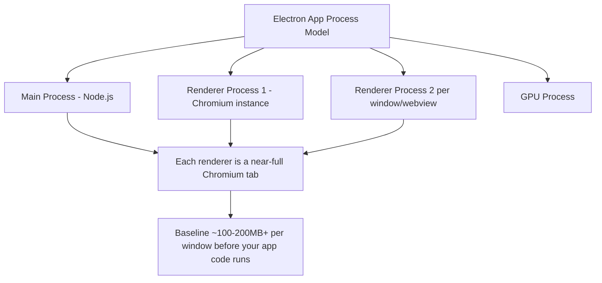

# Desktop Apps (Intermediate)

You know Electron ships Chromium + Node and that Tauri is "the lighter one." This is the brush-up on *why* that's true at a mechanical level, and the mistakes people make once they actually ship something.

## Electron — why it got popular, and why memory bloats

Electron won because it collapsed the cost of cross-platform desktop development to near zero for teams that already had web engineers: one Chromium renderer, one Node.js backend process, three platforms (Windows/macOS/Linux), one codebase. VS Code, Slack, and Discord all made this exact trade — ship fast everywhere vs. hand-roll three native apps.

**Where the memory actually goes** (not just "Chromium is big"):

- Electron uses Chromium's **multi-process architecture** — every `BrowserWindow` is essentially its own Chromium tab process, plus a shared GPU process, plus the main Node process. Baseline overhead exists before you've rendered a single component.
- Multiple Electron apps running simultaneously (Slack + Discord + VS Code) means multiple *separate* Chromium engine instances in memory — they don't share a runtime the way browser tabs in one browser window can.
- V8 heap growth from leaked event listeners / detached DOM nodes in long-running renderer processes compounds this over a session (common in apps left open for days, like Slack).

**Common mistakes:**
- Not disabling `nodeIntegration` in the renderer and skipping `contextIsolation` — this is a **security** issue (renderer gets direct Node access, so any XSS becomes remote code execution), not just a performance one. Modern Electron defaults `contextIsolation: true`; don't turn it off without a strong reason, and use a `preload.js` script with `contextBridge` to expose only what's needed.
- Loading remote, untrusted content in a `BrowserWindow` with full Node access enabled.
- Shipping devtools/debug flags or unminified bundles in production builds, inflating both size and attack surface.
- Assuming "it's just a browser" and skipping desktop-specific concerns — native menus, deep linking, auto-update flows (`electron-updater`), and code signing/notarization (required on macOS or the OS will block the app).

## Tauri — how it gets small binaries

Tauri doesn't bundle a browser engine at all. It calls into the **OS-provided WebView**:
- Windows → WebView2 (Chromium-based, but Microsoft ships/updates it as part of the OS, not your app)
- macOS → WKWebView (Safari's engine)
- Linux → WebKitGTK

Your app binary only needs to contain your compiled Rust backend plus your frontend assets — not an entire browser engine — which is why a minimal Tauri app is measured in single-digit MBs versus Electron's 100+.

**The nuance people miss:** because Tauri relies on the OS's WebView, your app's rendering behavior is **not identical across platforms** the way Electron's is — WKWebView (Safari engine) has different CSS/JS support than Chromium. Something that works perfectly in your Electron app (built entirely on Chromium) may render subtly differently in a Tauri app on macOS because it's really Safari underneath. Test on each target OS; don't assume "runs in Chrome" == "runs everywhere" in Tauri.

**Common mistakes:**
- Assuming Rust knowledge is optional — you can ship a basic Tauri app with minimal Rust, but any nontrivial native integration (file system with custom permissions, system tray behavior, custom native menus) does require writing or modifying Rust commands.
- Forgetting Tauri's permission system (the `capabilities`/allowlist config) — unlike Electron where Node APIs are broadly available once integration is on, Tauri requires explicitly allow-listing which native APIs the frontend may call. Apps that "can't access the filesystem" in Tauri usually just haven't granted the capability.

## Flutter Desktop — what's different from Electron/Tauri

Flutter doesn't use a WebView or embed a browser at all — it's the same self-drawn rendering engine used on mobile, targeting a native window. This means:
- No HTML/CSS/JS involved whatsoever — you're fully in Dart/widget land, so there's no meaningful "web skills transfer" the way there is with the other two.
- Rendering is pixel-consistent across OSes (same tradeoff/benefit as on mobile), but you lose access to the DOM-based tooling and browser extensions your team may rely on.
- Common mistake: assuming Flutter desktop plugin parity with mobile — many community plugins are mobile-only; check desktop support before committing.

## Comparison table

| Aspect | Electron | Tauri | Flutter Desktop |
|---|---|---|---|
| Bundle size | 100+ MB | Single-digit to low tens of MB | Medium (tens of MB) |
| Memory | High — full Chromium per window/app | Lower — shares OS WebView | Medium |
| Rendering consistency across OS | High (always Chromium) | Lower (WKWebView ≠ Chromium ≠ WebKitGTK) | High (self-drawn, always identical) |
| Backend language | Node.js | Rust | Dart |
| Native API access model | Broad by default (needs explicit lockdown) | Explicit allowlist/capabilities required | Plugin-based |
| Maturity/ecosystem | Very mature, huge plugin ecosystem | Newer, smaller but fast-growing | Maturing for desktop specifically |

## Common mistakes summary

1. Leaving `nodeIntegration`/`contextIsolation` misconfigured in Electron — a real security hole, not just bloat.
2. Assuming Tauri renders identically across OSes — it doesn't; test on each WebView.
3. Underestimating Rust involvement in Tauri for anything beyond the basics.
4. Skipping code signing/notarization and auto-update setup — these are desktop-specific requirements web deployment never taught you.
5. Assuming Flutter mobile plugins "just work" on desktop.

---

**Where this fits:** Sits between Mobile Apps and Browser APIs in the roadmap — the same three-way split (bundle-the-runtime vs. lightweight-native-shell vs. self-rendering-engine) mirrors the mobile-apps landscape, just targeting the desktop OS instead.
