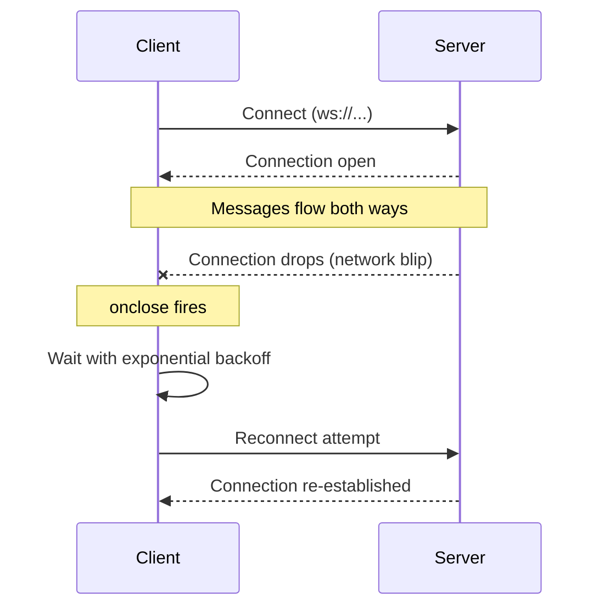

# Browser APIs (Intermediate)

You know these APIs exist and have probably used `localStorage` and maybe WebSockets. This is the brush-up on the details people forget — storage limits, reconnection logic, security gotchas — the stuff that only shows up once you ship something real.

## Storage: the nuance people forget

| | localStorage | sessionStorage | IndexedDB |
|---|---|---|---|
| Persistence | Forever (until cleared) | Tab lifetime only | Forever (until cleared) |
| Capacity | ~5-10MB (browser-dependent) | ~5-10MB | Hundreds of MB+ (quota-based) |
| API style | Synchronous | Synchronous | Asynchronous |
| Blocks main thread? | Yes | Yes | No |
| Shared across tabs (same origin)? | Yes | No — per-tab only | Yes |
| Stores | Strings only | Strings only | Structured data, blobs, files |

**Common mistakes:**
- Using `localStorage` for anything security-sensitive (auth tokens). It's **not** protected from JavaScript running on the same origin — any XSS vulnerability gives an attacker full read access to everything in localStorage. Prefer `httpOnly` cookies for tokens where possible; if you must use client-side storage, understand the tradeoff.
- Storing large or frequently-updated data in `localStorage`/`sessionStorage` — because both are **synchronous**, large reads/writes block the main thread and can visibly jank the UI. Move to IndexedDB once data gets non-trivial.
- Forgetting `JSON.parse`/`JSON.stringify` round-trips lose things like `Date` objects, `Map`, `Set`, and functions — they become plain strings/objects. Rehydrate manually after parsing.
- Assuming `sessionStorage` is shared between tabs of the same site — it isn't. Each tab gets its own isolated store, even though `localStorage` on the same site is shared.
- Not handling `QuotaExceededError` — storage isn't infinite; a `setItem` call can throw once the quota is hit.

## WebSockets — reconnection is the part people skip

A raw `new WebSocket(url)` connection is fragile: network drops, server restarts, and mobile devices switching networks will all kill it silently unless you handle `onclose`/`onerror` explicitly. Production WebSocket code almost always needs manual reconnect logic with backoff.



```javascript
function connect(url, onMessage, attempt = 0) {
  const socket = new WebSocket(url);

  socket.onmessage = onMessage;

  socket.onclose = () => {
    const delay = Math.min(1000 * 2 ** attempt, 30000); // exponential backoff, capped
    setTimeout(() => connect(url, onMessage, attempt + 1), delay);
  };

  socket.onerror = () => socket.close(); // triggers onclose -> reconnect
  return socket;
}
```

**Common mistakes:**
- No reconnection strategy at all — one dropped packet and the "real-time" feature silently stops working until a full page reload.
- No heartbeat/ping-pong — dead connections (e.g., laptop sleep, NAT timeout) can sit in a zombie "open" state without the client realizing it needs to reconnect. Send periodic pings and reconnect if no pong arrives.
- Not closing sockets on component unmount (React) — leaks connections and can cause "setState on unmounted component" warnings/bugs. Always clean up in `useEffect`'s return function.
- Sending messages before `onopen` fires — the socket isn't ready to send yet immediately after construction; you must wait for the open event.

## Server-Sent Events — the nuance

- SSE automatically reconnects on its own (unlike raw WebSockets) — the browser retries by default, and the server can control the retry delay via the `retry:` field in the stream.
- SSE is plain HTTP, so it works through existing HTTP infrastructure (proxies, load balancers) more easily than WebSockets, which need protocol upgrade support.
- Limited to text data (UTF-8) — no binary frames like WebSockets support.
- Browsers cap the number of concurrent SSE connections **per domain** (historically 6 for HTTP/1.1) — opening many `EventSource` connections to the same origin can silently stall some of them. HTTP/2 removes this limit by multiplexing.

**Common mistake:** choosing WebSockets by default "because real-time" when the actual requirement is one-way server push (notifications, live scores) — SSE is simpler, auto-reconnects, and works over plain HTTP. Reach for WebSockets only when you actually need bidirectional communication.

## Service Workers (brief)

Covered in depth under PWAs — but the thing intermediate devs often forget: a Service Worker only takes control after the *second* page load (the first visit registers it, but doesn't activate control of the existing page), and it intercepts `fetch` events at the origin level, meaning bugs in caching logic can serve stale content indefinitely until the worker is explicitly updated/unregistered. Always version your cache names.

## Geolocation, Notifications, Device Orientation, Payments, Credentials — gotchas

- **Geolocation**: `getCurrentPosition` requires a secure context (HTTPS) in modern browsers — will silently fail or throw on `http://`. Also, accuracy varies wildly (GPS on mobile vs. IP-based estimation on desktop) — always check `position.coords.accuracy`.
- **Notifications**: Permission can only be requested from a **user gesture** (a click), not on page load — browsers block/ignore silent permission prompts to curb abuse. Once denied, you cannot re-prompt programmatically; the user must manually change the site's permission in browser settings.
- **Device Orientation**: iOS Safari (13+) requires an explicit `DeviceOrientationEvent.requestPermission()` call from a user gesture — code that works on Android/desktop will silently do nothing on iOS without this extra step.
- **Payment Request API**: Adoption/support is inconsistent across browsers — always have a fallback checkout form; don't build a payment flow with the Payment Request API as your only path.
- **Credential Management API**: Only works over HTTPS, and browser support/behavior (especially for federated credentials) varies enough that it should be treated as a progressive enhancement, not a required flow.

## Common mistakes summary

1. Storing auth tokens in `localStorage` — vulnerable to XSS exfiltration.
2. No WebSocket reconnection/heartbeat logic in production code.
3. Reaching for WebSockets when SSE (simpler, auto-reconnecting, one-way) would suffice.
4. Requesting Notification/Geolocation/DeviceOrientation permissions outside a user gesture, or without a fallback.
5. Forgetting Service Worker cache versioning, leading to permanently stale content.
6. Not handling storage quota errors.

---

**Where this fits:** Sits between Desktop Apps and Measuring & Improving Performance in the roadmap.
