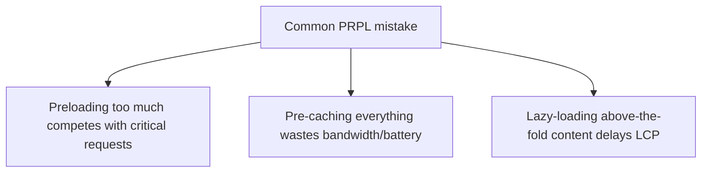
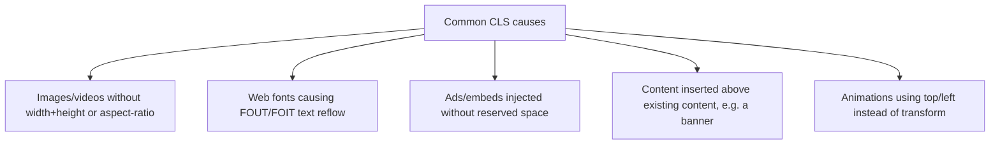

# Measuring & Improving Performance (Intermediate)

You know the names — LCP, CLS, Lighthouse — and have probably run an audit before. This is the brush-up on what actually causes the numbers to move, and the mistakes people make chasing a score instead of real user experience.

## PRPL — the nuance

PRPL isn't a checklist to apply uniformly; it's a prioritization strategy, and misapplying it is the common failure mode.

**Common mistakes:**
- **Over-preloading**: marking too many resources as `<link rel="preload">` — preload competes for the same limited bandwidth/priority as the resources actually needed for first paint. Preloading everything defeats the purpose; reserve it for the true critical path (LCP image, critical font).
- **Pre-caching too aggressively**: a Service Worker that eagerly caches the entire app on first load can itself compete with rendering the current page and burn the user's data/battery for routes they may never visit. Pre-cache based on *likely* next navigation, not everything.
- **Lazy-loading the wrong thing**: lazy-loading content that's above the fold or immediately needed (delays what should be the LCP element) is a self-inflicted LCP regression. Lazy-load below-the-fold and route-level code, not the hero content.



## RAIL — the nuance

The RAIL budgets aren't arbitrary — they map to specific technical causes people forget:

- The **100ms response budget** exists because of perceptual research on what "instant" feels like — but the real technical trap is **long tasks**: any single synchronous JS block over 50ms on the main thread blocks input handling entirely (this is literally how "Total Blocking Time," a Lighthouse metric, is calculated — sum of task time beyond 50ms).
- The **animation budget (~10ms/frame)** is tight because the browser itself needs the rest of the 16.6ms frame budget for style/layout/paint/composite — code that "only" takes 12ms of JS time can still miss 60fps once browser overhead is added.
- The **idle budget (under 50ms chunks)** is why `requestIdleCallback` exists — it lets you schedule non-urgent work (analytics, prefetching) to run only when the main thread is genuinely free, without you having to hand-tune `setTimeout` delays.

**Common mistake:** treating "the page loaded" (Load budget) as the finish line and ignoring Response/Animation/Idle — a page that loads in 2 seconds but then janks on every scroll or button press still fails RAIL, and users feel that failure directly.

## Core Web Vitals — what actually causes bad scores

**LCP causes people forget:**
- Render-blocking CSS/JS in `<head>` delaying first paint entirely.
- Client-side-rendered content where the LCP element (often a hero image or heading) doesn't exist in the initial HTML at all — it only appears after JS hydrates, which is why CSR-heavy SPAs often score worse on LCP than SSR/SSG equivalents for the exact same visual result.
- Images served without modern formats/compression (or without `fetchpriority="high"` on the actual LCP image).

**INP (replacing FID) causes people forget:**
- FID only measured the *first* interaction — a page could look great on FID and still be miserable to use if the 5th click is janky. INP measures the *worst* interaction latency across the whole visit, which is why sites commonly see their INP number look worse than their old FID number even with no code changes — it's measuring something FID never captured.
- Long event handlers, expensive re-renders on every keystroke (uncontrolled/unthrottled input handlers), and third-party scripts (ads, analytics, chat widgets) hogging the main thread are the usual INP culprits.

**CLS causes people forget:**



```css
/* Bad: animating layout-affecting properties causes reflow -> can trigger CLS-adjacent jank */
.box { transition: top 0.3s, left 0.3s; }

/* Good: animate transform/opacity - GPU-composited, doesn't affect layout */
.box { transition: transform 0.3s, opacity 0.3s; }
```

**Common mistake:** fixing CLS by reserving space for images but forgetting web fonts — a custom font swapping in (FOUT) can reflow an entire page of text if `font-display: swap` isn't paired with matched fallback-font metrics (`size-adjust`, or tools like `next/font`/Fontaine that auto-generate metric-matched fallbacks).

## Lighthouse — the nuance

**Common mistakes:**
- Treating the Lighthouse score as gospel on a single run — Lighthouse lab results are inherently variable (CPU throttling simulation, network conditions, even the machine running it). Run multiple times or use median values; better yet, compare against **field data** (real user CrUX data in PageSpeed Insights) since lab conditions don't always match real-world device/network diversity.
- Chasing the score number itself rather than the underlying metric — e.g., stripping legitimate above-the-fold images to "improve" LCP score technically improves the number while making the page worse for users.
- Running Lighthouse against a logged-out, empty-state, or cached version of a page that doesn't represent what real users actually see.

## DevTools — the nuance

**Network tab:** people forget to disable cache (`Disable cache` checkbox) when testing repeat-load performance, and forget to throttle to a realistic network profile (Fast 3G / Slow 4G) — testing performance only on a fast office/home connection hides real-world bottlenecks.

**Performance tab:** the flame chart's yellow blocks are JS execution, purple is rendering/layout, green is painting — long yellow bars are your long tasks. People forget:
- The **"Bottom-Up"** and **"Call Tree"** views (not just the flame chart) are where you actually find *which function* is expensive, aggregated across the whole recording.
- CPU throttling (4x/6x slowdown) in the Performance tab simulates a mid-range mobile device — profiling only on your (fast) dev machine hides real user-experienced jank.

## Common mistakes summary

1. Over-preloading/over-pre-caching under PRPL, competing with the actual critical path.
2. Ignoring RAIL's Response/Animation/Idle budgets and optimizing only for Load time.
3. Not realizing CSR delays LCP because the element doesn't exist in initial HTML.
4. Confusing FID and INP — INP measures the worst interaction across the whole session, not just the first.
5. Fixing image CLS but ignoring web-font-driven layout shift.
6. Trusting a single Lighthouse lab run over real field/CrUX data.
7. Profiling performance only on a fast dev machine with no CPU/network throttling.

---

**Where this fits:** The final topic in the roadmap, following Browser APIs — the practical discipline of verifying that everything built across the roadmap (SSR/SSG, PWAs, mobile, desktop, browser APIs) actually performs well for real users.
