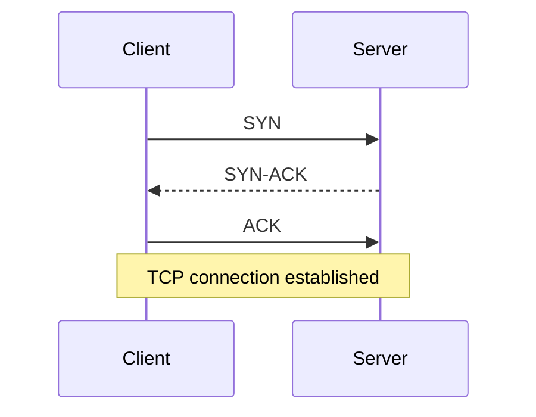

# The Internet — Job Tune Cheat Sheet

Dense recall reference. No hand-holding.

## Core Model

| Concept | Definition |
|---|---|
| Client-server model | Client requests, server responds. Stateless per-request by default. |
| Packet | Chunk of data with header (dest address, sequence #) routed independently. |
| Router | Forwards packets toward destination, hop by hop. |
| TCP | Reliable, ordered, connection-based (3-way handshake: SYN, SYN-ACK, ACK). |
| UDP | Unreliable, unordered, connectionless. Used for streaming/gaming/DNS queries. |



## HTTP Cheat Sheet

**Methods — safety/idempotency table:**

| Method | Safe | Idempotent | Typical use |
|---|:---:|:---:|---|
| GET | Y | Y | Read |
| HEAD | Y | Y | Read headers only |
| OPTIONS | Y | Y | Preflight/capabilities |
| PUT | N | Y | Full replace |
| DELETE | N | Y | Remove |
| POST | N | N | Create / non-idempotent action |
| PATCH | N | N* | Partial update |

**Status codes — memorize ranges + key codes:**

| Code | Meaning |
|---|---|
| 200 | OK |
| 201 | Created |
| 204 | No Content |
| 301 / 302 | Permanent / Temporary redirect |
| 304 | Not Modified (cache validation) |
| 400 | Bad Request |
| 401 | Unauthorized (not authenticated) |
| 403 | Forbidden (authenticated, no permission) |
| 404 | Not Found |
| 409 | Conflict |
| 429 | Too Many Requests |
| 500 | Internal Server Error |
| 502 | Bad Gateway |
| 503 | Service Unavailable |

**Key headers:** `Content-Type`, `Cache-Control`, `ETag`/`If-None-Match`, `Authorization`, `Access-Control-Allow-Origin` (CORS is server-set, not fixable client-side), `Content-Security-Policy`.

**HTTPS** = HTTP + TLS encryption. TLS handshake negotiates cipher suite + certificate validation before any HTTP data flows.

## Domains & Hosting

| Term | Role |
|---|---|
| Registry | Owns the TLD database (e.g., Verisign for `.com`) |
| Registrar | Sells domains to you (Namecheap, GoDaddy) |
| Nameserver / DNS provider | Hosts your DNS records — can differ from registrar (e.g., Cloudflare) |
| Hosting | Where site files/app actually run (static, VPS, PaaS, serverless) |

Serverless = you don't manage the server, not "no server."

## DNS Resolution Chain

```
Browser cache → OS cache → Recursive Resolver → Root server → TLD server → Authoritative server → IP returned
```

- **TTL** controls caching duration at each layer — explains propagation delay after DNS record changes.
- **Record types**: `A` (IPv4), `AAAA` (IPv6), `CNAME` (alias), `MX` (mail), `TXT` (verification/SPF/DKIM), `NS` (nameserver delegation).
- Root/TLD servers use **anycast** — same IP, multiple physical locations, routed to nearest.

## Browser Rendering Pipeline

```
HTML --parse--> DOM
CSS  --parse--> CSSOM
DOM + CSSOM --> Render Tree --> Layout --> Paint --> Composite
```

- CSS is **render-blocking** (prevents FOUC).
- `<script>` (no attr) is **parser-blocking**; `defer` = download parallel, execute after parse, in order; `async` = download parallel, execute ASAP (may interrupt parse), order not guaranteed.
- **Reflow** (layout) = geometry recalculation, expensive, cascades.
- **Repaint** = pixel redraw, no geometry change, cheaper.
- **Composite-only** (`transform`, `opacity`) = GPU-handled, skips layout+paint — preferred for animation.
- Reading `offsetHeight`/`getBoundingClientRect()` after a style write forces synchronous reflow ("layout thrashing") — batch reads before writes.

## Likely Interview Questions

**Q: What happens when you type a URL and press Enter?**
A: DNS resolution (cache chain → resolver → root → TLD → authoritative) → TCP handshake → TLS handshake (if HTTPS) → HTTP GET request → server responds → browser parses HTML/CSS → builds DOM/CSSOM → render tree → layout → paint → composite.

**Q: Difference between 401 and 403?**
A: 401 = not authenticated (no/invalid credentials). 403 = authenticated but lacks permission.

**Q: Why is PUT idempotent but POST isn't?**
A: PUT replaces a resource at a known URI — repeating it yields the same end state. POST typically creates a new resource or triggers an action each call, so repeating it can produce different results (e.g., duplicate records).

**Q: Why does DNS take time to propagate after a change?**
A: TTL-based caching at resolvers/browsers/OS — old records remain cached until TTL expires. Lower TTL before planned migrations.

**Q: Why prefer animating `transform`/`opacity` over `width`/`top`?**
A: They're composite-only properties handled on the GPU, skipping layout and paint — far cheaper than properties that trigger reflow.

**Q: What's the difference between the DOM and the render tree?**
A: DOM represents all HTML elements regardless of visibility; render tree only includes elements that will actually be painted (excludes `display: none`, `<head>`, etc.) and merges in CSSOM styles.

**Q: Registrar vs. registry vs. nameserver?**
A: Registry owns the TLD database; registrar sells/manages domain registration for you; nameserver/DNS provider actually stores and serves the DNS records (can be a separate company).

---

**Where this fits:** First topic in the Frontend roadmap (Internet → HTML → CSS → JavaScript → Version Control → ...).
