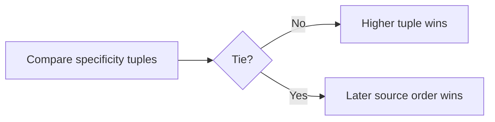

# CSS — Job Tune Cheat Sheet

Dense recall reference. No hand-holding.

## Specificity

| Selector type | Weight |
|---|---|
| Inline style | 1000 |
| ID (`#id`) | 100 |
| Class / attribute / pseudo-class (`.class`, `[type]`, `:hover`) | 10 |
| Element / pseudo-element (`div`, `::before`) | 1 |

- Tuple-based, not additive across tiers: 100 elements never beat 1 class.
- Tie → later source-order rule wins.
- `!important` overrides specificity entirely — avoid; escalates into override wars.
- Cascade layers (`@layer`) control priority between rule groups independent of specificity.
- Full cascade priority (low→high): user-agent → author → author `!important` → user-agent `!important`.



## Box Model

```
margin | border | padding | content
```

- `box-sizing: content-box` (default): `width` = content only.
- `box-sizing: border-box`: `width` = content + padding + border.
- Reset: `*, *::before, *::after { box-sizing: border-box; }` — must include pseudo-elements.
- **Margin collapsing**: adjacent vertical margins between block siblings collapse to the larger value, not sum. Also collapses parent/first-child without padding/border/inline-content between. Fix: padding/border on parent, `overflow:hidden`, `display:flow-root`, or use flex/grid (no collapsing inside).
- Percentage height on a child requires an explicit height on the ancestor chain.

## Flexbox

| Property | Axis | Effect |
|---|---|---|
| `justify-content` | main | `flex-start`, `flex-end`, `center`, `space-between`, `space-around`, `space-evenly` |
| `align-items` | cross, single line | `flex-start`, `center`, `stretch`, `baseline` |
| `align-content` | cross, multiple wrapped lines only | same values, needs `flex-wrap: wrap` + extra space |
| `flex-direction` | — | `row` (default), `column`, `row-reverse`, `column-reverse` |
| `flex: 1` | — | grow:1 shrink:1 **basis:0%** — pure proportional growth |
| `flex: auto` | — | grow:1 shrink:1 **basis:auto** — starts from content size |

- Implicit `min-width: auto` on flex items blocks shrinking below content size — classic overflow bug. Fix: `min-width: 0`.
- `gap` for spacing — no margin hacks needed.

## Grid

```css
display: grid;
grid-template-columns: repeat(auto-fit, minmax(200px, 1fr));
```

- `auto-fill`: empty tracks preserved (0-content, reserved space) — items stay `minmax` size.
- `auto-fit`: empty tracks collapse to 0 — remaining items stretch via `1fr`.
- `fr` distributes *remaining* space after fixed tracks + `gap` subtracted; mixing `%` and `fr` with `gap` causes overflow surprises.
- Items beyond explicit grid land in implicit grid, sized by `grid-auto-rows`/`grid-auto-columns` (default `auto`).
- `grid-template-areas` for named layout regions.

## Responsive Design

| Concept | Note |
|---|---|
| Viewport meta | `<meta name="viewport" content="width=device-width, initial-scale=1.0">` — required or mobile renders desktop-width and zooms out |
| Mobile-first | Base styles = mobile; `@media (min-width: …)` adds complexity upward. Preferred modern default. |
| Desktop-first | Base = desktop; `@media (max-width: …)` overrides down. Legacy pattern — don't mix with mobile-first in one codebase. |
| `em` vs `px` breakpoints | `em`-based breakpoints shift with user's browser font-size/zoom setting — accessibility win over fixed `px`. |
| Container queries | `container-type: inline-size` + `@container name (min-width: …)` — responds to parent container size, not viewport. Solves component-level responsiveness. |
| Logical properties | `margin-inline-start`, `padding-block-end` — auto-adapt to RTL/writing-mode vs. physical `margin-left`. |

**Relative units:** `%` (parent), `em` (current/parent font-size), `rem` (root font-size), `vw`/`vh` (1% of viewport dimension).

## Likely Interview Questions

**Q: Explain CSS specificity calculation.**
A: Tuple of (inline, IDs, classes/attrs/pseudo-classes, elements/pseudo-elements). Higher tier always wins regardless of count in lower tiers. Ties resolved by source order (last wins).

**Q: `flex: 1` vs `flex: auto` — difference?**
A: `flex: 1` sets `flex-basis: 0%` (pure proportional distribution, ignores content size as starting point). `flex: auto` sets `flex-basis: auto` (starts from content size, then grows/shrinks).

**Q: Why does a flex item overflow its container despite `flex-shrink: 1`?**
A: Flex items have an implicit `min-width: auto`, preventing shrink below content size. Override with `min-width: 0`.

**Q: `auto-fill` vs `auto-fit`?**
A: Both create as many tracks as fit via `minmax()`. `auto-fill` keeps unused tracks (reserved, empty). `auto-fit` collapses unused tracks to 0, letting remaining items stretch to fill space.

**Q: What is margin collapsing?**
A: Adjacent vertical margins of block-level siblings (or parent/child with no separating padding/border/content) combine into a single margin equal to the larger value, not the sum. Doesn't happen in flex/grid containers.

**Q: `box-sizing: content-box` vs `border-box`?**
A: `content-box` (default): `width` excludes padding/border, so total rendered size = width + padding + border. `border-box`: `width` includes padding/border, so it's the actual rendered size — generally more intuitive, hence the universal reset.

**Q: Media queries vs container queries?**
A: Media queries respond to viewport dimensions globally. Container queries (`@container`) respond to a specific ancestor container's size, enabling truly reusable components independent of where they're placed on the page.

**Q: Why use `rem` over `px` for font sizes?**
A: `rem` scales relative to the root font-size, so it respects user browser font-size/zoom preferences (accessibility). `px` stays fixed regardless of user settings.

**Q: Why avoid `!important`?**
A: Breaks normal cascade reasoning, forces future overrides to also use `!important` or higher-specificity/later-order hacks — an escalating maintenance problem. Prefer fixing the actual specificity/order issue.

---

**Where this fits:** Third topic in the Frontend roadmap (Internet → HTML → CSS → JavaScript → Version Control → ...).
