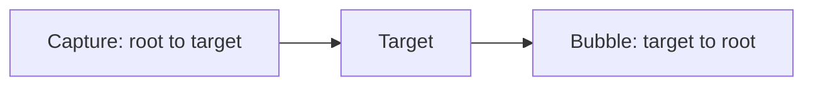

# JavaScript — Job Tune Cheat Sheet

## Core Language

| Concept | Key facts |
|---|---|
| `var` | Function/global scoped, hoisted with `undefined`, no TDZ |
| `let` | Block scoped, hoisted into TDZ (Temporal Dead Zone), reassignable |
| `const` | Block scoped, TDZ, **cannot be reassigned** (object contents still mutable) |
| Falsy values | `false, 0, "", null, undefined, NaN` — everything else truthy (`[]`, `{}` included) |
| `==` vs `===` | `==` coerces types before comparing; `===` never does. Always use `===` |
| `typeof null` | `"object"` (famous JS bug, kept for backward compat) |
| Hoisting | Function declarations fully hoisted; `var` hoisted as `undefined`; `let`/`const` hoisted but in TDZ |
| `this` (regular fn) | Determined by call site (`obj.method()` → `obj`) |
| `this` (arrow fn) | Lexical — inherited from enclosing scope, never rebound |
| Closures | Inner function retains access to outer function's variables after outer returns |
| Event loop order | Sync code → microtasks (Promises) → macrotasks (setTimeout, I/O) |

```js
// Closure example — classic interview snippet
function makeCounter() {
  let count = 0;
  return () => ++count;
}
const counter = makeCounter();
counter(); // 1
counter(); // 2
```

## DOM Manipulation

| Task | API |
|---|---|
| Select one | `document.querySelector(selector)` |
| Select all | `document.querySelectorAll(selector)` (static NodeList) |
| Select by ID | `document.getElementById(id)` |
| Live collection | `getElementsByClassName` / `getElementsByTagName` (updates automatically) |
| Set text (safe) | `el.textContent = str` |
| Set HTML (XSS risk) | `el.innerHTML = str` |
| Create | `document.createElement(tag)` |
| Insert | `parent.appendChild(el)`, `parent.insertBefore(el, ref)`, `el.append()` |
| Remove | `el.remove()` |
| Class toggling | `el.classList.add/remove/toggle/contains` |
| Listen | `el.addEventListener(type, handler, options)` |
| Stop bubbling | `event.stopPropagation()` |
| Prevent default | `event.preventDefault()` |
| Event delegation | Attach listener to parent, check `event.target` |

**Event phases:** capture (root → target) → target → bubble (target → root). `addEventListener(type, fn, true)` listens during capture phase.



## Fetch API / Ajax (XHR)

| Aspect | XMLHttpRequest | fetch() |
|---|---|---|
| API style | Event-based (`onload`, `onerror`) | Promise-based |
| Rejects on 4xx/5xx? | No (check `status`) | **No** (check `response.ok` / `response.status`) |
| Rejects on network failure? | Yes (`onerror`) | Yes |
| Cancel | `xhr.abort()` | `AbortController` + `signal` |
| Upload progress | `xhr.upload.onprogress` | Not natively supported (needs streams) |
| async/await compatible | Only via wrapping in a Promise | Native |
| Response parsing | `xhr.responseText` (manual `JSON.parse`) | `response.json()`, `.text()`, `.blob()` |

```js
// fetch — GET
const res = await fetch(url);
if (!res.ok) throw new Error(`HTTP ${res.status}`);
const data = await res.json();

// fetch — POST
await fetch(url, {
  method: "POST",
  headers: { "Content-Type": "application/json" },
  body: JSON.stringify(payload),
});

// Abort
const controller = new AbortController();
fetch(url, { signal: controller.signal });
controller.abort();

// Parallel requests
const [a, b] = await Promise.all([fetch(url1), fetch(url2)]);

// Tolerant of individual failures
const results = await Promise.allSettled([fetch(url1), fetch(url2)]);
```

**Critical fact:** `fetch()` only rejects on network-level failures (DNS, CORS, offline). A 404 or 500 response is a *resolved* Promise with `response.ok === false`. This trips up almost everyone coming from `axios` (which does reject on bad status codes).

| Promise combinator | Behavior |
|---|---|
| `Promise.all` | Rejects as soon as any promise rejects (fail-fast) |
| `Promise.allSettled` | Always resolves; gives `{status, value/reason}` per promise |
| `Promise.race` | Resolves/rejects with whichever settles first |
| `Promise.any` | Resolves with first fulfillment; rejects only if all reject |

## Likely Interview Questions

**Q: Difference between `let`, `const`, and `var`?**
A: Scope (function vs block) and hoisting behavior (TDZ vs `undefined` initialization); `const` also disallows reassignment.

**Q: What's the event loop?**
A: JS is single-threaded; the call stack runs sync code, then drains the microtask queue (Promises) fully, then takes one macrotask (setTimeout/setInterval/I/O) per loop tick.

**Q: Why doesn't `fetch` reject on a 404?**
A: By spec, `fetch` only rejects on network errors — HTTP error codes are still "successful" responses at the transport level. You must check `response.ok`.

**Q: Explain event delegation.**
A: Attach one listener to a common ancestor and use `event.target` to identify which child was interacted with, relying on event bubbling. Reduces listener count and works for dynamically added elements.

**Q: What is a closure?**
A: A function bundled with references to its surrounding lexical scope, letting it access variables from an outer function after that function has returned.

**Q: `innerHTML` vs `textContent`?**
A: `innerHTML` parses and renders HTML (XSS risk with untrusted input); `textContent` sets/reads raw text safely and is faster.

**Q: How do you cancel a fetch request?**
A: Pass an `AbortController`'s `signal` into the fetch options, then call `controller.abort()`.

**Q: `Promise.all` vs `Promise.allSettled`?**
A: `all` fails fast on first rejection; `allSettled` always resolves with per-promise status, useful when partial failures are acceptable.

**Q: What does `this` refer to inside an arrow function?**
A: Whatever `this` was in the enclosing lexical scope at definition time — arrow functions never bind their own `this`.

---

**Where this fits:** JavaScript → Version Control (Git) → Package Managers → Pick a Framework → Writing CSS → ...
