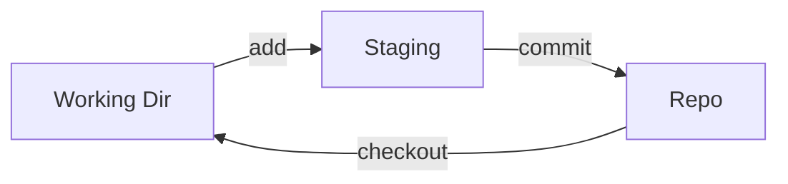

# Version Control — Job Tune Cheat Sheet

## Git Core Model

| Area | Description |
|---|---|
| Working directory | Actual files on disk |
| Staging area (index) | Changes marked for next commit (`git add`) |
| Repository (`.git`) | Committed, permanent history |

## Essential Commands

| Command | Purpose |
|---|---|
| `git init` | Create new repo |
| `git clone <url>` | Copy remote repo locally |
| `git status` | Show working tree state |
| `git add <file>` / `git add .` | Stage changes |
| `git commit -m "msg"` | Save staged snapshot |
| `git log --oneline --graph` | View history |
| `git branch <name>` | Create branch |
| `git checkout -b <name>` / `git switch -c <name>` | Create + switch branch |
| `git merge <branch>` | Merge branch into current (creates merge commit if diverged) |
| `git rebase <branch>` | Replay current branch's commits onto target (linear history) |
| `git rebase -i HEAD~n` | Interactive rebase — squash/reword/drop |
| `git stash` / `git stash pop` | Shelve / restore uncommitted work |
| `git reset --soft/--mixed/--hard` | Undo commits (increasing destructiveness) |
| `git revert <hash>` | Undo via new commit (safe for shared history) |
| `git remote add origin <url>` | Link local repo to remote |
| `git push` / `git pull` | Upload / download + merge commits |
| `git fetch` | Download only, no merge |
| `git cherry-pick <hash>` | Apply a single commit onto current branch |
| `git reflog` | Recovery log of HEAD movements (rescue from bad reset) |
| `git rm --cached <file>` | Untrack a file without deleting it |

## Merge vs Rebase

| | Merge | Rebase |
|---|---|---|
| History shape | Non-linear (branching, merge commits) | Linear |
| Rewrites commits? | No | Yes (new hashes) |
| Safe on shared branches? | Yes | **No** — never rebase pushed/shared commits |
| Use case | Integrating a feature into main | Cleaning up local branch before PR |

## Reset Modes

| Mode | Commit undone? | Staging area | Working directory |
|---|---|---|---|
| `--soft` | Yes | Kept (staged) | Kept |
| `--mixed` (default) | Yes | Cleared (unstaged) | Kept |
| `--hard` | Yes | Cleared | **Discarded** — destructive |

## Reset vs Revert

| | Rewrites history | Safe for shared branches |
|---|---|---|
| `git reset` | Yes | No |
| `git revert` | No (adds new commit) | Yes |

## VCS Hosting (GitHub / GitLab / Bitbucket)

| Adds on top of Git | Purpose |
|---|---|
| Remote hosted repo | Central shared source of truth |
| Pull/Merge Requests | Structured review + discussion before merging |
| Issues | Bug/feature tracking linked to code |
| CI/CD (Actions/Pipelines) | Automated test/build/deploy on push or PR |
| Protected branches | Block direct pushes, require review + passing checks |
| Fork | Personal copy of a repo you don't have write access to (open source contribution model) |

**PR merge strategies:** merge commit (preserves all commits + adds merge commit) · squash (all PR commits → one commit) · rebase-and-merge (linear, no merge commit).

**Force push safety:** always use `git push --force-with-lease`, never plain `--force` — it aborts if remote has commits you don't have locally.

## Likely Interview Questions

**Q: Merge vs rebase — when do you use each?**
A: Merge preserves full history and is safe for shared branches; rebase produces linear history but rewrites commit hashes, so only use it on local/unshared branches to clean up before opening a PR.

**Q: What's a merge conflict and how do you resolve it?**
A: Occurs when the same lines are changed differently on two branches being combined; Git marks the conflicting regions with `<<<<<<<`/`=======`/`>>>>>>>` markers — you manually edit to the correct result, then `git add` and commit (or `rebase --continue`).

**Q: Difference between `git fetch` and `git pull`?**
A: `fetch` downloads remote changes without touching your working branch; `pull` = `fetch` + `merge` (or rebase) automatically.

**Q: `git reset` vs `git revert`?**
A: `reset` rewrites history by moving the branch pointer (destructive on shared branches); `revert` adds a new commit that undoes changes, safe for shared history.

**Q: What does `--force-with-lease` do differently from `--force`?**
A: It refuses to overwrite the remote if it has commits you haven't fetched yet, preventing accidental clobbering of teammates' work.

**Q: What is a detached HEAD?**
A: Checking out a specific commit (not a branch) — HEAD points directly to a commit. New commits made here can be lost unless attached to a branch.

**Q: Fork vs branch — when do you use each?**
A: Branch when you have write access to the repo (internal teams); fork when you don't (open-source contributions), then PR from fork back to upstream.

**Q: What is `git cherry-pick` for?**
A: Applying a specific commit from one branch onto another without merging the whole branch.

---

**Where this fits:** JavaScript → Version Control (Git) → Package Managers → Pick a Framework → Writing CSS → ...
