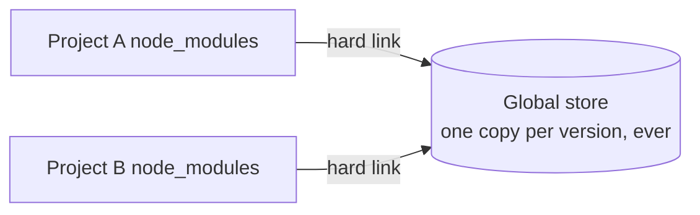

# Package Managers — Job Tune Cheat Sheet

## Core Concepts

| Term | Definition |
|---|---|
| `package.json` | Manifest: name, version, `dependencies`, `devDependencies`, `scripts` |
| `dependencies` | Needed at runtime |
| `devDependencies` | Needed only during development (linters, bundlers, test tools) |
| Lockfile | Pins exact resolved version tree (`package-lock.json`, `yarn.lock`, `pnpm-lock.yaml`) |
| `node_modules` | Where installed package code physically lives |
| Dependency resolution | Process of computing a compatible version tree from all declared ranges |
| Phantom dependency | Importing a package that works via hoisting but isn't declared — breaks unpredictably |

## Semver Ranges

| Syntax | Allows |
|---|---|
| `^1.4.0` | Minor + patch upgrades (`1.x.x`, not `2.0.0`) |
| `~1.4.0` | Patch upgrades only (`1.4.x`) |
| `1.4.0` | Exact version only |
| `^0.4.0` | Patch only below 1.0 (pre-1.0 = unstable API assumption) |
| `*` / `latest` | Any — avoid in production manifests |

## npm vs yarn vs pnpm

| | npm | yarn (classic) | pnpm |
|---|---|---|---|
| Bundled with Node.js | Yes | No | No |
| `node_modules` structure | Flat/hoisted | Flat/hoisted | Symlinked, strict (`.pnpm` store) |
| Disk usage (multi-project) | Highest | High | Lowest — content-addressable global store, hard links |
| Phantom dependencies possible | Yes | Yes | No — blocked by design |
| Lockfile | `package-lock.json` | `yarn.lock` | `pnpm-lock.yaml` |
| Deterministic CI install command | `npm ci` | `yarn install --frozen-lockfile` | `pnpm install --frozen-lockfile` |
| Monorepo/workspace support | Basic | Good | Excellent (built for scale) |
| Force nested version | `overrides` | `resolutions` | `pnpm.overrides` |

## pnpm's Content-Addressable Store — mechanics

- Packages keyed by content hash, stored once globally.
- Projects get **hard links**, not copies → near-zero duplication, faster installs.
- `node_modules` is symlinked and strict: only declared deps are resolvable from your app code → phantom dependencies fail loudly instead of silently working.
- Store is read-only by default to protect shared files from accidental edits.

## Commands Cheat Sheet

| Action | npm | yarn | pnpm |
|---|---|---|---|
| Install all | `npm install` | `yarn` | `pnpm install` |
| Add package | `npm install axios` | `yarn add axios` | `pnpm add axios` |
| Add dev dep | `npm install -D eslint` | `yarn add -D eslint` | `pnpm add -D eslint` |
| Remove | `npm uninstall axios` | `yarn remove axios` | `pnpm remove axios` |
| Run script | `npm run build` | `yarn build` | `pnpm build` |
| CI-safe install | `npm ci` | `yarn install --frozen-lockfile` | `pnpm install --frozen-lockfile` |

## Likely Interview Questions

**Q: What problem do lockfiles solve?**
A: `package.json` specifies version ranges, not exact versions; lockfiles pin the exact resolved tree so every install (any machine, any time) is identical.

**Q: What's a phantom dependency and which package manager prevents it?**
A: A package your code imports without declaring it in `package.json`, working only because npm/yarn hoist it into the flat `node_modules`. pnpm prevents this by using a strict, symlinked `node_modules` where only declared dependencies are resolvable.

**Q: How does pnpm save disk space?**
A: A single global content-addressable store holds one copy of each package version; projects reference it via hard links instead of duplicating files.

**Q: `npm install` vs `npm ci` — when to use which?**
A: `npm ci` installs exactly what's in the lockfile, deterministically, and fails if `package.json`/lockfile are out of sync — use it in CI. `npm install` can update the lockfile and is meant for local development.

**Q: Difference between `dependencies` and `devDependencies`?**
A: `dependencies` are required at runtime and ship to production; `devDependencies` are only needed locally/in CI (linters, test runners, bundlers).

**Q: What does `^` mean in a version range, and how does it differ below 1.0.0?**
A: Allows minor and patch upgrades without breaking the major version; for `0.x.y` packages, caret only allows patch-level upgrades since pre-1.0 packages don't guarantee a stable API across minors.

**Q: Why might a CI build break even though it worked locally?**
A: Commonly a stale/missing lockfile, an unpinned version range that resolved differently, or (with npm/yarn) reliance on a phantom dependency that hoisted differently in a clean install.

---

**Where this fits:** JavaScript → Version Control (Git) → Package Managers → Pick a Framework → Writing CSS → ...
