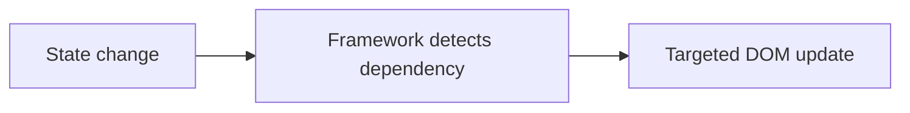

# Pick a Framework — Job Tune Cheat Sheet

## Why Frameworks Exist

| Concept | Definition |
|---|---|
| Declarative UI | Describe *what* UI should look like for given state; framework handles the *how* |
| Component model | Self-contained, reusable, composable UI units |
| Reactivity | Automatic tracking of which UI depends on which state, auto-updating on change |
| Virtual DOM | In-memory tree diffed against previous render to compute minimal real-DOM patches |
| Fine-grained reactivity | Direct dependency tracking per signal/value → no diffing, updates target nodes directly |



## Framework Comparison

| Framework | Reactivity model | Bundle size | Learning curve | SSR framework | Pick if... |
|---|---|---|---|---|---|
| **React** | Virtual DOM diff + hooks | Medium-large | Moderate | Next.js | Largest job market/ecosystem needed |
| **Vue.js** | Proxy-based reactive refs | Medium | Gentle | Nuxt | Beginner-friendly, official cohesive tooling |
| **Angular** | Change detection (+Signals in 17+) | Large | Steep | Angular Universal | Enterprise, batteries-included, TypeScript-first |
| **Svelte** | Compile-time, no runtime VDOM | Small | Gentle | SvelteKit | Smallest bundles, simplest syntax |
| **Solid JS** | Fine-grained signals, JSX | Small | Moderate | SolidStart | React-like DX + top-tier performance |
| **Qwik** | Signals + resumability (lazy exec) | Smallest initial payload | Moderate–steep | Qwik City | Fastest possible page load, content sites |

## Reactivity Gotchas (high interview yield)

| Framework | Gotcha | Fix |
|---|---|---|
| React | Stale closure in `useEffect` (captures old state) | Use functional updater `setCount(p => p+1)` or fix deps array |
| React | Mutating state object in place doesn't re-render | Always spread/copy: `setUser({...user, name})` |
| Vue | Destructuring `reactive()` loses reactivity | Use `toRefs()` or access via `.value`/dot path |
| Svelte | Array `.push()` alone doesn't trigger update | Reassign: `arr = [...arr, x]` |
| Solid | Forgetting to call signal as function | `count()` not `count` |
| Angular | Default change detection checks whole tree | Use `ChangeDetectionStrategy.OnPush` |
| Qwik | Removing `$` boundaries breaks lazy-loading | Keep `component$`, `onClick$` markers intact |

```jsx
// React stale closure — classic interview snippet
useEffect(() => {
  setInterval(() => setCount(c => c + 1), 1000); // functional form avoids stale closure
}, []);
```

## Key Industry Trend

Signals-based fine-grained reactivity has converged across React (ecosystem libraries), Vue 3, Angular 17+, Solid, Svelte 5 (runes), and Qwik — virtual-DOM diffing is no longer the only dominant model.

## Likely Interview Questions

**Q: Why use a framework instead of vanilla JS DOM manipulation?**
A: Manual DOM sync doesn't scale — frameworks provide declarative UI + automatic reactivity so the UI stays consistent with state without hand-written update code, plus a component model for reuse and structure.

**Q: Virtual DOM vs fine-grained reactivity — what's the tradeoff?**
A: Virtual DOM (React) re-runs component functions and diffs trees — simple mental model but pays a diff cost. Fine-grained reactivity (Solid, Svelte, Vue, Qwik) tracks exact dependencies and updates DOM nodes directly — faster, no diffing, but requires careful dependency tracking.

**Q: Why does mutating React state directly not trigger a re-render?**
A: React uses reference equality (`Object.is`) to detect state changes; mutating in place keeps the same reference, so React doesn't know anything changed. You must produce a new reference.

**Q: What is Qwik's "resumability" and how does it differ from hydration?**
A: Hydration (React/Vue/Angular default) re-executes all component JS on the client to attach interactivity after SSR. Resumability (Qwik) serializes app state into HTML and only loads/executes the JS needed for a specific interaction, on demand — avoiding the "re-run everything" cost entirely.

**Q: When would you choose Angular over React?**
A: Enterprise environments wanting an opinionated, all-in-one framework (routing, forms, DI, HTTP built in) with strong TypeScript conventions and long-term structural consistency across large teams.

**Q: What is `OnPush` change detection in Angular and why does it matter?**
A: Restricts a component's re-check to only when its `@Input()` references change or an internal event fires, instead of Angular's default tree-wide check on every async event — major performance lever in large apps.

---

**Where this fits:** JavaScript → Version Control (Git) → Package Managers → Pick a Framework → Writing CSS → ...
