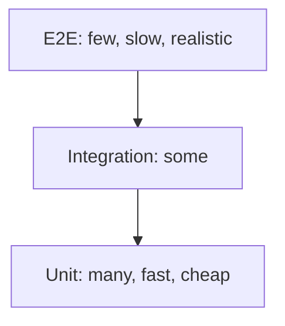

# Testing — Cheat Sheet

## Why testing matters

Catches regressions early, enables confident refactors, doubles as living documentation. Manual re-testing doesn't scale; automated tests do.

## Testing pyramid



| Level | Scope | Speed | Tooling |
|---|---|---|---|
| Unit | Single function/component, isolated | Fastest | Vitest, Jest |
| Integration | Multiple units together (still no real browser needed) | Medium | Vitest/Jest + Testing Library |
| E2E | Full app, real browser, real user flow | Slowest | Playwright, Cypress |

Anti-pattern: **ice-cream cone** — pyramid inverted (mostly E2E/manual, few unit) = slow, flaky, expensive CI.

---

## Vitest vs Jest

| | Vitest | Jest |
|---|---|---|
| Transform pipeline | Uses Vite's own (matches app config) | Separate (Babel/ts-jest) — can drift from app build |
| ESM | Native | Historically CJS-first |
| Globals (`test`,`expect`) | Off by default (import or `globals: true`) | On by default |
| Speed | Faster, esp. watch mode | Slower on large suites |

```js
// Vitest / Jest unit test (near-identical API)
import { describe, it, expect } from 'vitest';
import { sum } from './sum.js';

describe('sum', () => {
  it('adds numbers', () => {
    expect(sum(2, 3)).toBe(5);
  });
});
```

```jsx
// Component test w/ Testing Library
test('calls onClick', () => {
  const handleClick = vi.fn();
  render(<Button onClick={handleClick}>Go</Button>);
  fireEvent.click(screen.getByText('Go'));
  expect(handleClick).toHaveBeenCalledTimes(1);
});
```

---

## Playwright vs Cypress

| Aspect | Playwright | Cypress |
|---|---|---|
| Execution model | Outside browser (CDP automation) | Inside browser context |
| Cross-origin / OAuth flows | Handles natively | Historically brittle (`cy.origin()` helps) |
| Multi-tab/window | First-class | Limited |
| Browser coverage | Chromium, Firefox, WebKit | Mostly Chromium family |
| Free parallelization | Yes | Needs Cypress Cloud (paid) for full features |
| Language support | JS/TS, Python, Java, .NET | JS/TS only |

```js
// Playwright E2E example
import { test, expect } from '@playwright/test';

test('user can log in', async ({ page }) => {
  await page.goto('https://example.com/login');
  await page.fill('input[name="email"]', 'user@example.com');
  await page.fill('input[name="password"]', 'pw123');
  await page.click('button[type="submit"]');
  await expect(page.locator('h1')).toHaveText('Welcome back!');
});
```

---

## Flaky test causes — fast reference

| Cause | Fix |
|---|---|
| Assert before async settles | `await findBy...` / `waitFor` instead of `getBy...` |
| Hardcoded `sleep()` | Wait for condition/element, not fixed time |
| Leaked mocks/fake timers across tests | Reset in `beforeEach`/`afterEach` |
| Test order dependency | Each test sets up its own state |
| Real network calls in unit tests | Mock network (e.g. `msw`) |
| `Date.now()`/`Math.random()` untamed | Freeze time / seed randomness |

---

## Likely interview questions

**Q: Describe the testing pyramid and why the shape matters.**
A: Many fast/cheap unit tests at the base, fewer integration tests, fewest E2E tests at the top — because E2E is slow/expensive/flaky at scale; inverting it (ice-cream cone) makes CI slow and unreliable.

**Q: Vitest vs Jest — why prefer Vitest in a Vite app?**
A: Vitest reuses the app's own Vite transform/resolution pipeline, avoiding config drift between test and build environments that Jest (with a separate Babel/ts-jest pipeline) can introduce.

**Q: Give three common causes of flaky E2E tests.**
A: Asserting before async work resolves, hardcoded time-based waits instead of condition-based waits, and shared/leaked state between test runs.

**Q: Playwright vs Cypress — key architectural difference?**
A: Playwright automates the browser externally via protocols like CDP; Cypress runs inside the browser's own execution context, which historically caused cross-origin/multi-tab limitations Playwright doesn't have.

**Q: What's the difference between a unit test and an integration test in a frontend context?**
A: A unit test isolates a single function/component; an integration test exercises multiple units collaborating (e.g. a form + state + child components) — both can run in the same fast test runner without a real browser, unlike E2E.

**Q: How do you prevent flaky tests from async state updates?**
A: Use auto-retrying/async query methods (`findBy`, `waitFor`) instead of synchronous assertions immediately after triggering an update.

**Q: Why is over-relying on E2E tests for logic checks a mistake?**
A: E2E tests are slow, harder to debug, and expensive to maintain — logic like validation or conditional rendering is better and faster covered by unit tests; E2E should validate cross-system flows, not isolated logic.

---

**Where this fits**: Pick a Framework → Writing CSS → Build Tools → **Testing** → Authentication Strategies.
