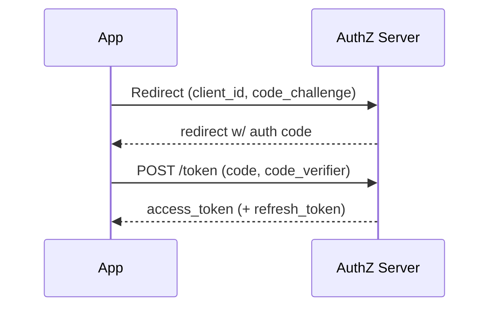

# Authentication — Cheat Sheet

## Core comparison table

| Method | State | Revocation | Scales horizontally | Transport | Typical use |
|--------|-------|-----------|---------------------|-----------|-------------|
| Session Auth | Stateful (server store) | Instant (delete record) | Needs shared store (Redis) | Cookie (session ID) | Traditional web apps |
| JWT | Stateless | Hard (expiry/blocklist/rotation) | Trivial (verify anywhere) | `Authorization: Bearer` or cookie | APIs, SPAs, microservices |
| OAuth 2.0 | N/A (delegation protocol) | Revoke token at Auth Server | N/A | Access token (Bearer) | Third-party access delegation |
| SSO (SAML/OIDC) | Session with IdP | Needs explicit SLO | N/A | Assertion/ID token | Enterprise, multi-app suites |
| Basic Auth | Stateless | None (no logout concept) | Trivial | `Authorization: Basic base64(u:p)` | Internal tools, machine-to-machine |

## JWT structure

`header.payload.signature` — Base64url encoded, **not encrypted**.

- Header: `{alg, typ}`
- Payload (claims): `{sub, iat, exp, ...custom}` — readable by anyone
- Signature: `HMACSHA256(base64(header)+"."+base64(payload), secret)`

**Never** put secrets/PII in the payload. Signature ≠ encryption.

## JWT storage decision table

| Storage | XSS-safe | CSRF-safe | Survives refresh |
|---------|----------|-----------|-------------------|
| localStorage | No | Yes | Yes |
| sessionStorage | No | Yes | No (tab close) |
| Memory (JS var) | Partial | Yes | No |
| httpOnly cookie | Yes | No (needs `SameSite`/CSRF token) | Yes |

**Recommended default:** httpOnly + Secure + SameSite=Strict/Lax cookie for refresh token; short-lived access token in memory.

## Login flow (JWT) — one-liner

`POST /login → server signs JWT → client sends Authorization: Bearer <jwt> on each request → server verifies signature, no DB hit`.

## OAuth Authorization Code Flow (with PKCE for public clients)

- Public clients (SPA/mobile) → **Authorization Code + PKCE**, never Implicit flow (deprecated, token leaks via URL).
- Confidential clients (server backends) → Authorization Code with `client_secret`.
- OAuth = authorization delegation. Add **OIDC** (`id_token`, a JWT) for authentication/identity.

## SSO essentials

- Not a protocol — a pattern, implemented via **SAML** (XML, enterprise) or **OIDC** (JSON/JWT, modern).
- Central Identity Provider (IdP) issues trust assertion to Service Providers (SPs).
- Logging out of one SP does **not** log out others without **Single Logout (SLO)**.

## Basic Auth

`Authorization: Basic base64(username:password)` sent on **every** request. No logout, no expiry, decodable trivially. TLS-only, internal/service-to-service use only.

## Revocation strategies for JWT (since there's no native revoke)

1. Short expiry (5–15 min) + refresh token rotation.
2. Server-side blocklist keyed on `jti`, TTL = remaining token life.
3. Reuse detection on refresh token rotation → flags theft.

## Likely interview questions

**Q: Why is JWT called "stateless"?**
A: All claims needed to authenticate live in the token itself; server doesn't store session data, so any server instance can verify it independently via signature check.

**Q: How do you revoke a JWT before expiry?**
A: You can't natively — use short expiry + refresh tokens, a server-side blocklist of `jti`, or rotate/invalidate refresh tokens.

**Q: Where should you store a JWT client-side, and why?**
A: httpOnly cookie — inaccessible to JS, so immune to XSS token theft. localStorage is readable by any injected script.

**Q: If you use httpOnly cookies, what new risk do you introduce, and how do you mitigate it?**
A: CSRF, because cookies are sent automatically. Mitigate with `SameSite=Strict/Lax` and a CSRF token (double-submit or synchronizer pattern).

**Q: What's the difference between authentication and authorization?**
A: Authentication = proving who you are. Authorization = what you're allowed to do once identified. OAuth is fundamentally an authorization delegation protocol.

**Q: Why does OAuth use an authorization code instead of returning the token directly?**
A: The code is exchanged for a token in a back-channel (server-to-server) call using a client secret (or PKCE verifier), keeping the token out of browser history/redirect URLs/logs.

**Q: What's PKCE and when is it required?**
A: Proof Key for Code Exchange — a dynamic verifier/challenge pair replacing the client secret for public clients (SPAs, mobile) that can't safely store one. Prevents authorization code interception.

**Q: Session auth vs JWT — which is more scalable?**
A: JWT, since verification needs no shared store; sessions require a centralized/shared store (e.g., Redis) across server instances.

**Q: Session auth vs JWT — which revokes more easily?**
A: Sessions — delete the server-side record and access is immediately gone. JWTs remain valid until expiry unless you add extra infrastructure.

## Where this fits

Authentication Strategies sits after Testing and before Web Security Basics in the frontend roadmap.
