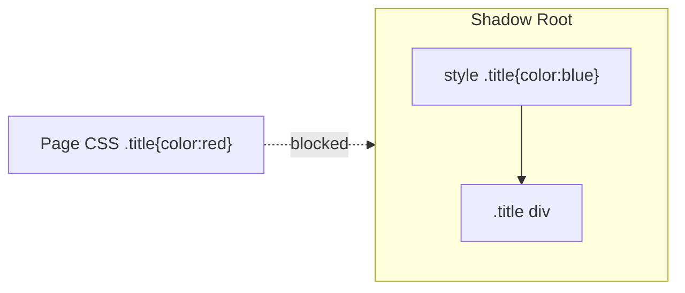

# Web Components — Cheat Sheet

## Three core APIs

| API | Purpose | Key method/tag |
|-----|---------|-----------------|
| Custom Elements | Define new HTML tags with behavior | `class extends HTMLElement`, `customElements.define('tag-name', Class)` |
| HTML Templates | Inert, reusable HTML blueprint | `<template>`, `template.content.cloneNode(true)` |
| Shadow DOM | Style/DOM encapsulation | `this.attachShadow({ mode: 'open' })` |

## Custom Elements essentials

```javascript
class MyButton extends HTMLElement {
  static get observedAttributes() { return ['label']; } // required for attributeChangedCallback

  connectedCallback() { this.render(); }          // element inserted into DOM
  disconnectedCallback() { /* cleanup */ }         // element removed
  attributeChangedCallback(n, o, v) { this.render(); } // watched attr changed

  render() {
    this.textContent = this.getAttribute('label');
  }
}
customElements.define('my-button', MyButton); // tag name MUST contain a hyphen
```

| Rule | Detail |
|------|--------|
| Tag name | Must contain a hyphen (future-proofs against native tag collisions) |
| Constructor | Cannot safely read attributes/children yet — do that in `connectedCallback` |
| `connectedCallback` | Fires on every (re)insertion, not just first mount — guard with a flag if needed |
| `attributeChangedCallback` | Silently never fires without `observedAttributes` |

## `<template>` essentials

- Content is parsed but **inert**: no script execution, no image fetch, no custom element upgrade.
- Lives in `template.content` (a `DocumentFragment`), not the main document — `document.querySelector` won't find it until cloned.
- Clone with `cloneNode(true)` and insert to activate.

## Shadow DOM essentials

```javascript
const shadow = this.attachShadow({ mode: 'open' }); // 'closed' hides shadowRoot externally, rarely worth it
shadow.innerHTML = `<style>.t{color:blue}</style><div class="t">Hi</div>`;
```

| Mechanism | Effect |
|-----------|--------|
| Shadow-internal `<style>` | Scoped only to shadow tree; page CSS can't reach in |
| CSS custom properties (`--x`) | Pierce the boundary — sanctioned theming hook |
| `::part(name)` + `part="name"` attr | Sanctioned external styling of specific internal elements |
| `<slot>` / `slot="name"` | Projects light-DOM children into shadow tree; slotted content keeps light-DOM styling, not shadow styling (except via `::slotted()`) |

## Diagram: encapsulation


Shadow wins inside its tree; page CSS cannot penetrate except via custom properties / `::part`.

## Framework-agnostic tradeoffs

| Pro | Con |
|-----|-----|
| No build step, works in any framework or none | No built-in reactivity/state binding |
| Native browser support, long-lived | Form participation needs extra `ElementInternals` API |
| True style isolation with zero tooling | SSR (Declarative Shadow DOM) less mature than React/Vue SSR |
| Ideal for cross-framework design systems, embeddable widgets | Testing ecosystem less mature; `closed` mode hurts tooling further |

## Likely interview questions

**Q: Why must custom element tag names contain a hyphen?**
A: Reserves a namespace so custom tags never collide with future native HTML elements (which are always hyphen-free).

**Q: Why can't you read attributes in the constructor?**
A: Spec restricts constructor behavior — the element isn't guaranteed fully parsed/upgraded yet; use `connectedCallback` instead.

**Q: What does Shadow DOM actually encapsulate?**
A: A separate DOM subtree whose internal markup and CSS are isolated from the rest of the page — external CSS can't select into it, internal CSS can't leak out (except via custom properties/`::part`).

**Q: How do you theme a Shadow DOM component from the outside page?**
A: CSS custom properties (`--var`) inherit through the shadow boundary; use `var(--x, fallback)` inside, set `--x` on the host from outside. `::part()` is the other sanctioned mechanism.

**Q: Why use `<template>` instead of building the DOM with `innerHTML` each time?**
A: Content is parsed once, inert (no premature script/image execution), and cheaply cloned for many instances — this is what Custom Elements use internally.

**Q: What's a major limitation of Web Components vs a framework like React?**
A: No built-in state management/reactivity or data binding — you re-render manually on attribute/property change, or reach for a helper library like Lit.

**Q: When would you choose Web Components over a framework component?**
A: Cross-framework design systems, embeddable third-party widgets, or long-lived components that shouldn't be tied to a specific framework's lifecycle.

## Where this fits

Web Components sits alongside Type Checkers, after Web Security Basics, in the frontend roadmap.
