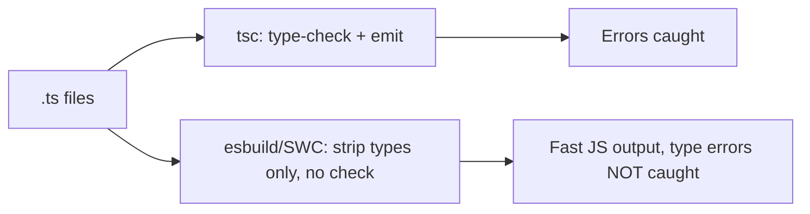

# Type Checkers (TypeScript) — Cheat Sheet

## Core value proposition

| | Runtime error (JS) | Compile-time error (TS) |
|---|---|---|
| Caught | While code executes (maybe in prod) | Before code runs, at build/edit time |
| Cost of bug | Potentially user-facing | Caught by developer, pre-ship |

```typescript
// Before (JS) — silent bug, wrong types coerce at runtime
function discount(price, pct) { return price - (price * pct) / 100; }
discount("49.99", 10); // no error, subtly wrong

// After (TS) — compile error, caught immediately
function discount(price: number, pct: number): number { return price - (price * pct) / 100; }
discount("49.99", 10); // Error: Argument of type 'string' is not assignable to 'number'
```

## Syntax quick reference

| Feature | Syntax | Notes |
|---------|--------|-------|
| Variable annotation | `let x: number` | Usually inferred, annotate at boundaries |
| Function types | `function f(a: string): number` | Params + return type |
| Interface | `interface User { id: number; name?: string }` | `?` = optional; supports declaration merging |
| Type alias | `type ID = string \| number` | Supports unions/intersections; no merging |
| Union | `string \| number` | Value is one of these types |
| Intersection | `A & B` | Value must satisfy both |
| Generics | `function f<T>(x: T): T` | Reusable across types, still type-safe |
| Generic constraint | `<T extends { length: number }>` | Restricts T to shapes with needed members |
| `unknown` | Safe "don't know yet" — must narrow before use | |
| `any` | Unsafe "opt out of checking" — avoid | |

## `interface` vs `type`

| | `interface` | `type` |
|---|---|---|
| Merges across declarations | Yes | No (duplicate = error) |
| Unions | No | Yes |
| Typical use | Object shapes, public APIs, augmentable types | Unions, mapped/conditional types, aliases |

## `any` vs `unknown`

| | `any` | `unknown` |
|---|---|---|
| Type checking | Disabled entirely | Still enforced — must narrow first |
| Safe default | No | Yes |

```typescript
function f(x: unknown) {
  if (typeof x === 'string') x.toUpperCase(); // OK after narrowing
}
```

## Structural typing gotcha

```typescript
interface Point { x: number; y: number; }
const p = { x: 1, y: 2, z: 3 };
function log(pt: Point) {}
log(p);                       // OK — structural match via variable
log({ x: 1, y: 2, z: 3 });    // Error — excess property check on OBJECT LITERAL only
```

## Build pipeline



| Tool | Type-checks? | Speed | Typical role |
|------|--------------|-------|---------------|
| `tsc` | Yes | Slower | Source of truth for types; `tsc --noEmit` in CI |
| esbuild | No (strips only) | Very fast | Dev server / bundler transpilation |
| SWC | No (strips only) | Very fast | Used by Next.js, others, for fast builds |

**Standard setup:** bundler (esbuild/SWC via Vite/Next.js) for fast dev/build, separate `tsc --noEmit` script run in CI/pre-commit to actually catch type errors.

```json
{ "scripts": { "build": "vite build", "typecheck": "tsc --noEmit" } }
```

`isolatedModules: true` flags code that can't survive single-file (bundler) transpilation (e.g. bare `const enum`, ambiguous type-only exports) — catches it in `tsc` instead of miscompiling silently in esbuild/SWC.

## Likely interview questions

**Q: What class of bugs does TypeScript eliminate that plain JS can't catch until runtime?**
A: Type-mismatch bugs — wrong argument types, missing/misnamed properties, null/undefined access — caught at compile time instead of when a user hits that code path.

**Q: Why is `any` dangerous?**
A: It fully disables type checking on that value and anything it touches, giving false confidence since the code still "type-checks" while runtime crashes remain possible.

**Q: `any` vs `unknown` — when do you use which?**
A: `unknown` when the type is genuinely not known yet but you still want safety — forces narrowing before use. `any` should be avoided; it's an escape hatch, not a type.

**Q: Why does passing an object literal with an extra property error, but passing the same shape via a variable doesn't?**
A: Excess property checking — a TS heuristic applied only to object literals (to catch likely typos), not a fundamental structural typing rule. Structural typing itself allows extra properties.

**Q: Key difference between `interface` and `type`?**
A: `interface` supports declaration merging (multiple declarations combine); `type` does not but supports unions/intersections that `interface` can't express directly.

**Q: Why might a build succeed (`npm run build`) but still ship type errors?**
A: Fast bundlers (esbuild/SWC) strip TypeScript types without checking them; only `tsc` (typically run as `tsc --noEmit`) performs full type-checking — it must be wired in separately, e.g. in CI.

**Q: What do generic constraints (`extends`) do?**
A: Restrict a generic type parameter to shapes that have specific required members, so the function body can safely use those members instead of falling back to `any`.

## Where this fits

Type Checkers sits alongside Web Components, after Web Security Basics, in the frontend roadmap.
